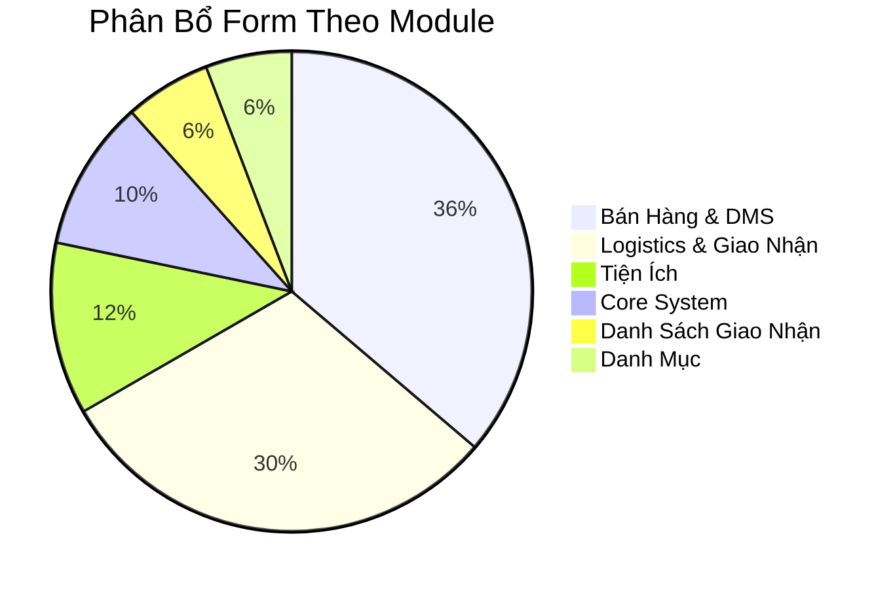

# Phân Tích Các Đối Tượng Đang Sử Dụng Trong Hệ Thống

## Cơ Chế Menu Động (Dynamic Menu System)

Hệ thống **không hard-code** menu. Menu được nạp động từ **3 bảng cấu hình trong database**:

| Bảng | Vai trò |
|---|---|
| `sys_Mainmenu` | Menu chính (cấp 1) |
| `sys_Menu_Sub` | Menu phụ (cấp 2) |
| `sys_Menu_Child` | Menu con (cấp 3) |

**Cơ chế phân quyền** kiểm soát user nhìn thấy menu nào:
- `fn_Quy_Phanquyen_Main` — quyền trên menu chính
- `fn_Quy_Phanquyen_Sub` — quyền trên menu phụ
- `Sys_Per_Sub` / `Sys_Per_DT` — permission matrix
- `DS_Form` — registry các form khả dụng

> [!IMPORTANT]
> Vì menu và phân quyền nằm trong database (`NHS_Logics`), muốn biết chính xác user nào thấy menu nào, cần restore file backup `Data_Logics.bak` hoặc `Data_LogicsNew.bak` và query các bảng trên.

---

## Danh Sách Form Đang Có Trong EXE (69 Form)

Dưới đây là toàn bộ form đã compile trong bản Soft_Run (bản triển khai thực tế):

### 🚀 Core System (7 form)

| Form | Chức năng |
|---|---|
| `frm_Run` | Form chính / Main MDI |
| `frm_sys_MeNu` | Quản lý / Sắp xếp menu hệ thống |
| `frm_Dnh_SXMeNu` | Sắp xếp menu động |
| `frm_Dnh_DynamicForm` | Form tải dữ liệu động (xem/chọn/sửa) |
| `frm_Dnh_Chon` | Form chọn dữ liệu chung |
| `frm_ChonDL` | Form chọn dữ liệu |
| `frm_SQL_Edit` | Form chỉnh sửa truy vấn SQL trực tiếp |

### 🛒 Bán Hàng & Phân Phối — DMS (25 form)

| Form | Chức năng |
|---|---|
| `frm_DMS_ConFigReg` | Cấu hình đăng ký module DMS |
| `frm_DMS_PhanQuyen` | Phân quyền người dùng DMS |
| `frm_DMS_ChonHang` | Chọn hàng hóa (khi bán/xuất) |
| `frm_DMS_ChonHangKM` | Chọn hàng khuyến mãi |
| `frm_DMS_ChonDonHang` | Chọn đơn hàng đã đặt |
| `frm_DMS_ChonKhuyenMaIUuDai` | Chọn chương trình KM/ưu đãi |
| `frm_DMS_DatMuaHang` | Đặt mua hàng (Purchase Order) |
| `frm_DMS_DatHangXuat` | Đặt hàng xuất (Sales Order) |
| `frm_DMS_TapHopDatHang` | Tập hợp / tổng hợp đơn đặt hàng |
| `frm_DMS_QLHangKhuyenMai` | Quản lý chương trình khuyến mãi |
| `frm_DMS_QLHangKhuyenMaiThem` | Thêm hàng KM vào chương trình |
| `frm_DMS_QLHangChietKhau` | Quản lý chính sách chiết khấu |
| `frm_DMS_QLCapThe` | Quản lý phát hành thẻ KH |
| `frm_DMS_QLTinhHinhCapThe` | Báo cáo tình hình cấp thẻ |
| `frm_DMS_QLDiemTichLuy` | Quản lý điểm tích lũy khách hàng |
| `frm_DMS_DMQLGiamGiaThe` | Quản lý chính sách giảm giá theo thẻ |
| `frm_DMS_DMThe` | Danh mục loại thẻ |
| `frm_DMS_DMKhuVuc` | Danh mục khu vực |
| `frm_DMS_DMNhomDoiTuong` | Danh mục nhóm đối tượng |
| `frm_DMS_DMXuatXu` | Danh mục xuất xứ |
| `frm_DMS_BCBanHangTheoChungTu` | BC bán hàng theo chứng từ |
| `frm_DMS_BCBanHangTheoMatHang` | BC bán hàng theo mặt hàng |
| `frm_DMS_BanHangTheoDonVivaChietKhau` | BC bán hàng theo đơn vị & chiết khấu |
| `frm_DMS_BC_BanHangKM` | BC hàng khuyến mãi |
| `frm_DMS_KT_HangTonKhoMaxMin` | Kiểm tra hàng tồn kho Max/Min |

### 🚚 Logistics & Giao Nhận (21 form)

| Form | Chức năng |
|---|---|
| `frm_Lgs_BienNhan_Hang` | Biên nhận hàng gửi |
| `frm_Lgs_BienNhan_Tien` | Biên nhận tiền gửi |
| `frm_Lgs_BienNhan_GiaoHang` | Biên nhận giao trả hàng |
| `frm_Lgs_BienNhan_GiaoTien` | Biên nhận giao trả tiền |
| `frm_Lgs_PhieuThu` | Phiếu thu logistics |
| `frm_Lgs_QL_CongNo` | Quản lý công nợ (chưa chốt) |
| `frm_Lgs_QL_Congno_DaChot` | Quản lý công nợ đã chốt |
| `frm_Lgs_QL_Giao` | Quản lý giao hàng/tiền |
| `frm_Lgs_ChungTu_CongNo` | Chứng từ công nợ |
| `frm_Lgs_DoanhThu` | Báo cáo doanh thu tổng |
| `frm_Lgs_DoanhThu_DaThu` | Doanh thu đã thu |
| `frm_Lgs_DoanhThu_ChuaThu` | Doanh thu chưa thu |
| `frm_Lgs_SoNhan_HangGui` | Sổ biên nhận hàng gửi |
| `frm_Lgs_SoNhan_TienGui` | Sổ biên nhận tiền gửi |
| `frm_Lgs_SoBienNhan_GiaoHang` | Sổ giao trả hàng |
| `frm_Lgs_SoHang_Giao` | Sổ hàng giao |
| `frm_Lgs_SoTien_Giao` | Sổ tiền giao |
| `frm_Lgs_Quanly_BienNhan_ThayDoi` | Quản lý biên nhận thay đổi |
| `frm_lgs_quanly_thaydoi_Thongtin` | Quản lý thay đổi thông tin |
| `frm_QuanLy_BienNhan` | Quản lý biên nhận tổng |
| `frm_Phieu_ChotNo_Hang_Load` | Phiếu chốt nợ hàng |

### 📋 Danh Sách & Giao Nhận (4 form)

| Form | Chức năng |
|---|---|
| `frm_DS_NhanHang` | Danh sách nhận hàng |
| `frm_DS_NhanTien` | Danh sách nhận tiền |
| `frm_DS_HangGiao` | Danh sách hàng đã giao |
| `frm_DS_GiaoTien` | Danh sách tiền đã giao |

### 🗃️ Danh Mục (Master Data) (4 form)

| Form | Chức năng |
|---|---|
| `frm_DM_Ca` | Danh mục ca làm việc |
| `frm_DM_DiaDiem_Gui` | Danh mục địa điểm gửi |
| `frm_DM_Khu` | Danh mục khu vực |
| `frm_DM_PhatHanhPhieu` | Danh mục phát hành phiếu |

### 🔧 Tiện Ích & Khác (8 form)

| Form | Chức năng |
|---|---|
| `frm_Nhs_Find` | Tìm kiếm nâng cao |
| `frm_nhs_NhapDL` | Nhập dữ liệu chung |
| `frm_nhs_BC_Ca` | Báo cáo theo ca |
| `frm_KetXuat_MaHang` | Kết xuất/export mã hàng |
| `frm_ShowImage` | Xem hình ảnh |
| `frm_XuLy` | Form xử lý chung |
| `frm_SoBienNhan_GiaoTien` | Sổ biên nhận giao tiền |
| `frm_DoiTuong_Base` | Form base cho đối tượng |

---

## Tổng Kết Theo Nhóm Chức Năng



## Nhận Xét Quan Trọng

> [!WARNING]
> Hệ thống **tập trung nặng vào 2 module**: **Bán hàng/DMS (22 form)** và **Logistics/Giao nhận (19 form)** — chiếm 65% tổng form. Các module kế toán (sổ sách, NXT, sổ quỹ) và kế toán tổng hợp **không có form riêng** trong bản deploy — chúng được phục vụ qua:
> - **Crystal Reports** (75 báo cáo)
> - **Dynamic Form** (`frm_Dnh_DynamicForm`) tải DataTable từ DB
> - **Các form kế toán của module Acc/SCC** (database khác: `Acc2009`, `SCC_Sales`)

> [!NOTE]
> Để biết chính xác **menu nào đang bật, user nào nhìn thấy gì**, cần **restore database backup** (`Data_LogicsNew.bak` — 16MB) lên SQL Server và query:
> ```sql
> SELECT * FROM sys_Mainmenu ORDER BY STT
> SELECT * FROM sys_Menu_Sub ORDER BY MainId, STT
> SELECT * FROM sys_Menu_Child ORDER BY SubId, STT
> SELECT * FROM sys_Nguoidung
> SELECT * FROM Sys_Config
> ```
