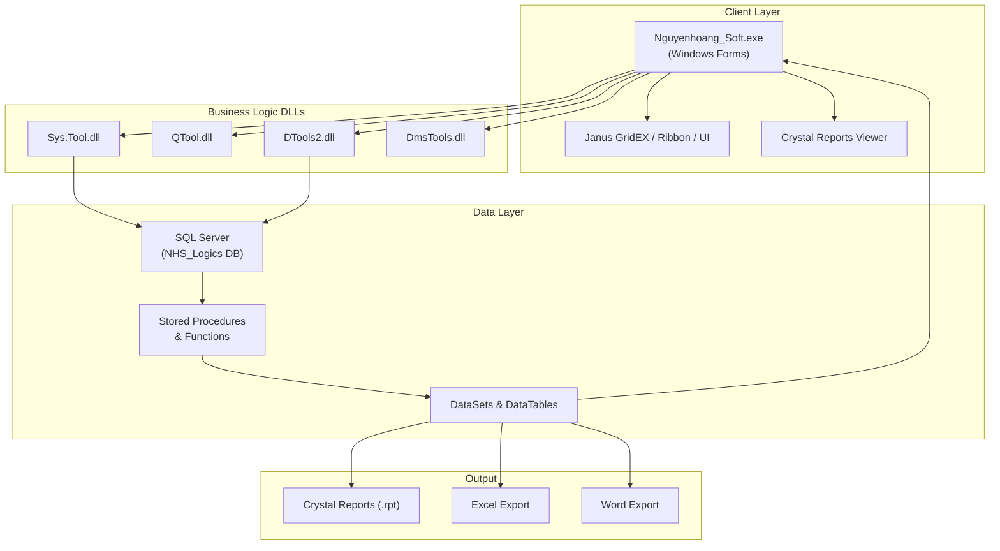

# Reverse Engineering - Hệ Thống Hiện Tại (Nguyenhoang_Logics / Thiên Minh Quang)

## 1. Tổng Quan Hệ Thống

| Thuộc tính | Giá trị |
|---|---|
| **Tên ứng dụng** | `Nguyenhoang_Soft.exe` (~14 MB) |
| **Loại ứng dụng** | Windows Forms (.NET Framework) |
| **Ngôn ngữ** | VB.NET |
| **Namespace gốc** | `NguyenHoang` |
| **CSDL** | SQL Server (SQL Server 2005 Express) |
| **Báo cáo** | Crystal Reports 9/10.5 + XI |
| **UI Grid** | Janus GridEX v3 (Ribbon, Schedule, Timeline, ButtonBar, ExplorerBar, CalendarCombo) |
| **Office Interop** | Excel + Word export |
| **Tác giả gốc** | Nguyễn Tiến Đĩnh (`tiendinhnguyen@gmail.com`) |

### Các Database được cấu hình

Từ file [Nguyenhoang_Soft.exe.config](file:///d:/Working/TMQ-Express/CurrentSystem/Nguyenhoang_Logics/bin/Nguyenhoang_Soft.exe.config):

| Tên Connection | Database | Server |
|---|---|---|
| Acc2009 | `Acc2009` | `10.0.0.27` |
| Acc | `Acc` | `TTV-SERVER` |
| HongCam | `HongCam` | `TTV-SERVER` |
| SCC_Sales | `SCC_Sales` | `khanhngoc-pc` |
| Vinagiay_Sales | `Vinagiay_Sales` | `nguyenhoang-co` |
| NHS_Logic | `NHS_Logic` | `nguyenhoang-co` |

Runtime database: `NHS_Logics` trên `SQLEXPRESS`

---

## 2. Kiến Trúc Module & Chức Năng

Hệ thống gồm **15+ module chính**, được phân tích từ XML documentation, Crystal Reports, và DataSet definitions.

### 2.1 🔐 Hệ Thống (System Administration)

| Module | Chức năng | Các bảng liên quan |
|---|---|---|
| **Menu hệ thống** | Quản lý menu nhiều cấp (Main → Sub → Child) | `Sys_MeNu`, `Sys_MeNu1`, `Sys_MeNu2`, `Sys_MeNu3`, `sys_MainMenu`, `sys_Menu_Sub`, `sys_Menu_Child` |
| **Quản lý người dùng** | CRUD người dùng, gán nhóm, gán đối tượng | `sys_Nguoidung`, `sys_Nguoidung_Group` |
| **Phân quyền** | Phân quyền chức năng Main/Sub cho user | `fn_Quy_Phanquyen_Main`, `fn_Quy_Phanquyen_Sub`, `Sys_Per_Sub`, `Sys_Per_DT` |
| **Cấu hình hệ thống** | Lưu trữ config hệ thống | `Sys_Config` |
| **Dynamic Form** | Form tải dữ liệu động (xem, chọn, chỉnh sửa) | `DS_Form`, `DS_FormDL`, `DS_Bang` |

### 2.2 📋 Danh Mục (Master Data)

| Module | Chức năng | Các bảng liên quan |
|---|---|---|
| **Đối tượng (Đối tác/KH/NCC)** | Quản lý khách hàng, nhà cung cấp, nhân viên | `dm_Doituong`, `dm_Doituong_ct`, `dm_Doituong_loai`, `dm_Loaidoituong`, `DM_NhomDoiTuong` |
| **Hàng hóa** | Quản lý mã hàng, loại hàng, nhóm hàng | `dm_Mahang`, `dm_Loaihang`, `DM_NhomHang`, `DM_Hang` |
| **Tài khoản kế toán** | Hệ thống tài khoản kế toán | `dm_Taikhoan`, `Taikhoan` |
| **Tiền tệ & Tỷ giá** | Quản lý loại tiền, tỷ giá ngày/tháng | `dm_Loaitien`, `Tigia_thang`, `Tigia_ng`, `dm_Tygia_ng`, `dm_Tygia_th` |
| **Yếu tố chi phí** | Quản lý yếu tố & phân loại chi phí | `dm_Yeuto`, `dm_Yeuto_ct`, `dm_Yeuto_loai`, `dm_Loaiyeuto` |
| **Tính chất** | Phân loại tính chất đối tượng | `dm_Tinhchat` |
| **Tài sản cố định** | Nhóm/loại TSCĐ, lý do tăng/giảm | `DM_Nhomtaisan`, `DM_Loaitaisan`, `DM_Lydo_Tanggiam`, `DM_BPSudung` |
| **CCDC (Công cụ dụng cụ)** | Loại & nhóm CCDC | `DM_LoaiCCDC`, `DM_NhomCCDC` |
| **Khu vực & Xuất xứ** | Vùng, khu vực, xuất xứ hàng hóa | `DM_Khu`, `DM_Vung_KhuVuc`, `DM_XuatXu` |
| **Chi nhánh & Cửa hàng** | Quản lý chi nhánh, cửa hàng | `dm_chinhanh`, `DM_Cuahang` |
| **Ca làm việc** | Quản lý ca bán hàng | `DM_Ca` |
| **Tuyến sản phẩm** | Tuyến phân phối sản phẩm | `DM_TuyenSP` |

### 2.3 🛒 Quản Lý Đặt Hàng (Order Management)

| Chức năng | Mô tả | Các bảng |
|---|---|---|
| **Đặt hàng mua** | Tạo & quản lý đơn đặt hàng mua | `CtDH` (chi tiết), `LkDH` (lịch ký), `QLDH` (quản lý) |
| **Đặt hàng bán** | Đơn đặt hàng từ khách hàng | `CTDHang`, `LKDHang` |
| **Định mức thành phẩm** | BOM (Bill of Materials) - Định mức nguyên liệu → thành phẩm | `DM_Dinhmuc_Thanhpham`, `Dinhmuc`, `dm_Mahang_TP`, `dm_Mahang_NL` |

### 2.4 💰 Thu Chi & Phiếu (Receipts/Payments)

| Chức năng | Mô tả | Reports |
|---|---|---|
| **Phiếu thu tiền mặt** | Thu tiền mặt, in phiếu | `quyPhieuthu.rpt` |
| **Phiếu thu ngân hàng** | Thu qua ngân hàng | `quyPhieuthu_NH.rpt` |
| **Phiếu chi tiền mặt** | Chi tiền mặt, in phiếu | `quyPhieuChi.rpt` |
| **Phiếu chi ngân hàng** | Chi qua ngân hàng | `quyPhieuChi_NH.rpt` |
| **Giấy nộp tiền** | Giấy nộp tiền vào quỹ | `quyGiaynoptien.rpt` |
| **Ủy nhiệm chi** | Lệnh chuyển tiền | `quyUNC.rpt` |
| **Sổ quỹ** | Theo dõi sổ quỹ tiền mặt | `fn_H_Soquy`, `Soquy.rpt` |
| **Nhật ký thu tiền** | Bảng kê nhật ký thu | `Nhatky_Thutien.rpt` |
| **Nhật ký chi tiền** | Bảng kê nhật ký chi | `Nhatky_Chitien.rpt` |

### 2.5 📦 Kho & Xuất Nhập Tồn (Inventory/Warehouse)

| Chức năng | Mô tả | Reports |
|---|---|---|
| **Phiếu nhập mua hàng** | Nhập kho từ nhà cung cấp | `quyPhieunhapmuahang.rpt` |
| **Phiếu xuất bán hàng** | Xuất kho bán cho khách | `quyphieuxuatbanhang.rpt` |
| **Điều chuyển kho** | Chuyển hàng giữa các kho | `quyDieuchuyenkho.rpt`, `sp_QRptDieuchuyenkho` |
| **Sổ Nhập-Xuất-Tồn (NXT)** | Theo dõi nhập/xuất/tồn kho | `fn_H_SoNxt`, `Dnh_SoNXT.rpt`, nhiều biến thể |
| **Thẻ kho** | Thẻ theo dõi kho theo mã hàng | `quyThekho.rpt`, `Dnh_TheKho.rpt` |
| **Tồn kho Max/Min** | Cảnh báo tồn kho vượt/dưới ngưỡng | `quySL_Tonmax.rpt`, `quySL_Tonmin.rpt`, `Fn_Dnh_HangTonKho_MaXMin` |
| **NXT chi tiết/tổng hợp** | Báo cáo NXT chi tiết và tổng hợp | `quyNXT_CT.rpt`, `quyNXT_TH.rpt`, `quyNXT_Max.rpt`, `quyNXT_Min.rpt` |
| **Phí lưu kho** | Tính phí lưu kho hàng hóa | `DMS_PhiLuuKho.rpt` |
| **Kiểm kê** | Kiểm kê hàng/tiền theo kho | `Dnh_SoKiemKe_Hang.rpt`, `Dnh_SoKiemKe_Tien.rpt` |
| **Số lượng tồn** | Tra cứu số lượng tồn kho | `sp_quyLaySL_ton`, `SCC_SLTon_Hang_Kho` |

### 2.6 📊 Báo Cáo Bán Hàng & Doanh Thu

| Chức năng | Mô tả | Reports |
|---|---|---|
| **BC bán hàng theo chứng từ** | Báo cáo bán hàng group theo phiếu/chứng từ | `Dnh_BaoCaoBanHangTheoChungTu.rpt` |
| **BC bán hàng theo mặt hàng** | Báo cáo bán hàng group theo mặt hàng | `Dnh_BaoCaoBanHangTheoMatHang.rpt` |
| **BC bán hàng theo đơn vị & chiết khấu** | Doanh thu theo đơn vị và % chiết khấu | `Dnh_BaoCaoTheoDonViVaChietKhau.rpt` |
| **BC hàng khuyến mãi** | Tổng hợp hàng khuyến mãi đã cấp | `Dnh_BaoCaoHangKhuyenMai.rpt` |
| **BC doanh thu tổng hợp** | Doanh thu tổng, đã thu, chưa thu | `Dnh_DoanhThu_Tong.rpt`, `Dnh_DoanhThu_DaThu.rpt`, `Dnh_DoanhThu_ChuaThu.rpt` |
| **BC doanh thu theo mã hàng** | Doanh thu chi tiết theo từng mặt hàng | `quyBangkedoanhthu_Mahang.rpt` |
| **Bảng kê doanh thu** | Bảng kê tổng hợp doanh thu | `quyBangkedoanhthu.rpt` |
| **Bán hàng trong ngày** | BC bán hàng real-time trong ngày | `fn_Dnh_BC_BanHangTrongNgay` |
| **Nhập trả trong ngày** | BC nhập trả real-time trong ngày | `fn_Dnh_BC_NhapTraTrongNgay` |
| **Phiếu thu hồi trong ngày** | BC thu hồi real-time trong ngày | `fn_Dnh_PhieuThuHoiTrongNgay` |
| **Bảng kê bán hàng** | Chi tiết bán hàng | `quybangkebanhang.rpt` |
| **Bảng kê mua hàng** | Chi tiết mua hàng | `quybangkemuahang.rpt` |
| **Kết ca** | Báo cáo kết ca bán hàng | `Dnh_KetCa.rpt` |

### 2.7 📝 Hóa Đơn & Thuế

| Chức năng | Reports |
|---|---|
| **Bảng kê hóa đơn bán** | `quyBangkeHD_Ban.rpt` |
| **Bảng kê hóa đơn mua** | `quyBangkeHD_Mua.rpt` |
| **Tờ khai thuế** | `Tokhaithue.rpt` |

### 2.8 📒 Sổ Sách Kế Toán

| Chức năng | Mô tả | Bảng/Report |
|---|---|---|
| **Sổ nhật ký chung** | Sổ ghi chép tất cả nghiệp vụ | `sp_QSonhatkychung`, `quySoNKC.rpt` |
| **Cân đối kế toán** | Bảng cân đối kế toán | `cdkt` |
| **Bảng kê nhập/xuất kho** | Bảng kê chứng từ vật tư | `fn_H_Bk_Ctvt`, `dsBangke_Nhap_Xuat_Kho` |
| **Nhật ký thu chi tiền** | Nhật ký ghi nhận thu chi | `dsNhatky_Thu_Chi_Tien` |
| **Phiếu thu** | Phiếu thu tổng hợp | `Dnh_PhieuThu.rpt` |

### 2.9 🚚 Logistics & Giao Nhận (Module Lgs)

| Chức năng | Mô tả | Bảng |
|---|---|---|
| **Biên nhận hàng gửi** | Nhận hàng gửi từ khách, in biên nhận | `Lgs_BienNhan`, `sp_In_BienNhan`, `Dnh_BienNhan_Hang.rpt` |
| **Biên nhận tiền gửi** | Nhận tiền gửi từ khách | `Lgs_BienNhan_Tien`, `Dnh_BienNhan_Tien.rpt` |
| **Phiếu thu logistics** | Phiếu thu từ dịch vụ logistics | `Lgs_PhieuThu`, `Lgs_PhieuThu1` |
| **Giao trả hàng** | Giao trả hàng cho khách | `Dnh_BienNhan_GiaoTra_Hang.rpt` |
| **Giao trả tiền** | Giao trả tiền cho khách | `Dnh_BienNhan_GiaoTra_Tien.rpt` |
| **Sổ biên nhận hàng gửi** | Sổ theo dõi biên nhận hàng | `Dnh_SoBienNhan_HangGui.rpt` |
| **Sổ biên nhận tiền gửi** | Sổ theo dõi biên nhận tiền | `Dnh_SoBienNhan_TienGui.rpt` |
| **Sổ giao trả hàng/tiền** | Sổ theo dõi giao trả | `Dnh_SoGiaoTra_Hang.rpt`, `Dnh_SoGiaoTra_Tien.rpt` |

### 2.10 💳 Công Nợ (Accounts Receivable/Payable)

| Chức năng | Mô tả | Bảng |
|---|---|---|
| **Công nợ khách hàng** | Theo dõi công nợ theo khách | `fn_Dnh_CongNoKhachHang` |
| **Chi tiết phát sinh** | Xem chi tiết các phát sinh công nợ | `fn_Dnh_ChiTiet_PS` |
| **Chứng từ công nợ** | Chứng từ ghi nhận công nợ | `Dnh_ChungTu_CongNo` |
| **Chốt nợ** | Phiếu chốt nợ cuối kỳ | `Phieu_ChotNo` |
| **DS công nợ chưa chốt** | Danh sách công nợ chưa đối chiếu | `Dnh_DS_CongNo_ChuaChot.rpt` |
| **DS công nợ đã chốt** | Danh sách công nợ đã đối chiếu | `Dnh_DS_CongNo_DaChot.rpt` |

### 2.11 🎁 Chương Trình Khuyến Mãi & Ưu Đãi (CRM)

| Chức năng | Mô tả | Bảng |
|---|---|---|
| **Khuyến mãi hàng hóa** | Chương trình KM theo mặt hàng | `SCC_Hang_KM`, `SCC_CT_Hang_KM`, `SCC_Kho_KM` |
| **Chính sách chiết khấu** | Chiết khấu theo đối tượng/hàng hóa | `SCC_ChietKhau`, `SCC_CT_ChietKhau`, `Dnh_ChinhSachChietKhau.rpt` |
| **Chương trình ưu đãi** | Ưu đãi đặc biệt | `SCC_UuDai`, `SCC_UuDai_CT`, `SCC_UuDai_CTHang`, `SCC_Kho_UuDai` |
| **Thẻ khách hàng** | Quản lý thẻ thành viên | `DM_The`, `DM_KhachHang_The` |
| **Tích lũy điểm** | Hệ thống tích lũy cho khách hàng | `Sys_TichLuy_KhachHang`, `Sys_TichLuy_CTKhachHang` |
| **Giảm giá theo thẻ** | Chính sách giảm giá theo loại thẻ | `DM_GiamGiaThe` |
| **Tình hình cấp thẻ** | Báo cáo phát hành thẻ | `Sp_QL_TinhHinh_CapThe` |
| **Chính sách khuyến mãi** | In chính sách KM | `Dnh_ChinhSachKhuyenMai.rpt` |

### 2.12 📊 Báo Cáo Vận Chuyển (DMS - Distribution)

| Reports | Mô tả |
|---|---|
| `DMS-H001.rpt` → `DMS-H005.rpt` | 5 báo cáo phân phối/distribution |

### 2.13 🔍 Tìm Kiếm & Lọc Dữ Liệu

| Chức năng | Mô tả |
|---|---|
| **Tìm kiếm nâng cao** (`Dnh_Find`) | Tìm kiếm trên lưới, bảng, hoặc CSDL với hỗ trợ liên kết bảng |
| **Lọc nhật ký** (`dsLoc_Nhatky`) | Lọc dữ liệu nhật ký với toán tử và mệnh đề tùy chỉnh |
| **Tìm kiếm TTDD** (`dsTimkiem_TTDD`) | Tra cứu thông tin/tìm kiếm nhanh |
| **Phân trang** (`Dnh_PhanTrang`) | Phân trang dữ liệu lưới |

### 2.14 📤 Xuất Dữ Liệu (Export)

| Chức năng | Mô tả |
|---|---|
| **Export Excel template** (`QTool.QExcell`) | Xuất dữ liệu ra file Excel mẫu, hỗ trợ grouping 3 cấp, SUM/COUNT, tiêu đề tuỳ chỉnh |
| **In Bill** | In bill/hoá đơn bán hàng (`Dnh_Bill.rpt`) |
| **In đơn đặt hàng** | In phiếu đặt hàng (`Dnh_DonDatHang.rpt`) |
| **In danh sách** | Danh sách hàng hóa, khách hàng (`Dnh_DanhSachHangHoa.rpt`, `Dnh_DanhSachKhachHang.rpt`) |

---

## 3. Thư Viện Hỗ Trợ (Supporting Libraries)

| DLL | Chức năng |
|---|---|
| `Sys.Tool.dll` | Tiện ích hệ thống: SQL execution, network check, form management, popup |
| `QTool.dll` | Export Excel nâng cao (grouping, template) |
| `DTools.dll` / `DTools2.dll` | Công cụ nội bộ |
| `DmsTools.dll` | Công cụ cho module Distribution (DMS) |
| `MTools2.DLL` | Công cụ bổ trợ |
| `DTools2FrAccess.dll` | Kết nối MS Access |
| Janus Controls (v3) | GridEX, Ribbon, Schedule, Timeline, ButtonBar, ExplorerBar, CalendarCombo, FilterEditor |

---

## 4. Sơ Đồ Kiến Trúc Tổng Thể

---

## 5. Tổng Hợp Số Lượng

| Hạng mục | Số lượng |
|---|---|
| Crystal Reports (.rpt) | **75** |
| DataSet/DataTable types | **~100+** |
| Stored Procedures/Functions | **20+** (qua tên bảng `sp_`, `fn_`) |
| Module chức năng chính | **14** |
| Thư viện DLL hỗ trợ | **6+** |

---

## 6. Nhận Xét Kiến Trúc

> [!IMPORTANT]
> Hệ thống là **phần mềm ERP tổng hợp** cho doanh nghiệp vừa và nhỏ, tập trung vào lĩnh vực **phân phối, bán lẻ và logistics**.

**Điểm mạnh:**
- Phủ sóng đầy đủ nghiệp vụ: bán hàng, mua hàng, kho, kế toán, CRM, logistics
- Hệ thống báo cáo phong phú (75 reports)
- Thiết kế dynamic (form/menu/grid có thể cấu hình từ database)
- Hỗ trợ đa tiền tệ và tỷ giá

**Điểm cần lưu ý khi chuyển đổi:**
- Kiến trúc **Client-Server truyền thống** (thick client), không phải web-based
- Phụ thuộc nặng vào **Crystal Reports** (licensing, runtime)
- Dùng **Janus Controls** (discontinued) → cần thay thế UI component
- Logic nghiệp vụ nằm trong cả **stored procedures** và **client code** → khó tách riêng
- Sử dụng **.NET Framework cũ** (2.0-3.5) và **SQL Server 2005**
