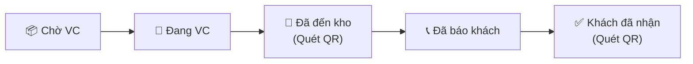
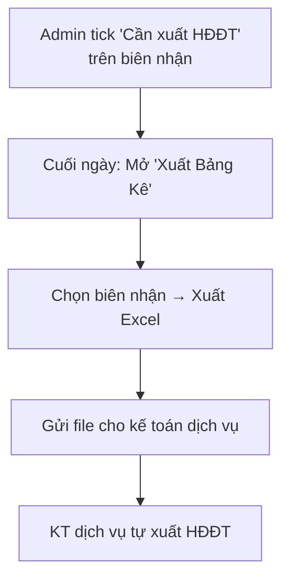
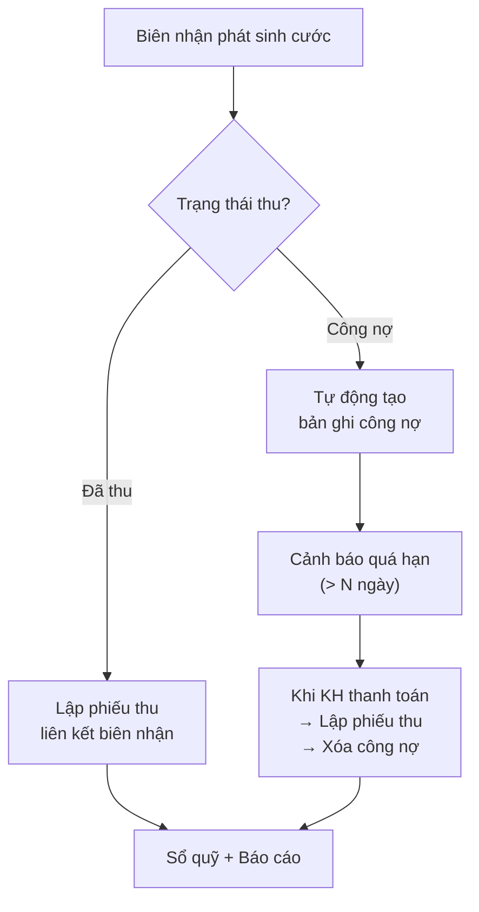

# Kế Hoạch Triển Khai Phase 1 — ERP TMQ Express

> **Mục đích**: Kế hoạch kỹ thuật Phase 1 dự án nâng cấp ERP TMQ Express — bao gồm toàn bộ nghiệp vụ cốt lõi từ biên nhận đến kế toán thu/chi, công nợ, dashboard thống kê và báo cáo.

> [!NOTE]
> Kế hoạch tổng thể xem tại [ERP_MasterPlan.md](../TongThe_NangCap_ERP/ERP_MasterPlan.md)

## Phạm Vi Phase 1

| Bao gồm | Mô tả |
|---|---|
| ✅ **Biên nhận hàng hóa** | Lập, sửa, tra cứu biên nhận — nghiệp vụ cốt lõi hàng ngày |
| ✅ **Quản lý khách hàng** | Danh bạ KH, gợi ý tự động khi lập biên nhận |
| ✅ **In ấn PDF + QR Code** | In phiếu biên nhận có mã QR từ trình duyệt |
| ✅ **Theo dõi vận chuyển** | Quét QR cập nhật: Chờ VC → Đang VC → Đã đến kho → Đã báo khách → Khách đã nhận |
| ✅ **Xuất bảng kê H\u0110\u0110T** | Tạo bảng kê (file Excel) → gửi cho kế toán dịch vụ (chỉ Admin) |
| ✅ **Tích hợp dữ liệu PM cũ** | Chuyển đổi dữ liệu KH, biên nhận từ phần mềm cũ |
| ✅ **Kế toán thu/chi** | Lập phiếu thu, phiếu chi, liên kết biên nhận, in PDF |
| ✅ **Quản lý công nợ** | Theo dõi công nợ KH, cảnh báo quá hạn, đối soát thu/chi |
| ✅ **Dashboard thống kê** | Biểu đồ doanh thu, tổng quan biên nhận, công nợ (ECharts) |
| ✅ **Báo cáo tổng hợp** | Doanh thu theo kỳ, sổ quỹ, so sánh tháng/năm — xuất PDF & Excel |
| ✅ **Hạ tầng nền tảng** | VPS, database, đăng nhập, phân quyền 3 role (admin/staff/kế toán) |

| Không bao gồm | Ghi chú |
|---|---|
| ❌ Trực tiếp xuất HĐĐT qua API | Kế toán dịch vụ xử lý |
| ❌ Thiết bị phần cứng | KH tự trang bị |

---

## Nguyên Tắc Chung

| Nguyên tắc | Quyết định |
|---|---|
| **Bản quyền** | 100% mã nguồn mở — 0 VNĐ chi phí bản quyền |
| **Nền tảng** | Web App truy cập qua trình duyệt |
| **Hạ tầng** | **Thuê VPS** (Vietnix 4GB RAM / 2 vCPU / 40GB SSD) — 250K/tháng |
| **HĐĐT** | Xuất bảng kê → gửi kế toán dịch vụ (chỉ Admin thao tác) |
| **Vận chuyển** | Quét QR bằng điện thoại cập nhật trạng thái |
| **Phân quyền** | 3 vai trò: Admin / Staff / Kế toán — xem [PhanQuyen_DinhHuong.md](../TongThe_NangCap_ERP/PhanQuyen_DinhHuong.md) |

---

## Luồng Theo Dõi Vận Chuyển (5 trạng thái)

---

## Luồng Xuất Bảng Kê HĐĐT (Chỉ Admin)

---

## Luồng Kế Toán Thu/Chi & Công Nợ

---

## Tài Liệu Kỹ Thuật Chi Tiết

| Tài liệu | Mô tả |
|---|---|
| [NghiepVu_ChiTiet_Phase1.md](./NghiepVu_ChiTiet_Phase1.md) | Mô tả chi tiết từng nghiệp vụ |
| [TechStack_Architecture.md](./TechStack_Architecture.md) | Công nghệ, kiến trúc hệ thống |
| [SoSanh_CongNghe_VPS.md](./SoSanh_CongNghe_VPS.md) | So sánh công nghệ & yêu cầu VPS |
| [DatabaseSchema_Phase1.md](./DatabaseSchema_Phase1.md) | Thiết kế cơ sở dữ liệu |
| [Wireframes_Phase1.md](./Wireframes_Phase1.md) | Phác thảo giao diện |
| [API_Specification.md](./API_Specification.md) | 53 REST API endpoints |
| [DevSetup_Guide.md](./DevSetup_Guide.md) | Hướng dẫn cài đặt & quy ước dev |

---

## Lộ Trình Triển Khai

| Giai đoạn | Hạng mục |
|---|---|
| **Bước 1** | Hạ tầng: VPS, CSDL, API, đăng nhập, phân quyền 3 role |
| **Bước 2** | Quản lý KH + Biên nhận hàng hóa |
| **Bước 3** | In ấn PDF + QR Code |
| **Bước 4** | Theo dõi vận chuyển (quét QR) |
| **Bước 5** | Xuất bảng kê HĐĐT |
| **Bước 6** | Tích hợp dữ liệu PM cũ (migrate) |
| **Bước 7** | Kế toán thu/chi + Công nợ |
| **Bước 8** | Dashboard thống kê + Báo cáo tổng hợp |
| **Bước 9** | Kiểm thử, nghiệm thu, đào tạo, chuyển giao |
