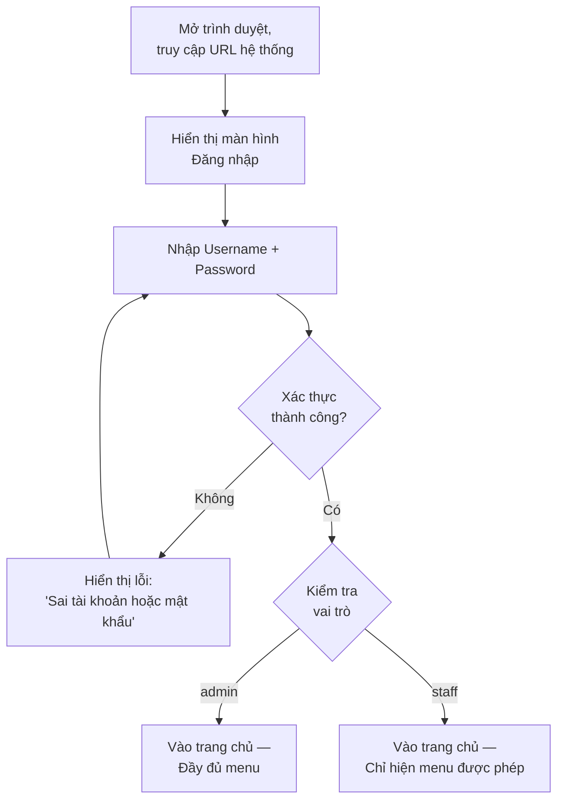
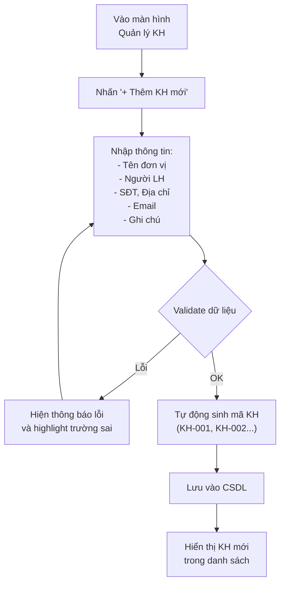
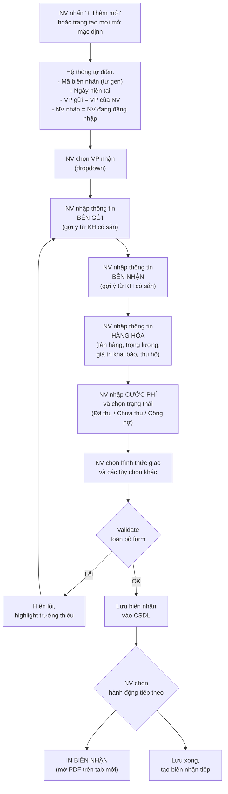
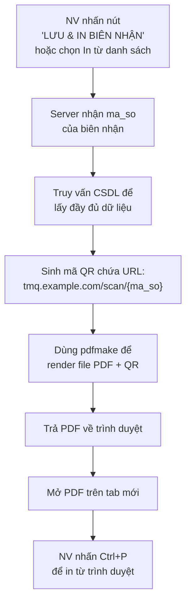
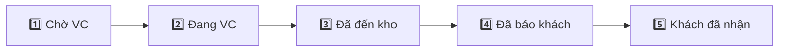
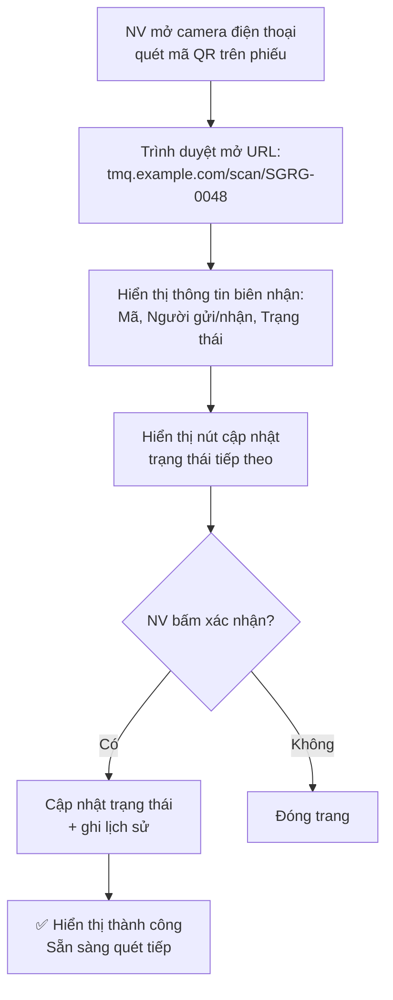
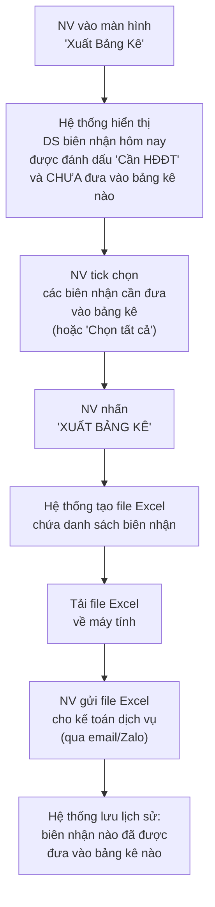
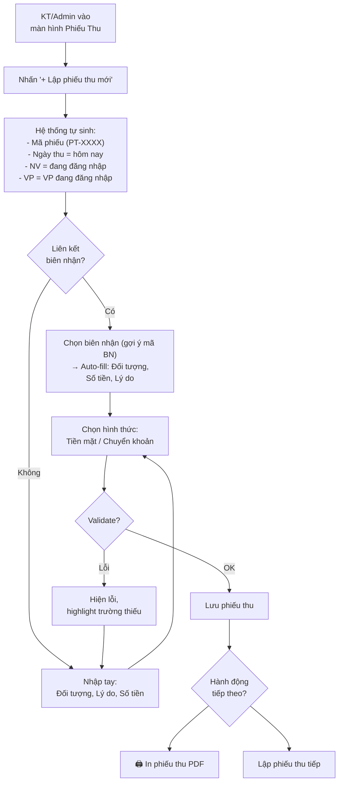
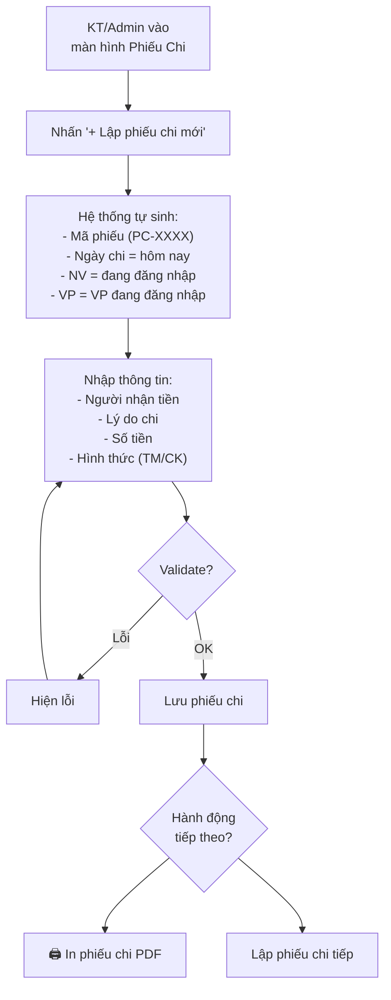
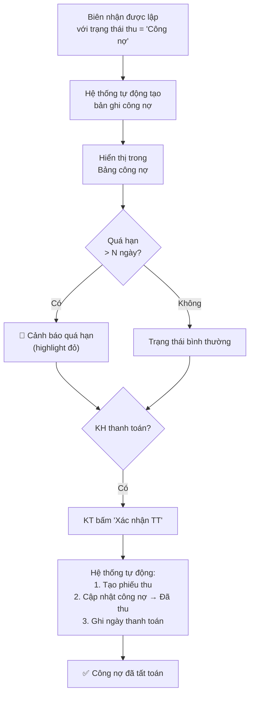

# Mô Tả Chi Tiết Nghiệp Vụ — Phase 1

> **Mục đích tài liệu**: Mô tả chi tiết từng nghiệp vụ sẽ được lập trình trong Phase 1, bao gồm luồng xử lý, quy tắc nghiệp vụ, và các trường hợp đặc biệt. Tài liệu này là cơ sở để lập trình viên hiểu rõ yêu cầu trước khi code.

> [!NOTE]
> Tham khảo thêm: [KeHoach_Phase1.md](./KeHoach_Phase1.md) · [DatabaseSchema_Phase1.md](./DatabaseSchema_Phase1.md) · [Wireframes_Phase1.md](./Wireframes_Phase1.md)

---

## Mục Lục Nghiệp Vụ

| # | Nghiệp vụ | Mô tả ngắn |
|---|---|---|
| 1 | [Đăng nhập & Phân quyền](#1-đăng-nhập--phân-quyền) | Xác thực người dùng, phân quyền admin/staff/kế toán |
| 2 | [Quản lý văn phòng](#2-quản-lý-văn-phòng-chi-nhánh) | Dữ liệu chi nhánh (SG, CT, RG) |
| 3 | [Quản lý khách hàng](#3-quản-lý-khách-hàng) | CRUD danh bạ KH, tìm kiếm, gợi ý tự động |
| 4 | [Lập biên nhận hàng hóa](#4-lập-biên-nhận-hàng-hóa) | Nghiệp vụ cốt lõi — tạo phiếu gửi hàng |
| 5 | [Tra cứu & Sửa biên nhận](#5-tra-cứu--sửa-biên-nhận) | Danh sách, tìm kiếm, chỉnh sửa biên nhận |
| 6 | [In phiếu biên nhận (PDF + QR)](#6-in-phiếu-biên-nhận-pdf--qr) | Xuất PDF phiếu biên nhận có mã QR |
| 7 | [Theo dõi vận chuyển (Quét QR)](#7-theo-dõi-vận-chuyển-quét-qr) | Cập nhật trạng thái bằng quét mã QR trên điện thoại |
| 8 | [Đánh dấu biên nhận cần xuất HĐĐT](#8-đánh-dấu-biên-nhận-cần-xuất-hđđt) | Tick đánh dấu biên nhận cần đưa vào bảng kê |
| 9 | [Xuất bảng kê phục vụ HĐĐT](#9-xuất-bảng-kê-phục-vụ-hđđt) | Tạo file Excel bảng kê → gửi kế toán dịch vụ |
| 10 | [Quản lý nhân viên](#10-quản-lý-nhân-viên) | Tạo/sửa tài khoản nhân viên |
| 11 | [Lập phiếu thu](#11-lập-phiếu-thu) | Thu tiền cước, thu hộ, thu công nợ — in phiếu PDF |
| 12 | [Lập phiếu chi](#12-lập-phiếu-chi) | Chi trả đối tác, chi phí vận hành — in phiếu PDF |
| 13 | [Quản lý công nợ](#13-quản-lý-công-nợ) | Theo dõi công nợ KH, cảnh báo quá hạn, xác nhận TT |
| 14 | [Dashboard thống kê & Báo cáo](#14-dashboard-thống-kê--báo-cáo) | Biểu đồ doanh thu, sổ quỹ, so sánh — xuất PDF/Excel |

---

## 1. Đăng Nhập & Phân Quyền

### Mô tả
Nhân viên mở trình duyệt, truy cập hệ thống, nhập tài khoản và mật khẩu để đăng nhập. Hệ thống xác thực và phân quyền theo vai trò.

### Luồng chính

### Phân quyền theo vai trò

| Chức năng | `admin` | `staff` | `accountant` |
|---|:---:|:---:|:---:|
| Lập / Sửa biên nhận | ✅ | ✅ *(chỉ BN do mình tạo)* | ❌ |
| Xem danh sách biên nhận | ✅ | ✅ (chỉ VP mình) | ✅ (chỉ xem) |
| Quản lý khách hàng | ✅ | ✅ | ✅ (chỉ xem) |
| Xuất bảng kê HĐĐT | ✅ | ❌ | ❌ |
| Phiếu thu / Phiếu chi | ✅ | ❌ | ✅ |
| Quản lý công nợ | ✅ | ❌ | ✅ |
| Dashboard & Báo cáo | ✅ | ✅ (VP mình) | ✅ |
| Quản lý nhân viên | ✅ | ❌ | ❌ |
| Quản lý văn phòng | ✅ | ❌ | ❌ |

### Quy tắc nghiệp vụ

- **NV-1.1**: Mật khẩu phải được mã hóa (hash) trước khi lưu vào CSDL — không lưu bản rõ (plaintext).
- **NV-1.2**: Sau đăng nhập, hệ thống ghi nhận `van_phong_id` của nhân viên → dùng làm **VP gửi** mặc định khi lập biên nhận.
- **NV-1.3**: Session / Token hết hạn sau 8 giờ (tương đương 1 ca làm việc). Nhân viên phải đăng nhập lại vào đầu ca.
- **NV-1.4**: Admin có thể reset mật khẩu cho nhân viên.

---

## 2. Quản Lý Văn Phòng (Chi Nhánh)

### Mô tả
Quản lý danh sách chi nhánh/văn phòng của TMQ Express. Dữ liệu này được dùng ở khắp hệ thống (VP gửi, VP nhận trên biên nhận, gán nhân viên vào VP...).

### Các thao tác

| Thao tác | Mô tả | Quyền |
|---|---|---|
| Xem danh sách VP | Hiển thị tất cả chi nhánh | admin |
| Thêm VP mới | Thêm chi nhánh (mã VP, tên, địa chỉ, SĐT) | admin |
| Sửa thông tin VP | Cập nhật tên, địa chỉ, SĐT | admin |
| Vô hiệu hóa VP | Set `active = false` (không xóa cứng) | admin |

### Quy tắc nghiệp vụ

- **NV-2.1**: `ma_vp` là duy nhất, viết tắt 2-3 ký tự (VD: `SG`, `CT`, `RG`). Một khi đã tạo thì **không được đổi** vì mã này được dùng để sinh mã biên nhận.
- **NV-2.2**: VP bị vô hiệu hóa (`active = false`) sẽ không xuất hiện trong dropdown chọn VP gửi/nhận, nhưng dữ liệu lịch sử vẫn giữ nguyên.
- **NV-2.3**: Dữ liệu ban đầu seed sẵn 3 VP: Tp.HCM (`SG`), Cần Thơ (`CT`), Rạch Giá (`RG`).

---

## 3. Quản Lý Khách Hàng

### Mô tả
Quản lý danh bạ khách hàng / đối tác gửi-nhận hàng. Mục đích chính:
1. **Gợi ý tự động** khi nhân viên lập biên nhận (gõ tên/SĐT → hệ thống gợi ý KH đã có).
2. **Theo dõi lịch sử** giao dịch của từng KH.

### Luồng chính — Thêm khách hàng mới

### Các thao tác

| Thao tác | Mô tả |
|---|---|
| **Thêm KH** | Nhập thông tin, hệ thống tự sinh `ma_kh` |
| **Sửa KH** | Cập nhật thông tin (trừ `ma_kh`) |
| **Xóa mềm** | Set `active = false`, KH không còn xuất hiện trong gợi ý |
| **Tìm kiếm** | Tìm theo tên, SĐT, mã KH — tìm kiếm tức thì (debounce) |
| **Xem lịch sử GD** | Liệt kê các biên nhận liên quan đến KH này |

### Quy tắc nghiệp vụ

- **NV-3.1**: `ma_kh` tự sinh theo format `KH-XXX` (số thứ tự tăng dần), không cho phép nhập tay.
- **NV-3.2**: `ten_don_vi` là bắt buộc. Các trường còn lại tùy chọn.
- **NV-3.3**: Khi tìm kiếm, kết quả phải trả về **trong vòng 300ms** (debounce 200ms khi gõ).
- **NV-3.4**: Một KH có thể vừa là "người gửi" và vừa là "người nhận" — không phân loại cứng. Vai trò phụ thuộc vào từng biên nhận.
- **NV-3.5**: Không cho phép xóa cứng KH nếu đã có biên nhận liên kết.

### Gợi ý tự động (Autocomplete) khi lập biên nhận

Khi nhân viên gõ vào ô **"Đơn vị gửi"** hoặc **"Đơn vị nhận"** trên form biên nhận:

1. Gõ ≥ 2 ký tự → Hệ thống tìm trong bảng `khach_hang` (theo `ten_don_vi`, `nguoi_lien_he`, `dien_thoai`).
2. Hiển thị dropdown tối đa **5 kết quả** gợi ý.
3. Nhân viên chọn 1 kết quả → Tự động điền: Đơn vị, Tên người LH, SĐT, Địa chỉ.
4. Nhân viên **vẫn có thể sửa** thông tin sau khi chọn (VD: đổi người liên hệ).
5. Nếu không chọn gợi ý → Nhập tay bình thường (KH vãng lai, không bắt buộc phải có trong danh bạ).

---

## 4. Lập Biên Nhận Hàng Hóa

### Mô tả
Đây là **nghiệp vụ cốt lõi** diễn ra hàng ngày tại quầy. Khi khách mang hàng đến gửi, nhân viên lập biên nhận ghi nhận thông tin lô hàng, cước phí, và in phiếu cho khách.

### Luồng chính

### Quy tắc sinh mã biên nhận (`ma_so`)

Format: `{VP_GỬI}{VP_NHẬN}-{SỐ_THỨ_TỰ}` — ví dụ: `SGRG-0048`

| Thành phần | Giải thích |
|---|---|
| `SG` | Mã VP gửi (2-3 ký tự từ `van_phong.ma_vp`) |
| `RG` | Mã VP nhận |
| `0048` | Số thứ tự 4 chữ số, tăng dần theo **từng cặp tuyến** |

- **NV-4.1**: Mã biên nhận sinh tự động, nhân viên **không được phép nhập/sửa**.
- **NV-4.2**: Số thứ tự tăng dần **trong cùng 1 tuyến** (SGRG, SGCT, CTRG...). Mỗi tuyến có bộ đếm riêng.
- **NV-4.3**: Khi đổi VP nhận trên form → mã biên nhận **tự cập nhật** ngay lập tức.

### Validation dữ liệu

| Trường | Bắt buộc | Quy tắc |
|---|:---:|---|
| VP nhận | ✅ | Phải khác VP gửi |
| Đơn vị / Người gửi | ✅ | Ít nhất 1 trong 2 phải có giá trị |
| SĐT gửi | ❌ | Nếu có, validate format SĐT VN (10-11 số) |
| Đơn vị / Người nhận | ✅ | Ít nhất 1 trong 2 phải có giá trị |
| SĐT nhận | ❌ | Tương tự — khuyến khích nhập để liên lạc giao hàng |
| Tên hàng hóa | ✅ | Mô tả hàng gửi |
| Trọng lượng | ❌ | Nếu có, phải > 0 |
| Giá trị khai báo | ❌ | Nếu có, phải ≥ 0 |
| Cước phí | ✅ | Phải ≥ 0 |
| Trạng thái thu cước | ✅ | Một trong: Đã thu / Chưa thu / Công nợ |
| Thu hộ (CoD) | ❌ | Nếu có, phải ≥ 0 |
| Hình thức giao | ✅ | Một trong: Giao tận nơi / ĐT đến nhận / Tự đến nhận |

### Quy tắc nghiệp vụ bổ sung

- **NV-4.4**: `ngay_nhan` mặc định là ngày giờ hiện tại, nhân viên **có thể sửa** (VD: nhập hàng từ hôm qua).
- **NV-4.5**: Trạng thái biên nhận mặc định khi tạo: `Chờ vận chuyển`.
- **NV-4.6**: Checkbox **"Hàng dễ vỡ, hư hỏng không đền bù"** (`hang_hu_khong_den`) — mặc định unchecked.
- **NV-4.7**: Checkbox **"Cần xuất HĐĐT"** (`can_xuat_hddt`) — nếu checked → biên nhận sẽ được đánh dấu để đưa vào bảng kê cuối ngày (xem [NV #8](#8-đánh-dấu-biên-nhận-cần-xuất-hđđt)).
- **NV-4.8**: Sau khi lưu thành công, form **tự động reset** để sẵn sàng lập biên nhận tiếp (giữ nguyên VP gửi, VP nhận).

---

## 5. Tra Cứu & Sửa Biên Nhận

### Mô tả
Nhân viên xem danh sách biên nhận đã lập, tìm kiếm theo nhiều tiêu chí, và chỉnh sửa khi cần thiết.

### Danh sách biên nhận

Hiển thị dạng bảng (table) với các cột:

| Cột hiển thị | Nguồn dữ liệu |
|---|---|
| Mã biên nhận | `ma_so` |
| Ngày nhận | `ngay_nhan` |
| Tuyến | VP gửi → VP nhận |
| Người gửi | `nguoi_gui` hoặc `don_vi_gui` |
| Người nhận | `nguoi_nhan` hoặc `don_vi_nhan` |
| Cước phí | `gia_cuoc` (format tiền VNĐ) |
| Trạng thái thu | `trang_thai_thu` (Đã thu / Chưa thu / Công nợ) |
| Trạng thái vận chuyển | `trang_thai` |
| HĐĐT | 🧾 (đã đưa vào bảng kê) / — (chưa) |

### Tìm kiếm & Bộ lọc

| Bộ lọc | Mô tả |
|---|---|
| **Ô tìm kiếm chung** | Tìm theo mã biên nhận, tên người gửi/nhận, SĐT |
| **Lọc theo ngày** | Từ ngày — Đến ngày (mặc định: ngày hôm nay) |
| **Lọc theo VP** | VP gửi và/hoặc VP nhận |
| **Lọc theo trạng thái VC** | Chờ VC / Đang VC / Đã đến kho / Đã báo khách / Khách đã nhận |
| **Lọc theo trạng thái thu** | Đã thu / Chưa thu / Công nợ |

### Sửa biên nhận

- **NV-5.1**: Nhân viên click vào biên nhận trong danh sách → mở form chỉnh sửa (cùng layout với form tạo mới).
- **NV-5.2**: **Không được sửa** `ma_so`, `nhan_vien_nhap_id`, `created_at`.
- **NV-5.3**: **Được phép sửa**: Tất cả trường còn lại, bao gồm VP nhận (mã biên nhận sẽ **không đổi** sau khi đã tạo).
- **NV-5.4**: Biên nhận đã đưa vào bảng kê → hiển thị thông báo _"Biên nhận này đã được đưa vào bảng kê ngày DD/MM/YYYY."_
- **NV-5.5**: Trạng thái vận chuyển có **5 bước** (xem [NV #7](#7-theo-dõi-vận-chuyển-quét-qr)): `Chờ VC` → `Đang VC` → `Đã đến kho` → `Đã báo khách` → `Khách đã nhận`. Có thể quay lại trạng thái trước nếu cần.

### Phân trang

- **NV-5.6**: Mặc định hiển thị **20 biên nhận / trang**.
- **NV-5.7**: Sắp xếp mặc định: mới nhất trước (`ngay_nhan DESC`).

---

## 6. In Phiếu Biên Nhận (PDF + QR)

### Mô tả
Sau khi lưu biên nhận, nhân viên in phiếu ra giấy giao cho khách. Hệ thống tạo file PDF **có mã QR** rồi mở trên tab mới để nhân viên in từ trình duyệt.

### Luồng chính

### Nội dung phiếu in

Layout phiếu biên nhận phải **tương tự mẫu phiếu cũ** (Crystal Reports) để nhân viên và khách hàng quen thuộc:

| Khu vực | Nội dung hiển thị |
|---|---|
| **Header** | Logo TMQ Express, tên VP, địa chỉ VP, SĐT VP |
| **Mã biên nhận + QR Code** | Mã số (VD: SGRG-0048) + **Mã QR** (để quét cập nhật trạng thái) |
| **Ngày nhận** | Ngày giờ nhận hàng |
| **Bên gửi** | Đơn vị, Tên, SĐT, Địa chỉ |
| **Bên nhận** | Đơn vị, Tên, SĐT, Địa chỉ, CCCD |
| **Hàng hóa** | Tên hàng, Trọng lượng, Giá trị khai báo |
| **Tài chính** | Cước phí, Thu hộ (CoD), Trạng thái thu |
| **Tùy chọn** | Hình thức giao, Hàng hư hỏng không đền bù |
| **Footer** | Chữ ký người gửi, Chữ ký NV nhận (ô trống), Ghi chú |

### Quy tắc nghiệp vụ

- **NV-6.1**: Khổ giấy mặc định: **A5** (148 × 210mm).
- **NV-6.2**: PDF phải render **trong vòng 2 giây**.
- **NV-6.3**: Hỗ trợ in từ Chrome, Edge, Firefox.
- **NV-6.4**: Tiền tệ hiển thị dạng format VNĐ: `1.250.000`.
- **NV-6.5**: Font chữ hỗ trợ đầy đủ tiếng Việt có dấu.
- **NV-6.6**: **Mã QR** in ở góc trên bên phải, kích thước ~2×2cm. Chứa URL: `https://tmq.example.com/scan/{ma_so}`.

---

## 7. Theo Dõi Vận Chuyển (Quét QR)

### Mô tả
Nhân viên tại VP nhận hoặc NV giao hàng dùng điện thoại quét mã QR trên phiếu biên nhận để cập nhật trạng thái vận chuyển. Mỗi lần cập nhật đều được ghi lại lịch sử.

### 5 trạng thái vận chuyển

| # | Trạng thái | Ai cập nhật | Cách cập nhật | Ghi chú |
|---|---|---|---|---|
| 1 | `Chờ vận chuyển` | Hệ thống | Tự động khi lập biên nhận | Mặc định |
| 2 | `Đang vận chuyển` | NV VP gửi | Bấm nút trên máy tính (chọn nhiều BN → "Gửi xe") | Cập nhật hàng loạt |
| 3 | `Đã đến kho` | NV VP nhận | **Quét QR** bằng điện thoại tại kho | Nhanh nhất |
| 4 | `Đã báo khách` | NV VP nhận | Bấm nút sau khi gọi ĐT cho khách | Tuỳ chọn |
| 5 | `Khách đã nhận` | NV giao hàng | **Quét QR** khi khách ký nhận | Bước cuối |

### Luồng quét QR

### Quy tắc nghiệp vụ

- **NV-7.1**: Mã QR trên phiếu chứa URL: `https://tmq.example.com/scan/{ma_so}` — khi quét sẽ mở **trang web mobile** (responsive).
- **NV-7.2**: Trang quét QR yêu cầu **đăng nhập** (NV phải login sẵn trên điện thoại). Không cho người ngoài cập nhật.
- **NV-7.3**: Trạng thái chỉ chuyển **tuần tự** (không nhảy bước). VD: không chuyển từ `Chờ VC` thẳng sang `Khách đã nhận`.
- **NV-7.4**: Admin có thể **quay lại** trạng thái trước (VD: `Đã đến kho` → `Đang VC` nếu nhập nhầm).
- **NV-7.5**: Mỗi lần cập nhật trạng thái đều **ghi lịch sử** vào bảng `lich_su_trang_thai`: thời gian, NV thực hiện, trạng thái cũ → mới.
- **NV-7.6**: Cập nhật hàng loạt: NV VP gửi có thể chọn nhiều biên nhận → bấm "Gửi xe" → tất cả chuyển sang `Đang vận chuyển`.
- **NV-7.7**: Trang mobile hiển thị đơn giản: thông tin biên nhận + **1 nút lớn** để cập nhật trạng thái. Tối ưu cho thao tác nhanh.

---

## 8. Đánh Dấu Biên Nhận Cần Xuất HĐĐT

### Mô tả
Khi khách yêu cầu xuất HĐĐT, nhân viên đánh dấu biên nhận đó. Hệ thống chỉ **ghi nhận** — không trực tiếp gọi API xuất hoá đơn. Việc xuất HĐĐT do **kế toán dịch vụ** thực hiện dựa trên bảng kê.

### Cách đánh dấu

Có 2 cách đánh dấu:

1. **Khi lập biên nhận**: Tick checkbox **"Cần xuất HĐĐT"** trên form lập biên nhận → biên nhận được tạo với `can_xuat_hddt = true`.
2. **Sau khi lập**: Trên màn hình sửa biên nhận, nhân viên có thể tick/bỏ tick checkbox này.

### Quy tắc nghiệp vụ

- **NV-8.1**: Checkbox **"Cần xuất HĐĐT"** là tùy chọn — mặc định **unchecked**.
- **NV-8.2**: Nhân viên có thể thay đổi trạng thái đánh dấu **bất kỳ lúc nào**.
- **NV-8.3**: Biên nhận đã đưa vào bảng kê (đã xuất file Excel) → checkbox **không cho phép bỏ tick**.

---

## 9. Xuất Bảng Kê Phục Vụ HĐĐT

### Mô tả
Cuối ngày (hoặc khi cần), nhân viên vào màn hình "Xuất Bảng Kê" để chọn các biên nhận cần xuất HĐĐT → tạo file Excel bảng kê → gửi file cho kế toán dịch vụ (qua email/Zalo). Kế toán dịch vụ dựa vào bảng kê để tự xuất HĐĐT và xử lý kế toán.

### Luồng chính

### Bộ lọc trên màn hình xuất bảng kê

| Bộ lọc | Mặc định |
|---|---|
| Ngày | Hôm nay |
| VP | VP của NV đang đăng nhập |
| Trạng thái | Chỉ hiện biên nhận **đã đánh dấu "Cần HĐĐT"** và **chưa đưa vào bảng kê** |

### Thông tin hiển thị mỗi dòng

| Cột | Dữ liệu |
|---|---|
| ☐ Checkbox | Cho phép chọn/bỏ chọn |
| Mã biên nhận | `ma_so` |
| Ngày nhận | `ngay_nhan` |
| Đơn vị gửi | `don_vi_gui` hoặc `nguoi_gui` |
| Đơn vị nhận | `don_vi_nhan` hoặc `nguoi_nhan` |
| Cước phí | `gia_cuoc` |

### Nội dung file Excel bảng kê

| Cột Excel | Dữ liệu |
|---|---|
| STT | Số thứ tự (tự sinh 1, 2, 3...) |
| Mã biên nhận | `ma_so` |
| Ngày nhận | `ngay_nhan` |
| Đơn vị gửi | `don_vi_gui` hoặc `nguoi_gui` |
| Đơn vị nhận | `don_vi_nhan` hoặc `nguoi_nhan` |
| Số lượng | `1` (mặc định) |
| Thành tiền | `gia_cuoc` |
| **Dòng cuối** | | **Tổng cộng** (sum cột Thành tiền) |

### Quy tắc nghiệp vụ

- **NV-9.1**: NV có thể thay đổi bộ lọc ngày để xem biên nhận ngày trước.
- **NV-9.2**: File Excel có tên tự động: `BangKe_HDDT_YYYYMMDD_001.xlsx`.
- **NV-9.3**: Sau khi xuất, các biên nhận được đánh dấu **đã đưa vào bảng kê** → không hiển thị lại.
- **NV-9.4**: Lưu lịch sử bảng kê vào CSDL.
- **NV-9.5**: NV có thể xem lại và tải lại bảng kê cũ.

---

## 10. Quản Lý Nhân Viên

### Mô tả
Admin quản lý tài khoản nhân viên: tạo mới, sửa thông tin, vô hiệu hóa tài khoản, reset mật khẩu.

### Các thao tác

| Thao tác | Mô tả | Quyền |
|---|---|---|
| Xem danh sách NV | Hiển thị tất cả NV, có bộ lọc theo VP | admin |
| Thêm NV | Tạo tài khoản: mã NV, tên, VP, role, username, password | admin |
| Sửa NV | Cập nhật tên, VP, role | admin |
| Reset mật khẩu | Đặt lại mật khẩu về giá trị mặc định | admin |
| Vô hiệu hóa NV | NV không thể đăng nhập nữa (không xóa cứng) | admin |

### Quy tắc nghiệp vụ

- **NV-10.1**: `ma_nv` là duy nhất, nhập tay bởi admin.
- **NV-10.2**: `username` là duy nhất, không cho phép trùng.
- **NV-10.3**: Mật khẩu mới phải ≥ 6 ký tự.
- **NV-10.4**: Khi reset mật khẩu, hệ thống đặt mật khẩu tạm và yêu cầu NV đổi lại khi đăng nhập lần đầu.
- **NV-10.5**: Không xóa cứng NV đã lập biên nhận — chỉ vô hiệu hóa.
- **NV-10.6**: Mỗi NV phải gắn với đúng **1 văn phòng**.

---

## 11. Lập Phiếu Thu

### Mô tả
Khi thu tiền từ khách hàng (cước vận chuyển, thu hộ CoD, hoặc thanh toán công nợ), kế toán hoặc admin lập phiếu thu để ghi nhận khoản thu vào sổ quỹ. Phiếu thu có thể liên kết với biên nhận cụ thể.

### Luồng chính

### Các thao tác

| Thao tác | Mô tả | Quyền |
|---|---|---|
| Lập phiếu thu | Tạo phiếu mới, ghi nhận khoản thu | admin, accountant |
| Sửa phiếu thu | Chỉnh sửa phiếu đã lập | admin (tất cả), accountant (chỉ phiếu mình tạo) |
| Hủy phiếu thu | Đánh dấu hủy (không xóa cứng) | admin only |
| Xem danh sách | Tìm kiếm, lọc theo ngày/VP/hình thức | admin, accountant |
| In phiếu thu | Xuất PDF phiếu thu (A5) | admin, accountant |

### Quy tắc nghiệp vụ

- **NV-11.1**: `ma_phieu` tự sinh theo format `PT-XXXX` (tăng dần).
- **NV-11.2**: Có thể **liên kết biên nhận** → auto-fill thông tin. Không bắt buộc.
- **NV-11.3**: Hình thức thanh toán: **Tiền mặt** hoặc **Chuyển khoản**.
- **NV-11.4**: Nếu thu cước từ biên nhận → auto-fill: `doi_tuong` = đơn vị gửi, `so_tien` = cước, `ly_do` = "Thu cước BN {ma_so}".
- **NV-11.5**: Chỉ **admin** và **accountant** có quyền lập phiếu thu.
- **NV-11.6**: In phiếu thu PDF khổ **A5** — gồm: tiêu đề, mã phiếu, ngày thu, đối tượng, số tiền (bằng số + bằng chữ), lý do, chữ ký.

---

## 12. Lập Phiếu Chi

### Mô tả
Khi chi trả tiền cho đối tác, nhà xe, hoặc các chi phí vận hành, kế toán hoặc admin lập phiếu chi để ghi nhận khoản chi.

### Luồng chính

### Các thao tác

| Thao tác | Mô tả | Quyền |
|---|---|---|
| Lập phiếu chi | Tạo phiếu mới, ghi nhận khoản chi | admin, accountant |
| Sửa phiếu chi | Chỉnh sửa phiếu đã lập | admin (tất cả), accountant (chỉ phiếu mình tạo) |
| Hủy phiếu chi | Đánh dấu hủy (không xóa cứng) | admin only |
| Xem danh sách | Tìm kiếm, lọc theo ngày/VP/hình thức | admin, accountant |
| In phiếu chi | Xuất PDF phiếu chi (A5) | admin, accountant |

### Quy tắc nghiệp vụ

- **NV-12.1**: `ma_phieu` tự sinh theo format `PC-XXXX` (tăng dần).
- **NV-12.2**: Chỉ **admin** được hủy phiếu chi. Kế toán chỉ sửa phiếu do mình tạo, không được hủy.
- **NV-12.3**: Accountant **sửa được phiếu do mình tạo**. Admin sửa được tất cả.
- **NV-12.4**: In phiếu chi PDF khổ **A5** — layout tương tự phiếu thu.

---

## 13. Quản Lý Công Nợ

### Mô tả
Khi biên nhận có `trang_thai_thu = Công nợ`, hệ thống **tự động tạo** bản ghi công nợ. Kế toán theo dõi danh sách công nợ, nhận cảnh báo quá hạn, và xác nhận thanh toán khi KH trả tiền.

### Luồng chính

### Bảng công nợ — Hiển thị

| Cột | Dữ liệu |
|---|---|
| Đối tượng | `doi_tuong` (tên KH / đơn vị) |
| Mã biên nhận | `bien_nhan.ma_so` |
| Số tiền nợ | `so_tien_no` (format VNĐ) |
| Ngày phát sinh | `ngay_phat_sinh` |
| Số ngày nợ | Tính từ `ngay_phat_sinh` đến hôm nay |
| Trạng thái | 🔴 Quá hạn / 🟡 Chưa thu / 🟢 Đã thu |
| Hành động | [Xác nhận TT] |

### Bộ lọc

| Bộ lọc | Mặc định |
|---|---|
| VP | VP của NV đang đăng nhập |
| Trạng thái | Chỉ hiện "Chưa thu" + "Quá hạn" |
| Từ ngày — Đến ngày | 30 ngày gần nhất |
| Tìm kiếm | Theo tên đối tượng, mã BN |

### Quy tắc nghiệp vụ

- **NV-13.1**: Bản ghi công nợ **tự động tạo** khi biên nhận có `trang_thai_thu = Công nợ`. Đối tượng = `don_vi_gui` hoặc `nguoi_gui`, số tiền = `gia_cuoc`.
- **NV-13.2**: **Cảnh báo quá hạn** khi số ngày nợ > N ngày. N mặc định = **30 ngày** (có thể cấu hình sau).
- **NV-13.3**: Khi bấm **"Xác nhận thanh toán"** → hệ thống tự tạo phiếu thu liên kết → cập nhật `cong_no.trang_thai = Đã thu`, ghi `ngay_thu` và `phieu_thu_id`.
- **NV-13.4**: **Không xóa cứng** bản ghi công nợ — chỉ cập nhật trạng thái. Dữ liệu lịch sử giữ nguyên.

---

## 14. Dashboard Thống Kê & Báo Cáo

### Mô tả
Dashboard cung cấp cái nhìn tổng quan về hoạt động kinh doanh. Báo cáo giúp phân tích chi tiết doanh thu, sổ quỹ, và so sánh theo thời gian. Dữ liệu hiển thị bằng **biểu đồ ECharts** và có thể xuất **PDF/Excel**.

### Dashboard — Thông tin hiển thị

| Card thống kê | Dữ liệu | Ghi chú |
|---|---|---|
| 📝 Biên nhận hôm nay | Số BN lập trong ngày | Click → `SCR-BN-LIST` |
| 💰 Doanh thu hôm nay | Tổng cước phí BN trong ngày | VNĐ |
| ✅ Đã thu | Tổng tiền đã thu (phiếu thu) | VNĐ |
| 🔴 Công nợ | Tổng tiền công nợ chưa thu | Click → `SCR-CONGNO` |
| 🚚 Đang vận chuyển | Số BN trạng thái "Đang VC" | |
| 📊 Chờ bảng kê | Số BN đánh dấu HĐĐT chưa xuất BK | Click → `SCR-BANGKE` |

### Biểu đồ (ECharts)

| Biểu đồ | Loại | Dữ liệu |
|---|---|---|
| Doanh thu 7 ngày | Bar chart | Cước phí theo ngày (7 ngày gần nhất) |
| Tỷ lệ tuyến đường | Pie chart | % biên nhận theo tuyến (SG→CT, SG→RG, CT→RG…) |
| Thu/Chi theo tháng | Line chart | So sánh thu vs chi theo tháng |

### Báo cáo — Các loại

| Báo cáo | Nội dung | Xuất |
|---|---|---|
| **Doanh thu theo kỳ** | Tổng cước, phí thu hộ, theo VP/tuyến | PDF, Excel |
| **Sổ quỹ tiền mặt** | DS phiếu thu/chi theo ngày, số dư đầu/cuối kỳ | PDF, Excel |
| **Báo cáo biên nhận** | Số lượng BN theo tuyến, trạng thái VC, trạng thái thu | PDF, Excel |
| **So sánh tháng/năm** | So sánh doanh thu tháng này vs tháng trước / cùng kỳ năm trước | PDF, Excel |
| **Báo cáo công nợ** | DS công nợ theo KH, tổng nợ, tuổi nợ | PDF, Excel |

### Bộ lọc chung

| Bộ lọc | Mặc định |
|---|---|
| VP | Admin/KT: Tất cả VP · Staff: VP mình |
| Khoảng thời gian | Tháng hiện tại |
| Loại báo cáo | Doanh thu theo kỳ |

### Quy tắc nghiệp vụ

- **NV-14.1**: Dashboard và báo cáo có **bộ lọc theo VP** + **khoảng thời gian** (ngày, tuần, tháng, năm, tùy chọn).
- **NV-14.2**: **Staff chỉ xem dữ liệu VP mình**. Admin và accountant xem được **tất cả VP** (hoặc lọc theo VP cụ thể).
- **NV-14.3**: Báo cáo gồm: **Doanh thu theo kỳ**, **Sổ quỹ tiền mặt**, **Báo cáo biên nhận**, **So sánh tháng/năm**, **Báo cáo công nợ**.
- **NV-14.4**: Xuất báo cáo **PDF** (định dạng A4, có logo TMQ) và **Excel** (dữ liệu raw để KH tự phân tích thêm).

---

## Bảng Tổng Hợp Quy Tắc Nghiệp Vụ

| Mã | Nghiệp vụ | Nội dung tóm tắt |
|---|---|---|
| NV-1.1 | Đăng nhập | Mật khẩu phải hash, không lưu plaintext |
| NV-1.2 | Đăng nhập | VP mặc định = VP của NV đăng nhập |
| NV-1.3 | Đăng nhập | Session hết hạn sau 8 giờ |
| NV-1.4 | Đăng nhập | Admin reset được mật khẩu NV |
| NV-2.1 | Văn phòng | Mã VP không đổi sau khi tạo |
| NV-2.2 | Văn phòng | VP inactive không hiện trong dropdown |
| NV-2.3 | Văn phòng | Seed sẵn 3 VP: SG, CT, RG |
| NV-3.1 | Khách hàng | Mã KH tự sinh (KH-XXX) |
| NV-3.2 | Khách hàng | Tên đơn vị là bắt buộc |
| NV-3.3 | Khách hàng | Tìm kiếm phải ≤ 300ms |
| NV-3.4 | Khách hàng | KH không phân loại cứng gửi/nhận |
| NV-3.5 | Khách hàng | Không xóa cứng KH có biên nhận |
| NV-4.1 | Biên nhận | Mã biên nhận sinh tự động |
| NV-4.2 | Biên nhận | Số thứ tự tăng theo từng tuyến |
| NV-4.3 | Biên nhận | Đổi VP nhận → mã tự cập nhật |
| NV-4.4 | Biên nhận | Ngày nhận có thể sửa |
| NV-4.5 | Biên nhận | Trạng thái mặc định: Chờ vận chuyển |
| NV-4.6 | Biên nhận | Checkbox hư hỏng mặc định unchecked |
| NV-4.7 | Biên nhận | Checkbox "Cần xuất HĐĐT" → đánh dấu cho bảng kê |
| NV-4.8 | Biên nhận | Form auto-reset sau khi lưu |
| NV-5.1 | Tra cứu | Click vào biên nhận → mở form sửa |
| NV-5.2 | Tra cứu | Không sửa được mã, NV nhập, created_at |
| NV-5.3 | Tra cứu | Sửa VP nhận không đổi mã biên nhận |
| NV-5.4 | Tra cứu | Thông báo nếu biên nhận đã đưa vào bảng kê |
| NV-5.5 | Tra cứu | Trạng thái vận chuyển có thể quay lại |
| NV-5.6 | Tra cứu | Phân trang 20 dòng/trang |
| NV-5.7 | Tra cứu | Sắp xếp mặc định: mới nhất trước |
| NV-6.1 | In PDF | Khổ A5 mặc định |
| NV-6.2 | In PDF | Render PDF ≤ 2 giây |
| NV-6.3 | In PDF | Hỗ trợ Chrome, Edge, Firefox |
| NV-6.4 | In PDF | Format tiền VNĐ dùng dấu chấm |
| NV-6.5 | In PDF | Font hỗ trợ tiếng Việt có dấu |
| NV-6.6 | In PDF | Mã QR in góc trên bên phải ~2×2cm |
| NV-7.1 | Theo dõi vận chuyển | URL QR: https://tmq.example.com/scan/{ma_so} |
| NV-7.2 | Theo dõi vận chuyển | Trang quét QR yêu cầu đăng nhập |
| NV-7.3 | Theo dõi vận chuyển | Trạng thái chuyển tuần tự (không nhảy bước) |
| NV-7.4 | Theo dõi vận chuyển | Admin có thể quay lại trạng thái trước |
| NV-7.5 | Theo dõi vận chuyển | Ghi lịch sử mỗi lần cập nhật trạng thái |
| NV-7.6 | Theo dõi vận chuyển | Cập nhật hàng loạt ("Gửi xe") |
| NV-7.7 | Theo dõi vận chuyển | Trang mobile tối ưu: 1 nút lớn cập nhật |
| NV-8.1 | Đánh dấu HĐĐT | Checkbox "Cần xuất HĐĐT" mặc định unchecked |
| NV-8.2 | Đánh dấu HĐĐT | Có thể thay đổi bất kỳ lúc nào |
| NV-8.3 | Đánh dấu HĐĐT | Đã vào bảng kê → không bỏ tick được |
| NV-9.1 | Bảng kê HĐĐT | Xem được biên nhận ngày trước |
| NV-9.2 | Bảng kê HĐĐT | Tên file Excel tự sinh theo ngày |
| NV-9.3 | Bảng kê HĐĐT | Biên nhận đã vào bảng kê → ẩn khỏi DS chờ |
| NV-9.4 | Bảng kê HĐĐT | Lưu lịch sử bảng kê vào CSDL |
| NV-9.5 | Bảng kê HĐĐT | Xem lại và tải lại bảng kê cũ |
| NV-10.1 | Nhân viên | Mã NV nhập tay, duy nhất |
| NV-10.2 | Nhân viên | Username duy nhất |
| NV-10.3 | Nhân viên | Mật khẩu ≥ 6 ký tự |
| NV-10.4 | Nhân viên | Reset MK → yêu cầu đổi lần đầu |
| NV-10.5 | Nhân viên | Không xóa cứng NV có biên nhận |
| NV-10.6 | Nhân viên | Mỗi NV gắn đúng 1 VP |
| NV-11.1 | Phiếu thu | Mã phiếu tự sinh PT-XXXX |
| NV-11.2 | Phiếu thu | Có thể liên kết biên nhận (tùy chọn) |
| NV-11.3 | Phiếu thu | Hỗ trợ Tiền mặt / Chuyển khoản |
| NV-11.4 | Phiếu thu | Thu cước BN → auto-fill từ BN |
| NV-11.5 | Phiếu thu | Chỉ admin + accountant lập được |
| NV-11.6 | Phiếu thu | In phiếu thu PDF (A5) |
| NV-12.1 | Phiếu chi | Mã phiếu tự sinh PC-XXXX |
| NV-12.2 | Phiếu chi | Chỉ admin được hủy phiếu chi |
| NV-12.3 | Phiếu chi | KT sửa được phiếu do mình tạo |
| NV-12.4 | Phiếu chi | In phiếu chi PDF (A5) |
| NV-13.1 | Công nợ | Auto-tạo khi BN có trang_thai_thu = Công nợ |
| NV-13.2 | Công nợ | Cảnh báo quá hạn > N ngày (cấu hình) |
| NV-13.3 | Công nợ | Xác nhận TT → tự tạo phiếu thu + xóa nợ |
| NV-13.4 | Công nợ | Không xóa cứng bản ghi công nợ |
| NV-14.1 | Dashboard | Bộ lọc theo VP + khoảng thời gian |
| NV-14.2 | Dashboard | Staff chỉ xem VP mình, admin/KT xem tất cả |
| NV-14.3 | Báo cáo | Doanh thu theo kỳ, sổ quỹ, so sánh tháng/năm |
| NV-14.4 | Báo cáo | Xuất PDF và Excel |
