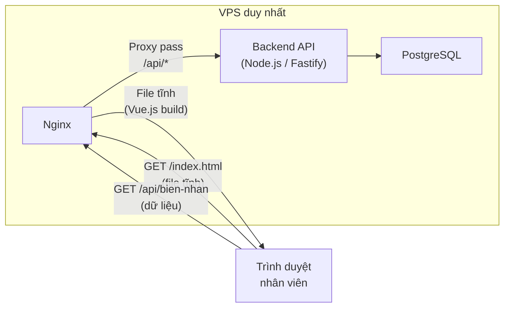

# So Sánh Công Nghệ & Yêu Cầu VPS — Dự Án TMQ Express

> **Mục đích tài liệu**: So sánh các phương án công nghệ phổ biến cho dự án TMQ Express, bao gồm ước tính tài nguyên VPS tương ứng. Giúp đội dự án và khách hàng hiểu rõ sự đánh đổi giữa **chi phí hạ tầng** và **lựa chọn công nghệ**.

> [!NOTE]
> Quy mô dự án: **~3-10 người dùng đồng thời**, 3 văn phòng (SG, CT, RG). Dữ liệu chủ yếu là biên nhận hàng hóa và bảng kê.

---

## 1. Tổng Quan 4 Phương Án Công Nghệ

| | 🟢 PA1 — Node.js *(Đang chọn)* | 🔵 PA2 — Java Spring Boot | 🟣 PA3 — .NET Core | 🟠 PA4 — PHP Laravel |
|---|---|---|---|---|
| **Frontend** | Vue.js 3 | Vue.js 3 hoặc React | Vue.js 3 hoặc React | Vue.js 3 hoặc React |
| **Backend** | Node.js + Fastify | Java 21 + Spring Boot | .NET 8 + ASP.NET Core | PHP 8.3 + Laravel 11 |
| **Database** | PostgreSQL 16 | PostgreSQL hoặc MySQL | PostgreSQL hoặc SQL Server | MySQL 8 |
| **ORM** | Prisma / Drizzle | Hibernate / JPA | Entity Framework Core | Eloquent |
| **PDF** | pdfmake | iText / JasperReports | QuestPDF / Puppeteer | DomPDF / Snappy |
| **Proxy** | Caddy / Nginx | Nginx | Nginx / IIS | Nginx |
| **Ngôn ngữ** | JavaScript / TypeScript | Java | C# | PHP |
| **Bản quyền** | 0 đồng | 0 đồng | 0 đồng (Linux) | 0 đồng |

---

## 2. So Sánh Tài Nguyên — Toàn Bộ Stack (Backend + Database + Frontend)

### RAM ước tính khi chạy (idle + light load)

| Thành phần | 🟢 Node.js | 🔵 Java Spring | 🟣 .NET Core | 🟠 PHP Laravel |
|---|---|---|---|---|
| HĐH Linux | 200-300 MB | 200-300 MB | 200-300 MB | 200-300 MB |
| **Backend (Runtime)** | **50-100 MB** | **300-500 MB** | **200-400 MB** | **100-200 MB** |
| **Database (PostgreSQL/MySQL)** | **200-500 MB** | **200-500 MB** | **200-500 MB** | **200-400 MB** |
| **Frontend (Nginx static)** | **20-50 MB** | **20-50 MB** | **20-50 MB** | **20-50 MB** |
| PDF + QR Engine | 10-20 MB | 50-100 MB | 10-50 MB | 50-100 MB |
| ||||
| **🔢 TỔNG RAM** | **~500-970 MB** | **~770-1.45 GB** | **~630-1.3 GB** | **~570-1.05 GB** |
| **📊 % sử dụng VPS 2GB** | **~25-48%** | **~39-73%** | **~32-65%** | **~29-53%** |
| **📊 % sử dụng VPS 4GB** | **~13-24%** | **~19-36%** | **~16-33%** | **~14-26%** |

### CPU ước tính (vCPU)

| Tình huống | 🟢 Node.js | 🔵 Java Spring | 🟣 .NET Core | 🟠 PHP Laravel |
|---|---|---|---|---|
| **Idle (rảnh)** | ~1-3% | ~3-8% | ~2-5% | ~1-3% |
| **Light load (~5 users)** | ~5-15% | ~10-25% | ~8-20% | ~5-15% |
| **Peak (~10 users đồng thời)** | ~15-30% | ~25-50% | ~20-40% | ~15-35% |
| **vCPU tối thiểu** | **1 vCPU** | **2 vCPU** | **2 vCPU** | **1 vCPU** |

> [!NOTE]
> CPU usage thấp vì workload chủ yếu là CRUD + render PDF — không có tác vụ tính toán nặng. **1 vCPU** là đủ cho Node.js/PHP với quy mô TMQ Express.

### Biểu đồ tổng RAM (Backend + DB + Frontend + OS)

```text
Tổng RAM sử dụng — Toàn bộ stack trên 1 VPS
═══════════════════════════════════════════════════════════════════

🟢 Node.js       ████████░░░░░░░░░░░░░░░░░░░░░░   ~500-970 MB
🟠 PHP Laravel   ██████████░░░░░░░░░░░░░░░░░░░░   ~570 MB-1.05 GB
🟣 .NET Core     ████████████░░░░░░░░░░░░░░░░░░   ~630 MB-1.3 GB
🔵 Java Spring   ████████████████░░░░░░░░░░░░░░   ~770 MB-1.45 GB
                  ─ ─ ─ ─ ─ ─ ─ ─ ─ ─ ─ ─ ─ ─ ─ ─ ─ ─ ─ ─ ─ ─
VPS 2GB           ████████████████████████████████  2.0 GB

                  |        |         |         |         |
                  0       500 MB    1 GB     1.5 GB    2 GB
```

---

## 3. VPS Khuyến Nghị Theo Phương Án

| | 🟢 Node.js | 🔵 Java Spring | 🟣 .NET Core | 🟠 PHP Laravel |
|---|---|---|---|---|
| **RAM tối thiểu** | 1 GB | 2 GB | 2 GB | 1 GB |
| **RAM khuyến nghị** | **2 GB** | **4 GB** | **4 GB** | **2 GB** |
| **vCPU** | 1 | 2 | 2 | 1 |
| **Ổ cứng (SSD)** | 20 GB | 30 GB | 30 GB | 20 GB |
| **HĐH** | Ubuntu 22.04 | Ubuntu 22.04 | Ubuntu 22.04 | Ubuntu 22.04 |

> [!IMPORTANT]
> **Java Spring Boot** cần VPS mạnh nhất do JVM tiêu thụ RAM lớn (heap mặc định 256-512MB). Đây là đánh đổi lớn nhất khi chọn Java.

---

## 4. Chi Phí VPS Hàng Tháng (Ước Tính)

Giá tham chiếu từ các nhà cung cấp VPS Việt Nam (2026):

| VPS Spec | 🟢 Node.js | 🔵 Java Spring | 🟣 .NET Core | 🟠 PHP Laravel |
|---|---|---|---|---|
| **Cấu hình cần** | 2GB / 1 vCPU | 4GB / 2 vCPU | 4GB / 2 vCPU | 2GB / 1 vCPU |
| **Tinh Phong / VinaHost** | ~100-150K | ~250-400K | ~250-400K | ~100-150K |
| **Vultr / DigitalOcean** | ~$6-12/th | ~$12-24/th | ~$12-24/th | ~$6-12/th |
| **Chênh lệch so với PA1** | — | **+100-250K/th** | **+100-250K/th** | Tương đương |

### Chi phí VPS theo năm

| | 🟢 Node.js | 🔵 Java Spring | 🟣 .NET Core | 🟠 PHP Laravel |
|---|---|---|---|---|
| **Chi phí / năm** | ~1.2-1.8 triệu | ~3.0-4.8 triệu | ~3.0-4.8 triệu | ~1.2-1.8 triệu |
| **Chênh lệch / năm** | — | **+1.8-3.0 triệu** | **+1.8-3.0 triệu** | Tương đương |

---

## 5. So Sánh Phi Kỹ Thuật

### Nguồn nhân lực & Cộng đồng tại Việt Nam

| Tiêu chí | 🟢 Node.js | 🔵 Java Spring | 🟣 .NET Core | 🟠 PHP Laravel |
|---|---|---|---|---|
| **Dễ tuyển dụng** | ⭐⭐⭐ | ⭐⭐⭐⭐⭐ | ⭐⭐⭐⭐ | ⭐⭐⭐⭐ |
| **Chi phí nhân sự** | Trung bình | Cao | Cao | Thấp-Trung bình |
| **Cộng đồng VN** | Lớn | Rất lớn | Lớn | Rất lớn |
| **Tài liệu TV** | Nhiều | Rất nhiều | Nhiều | Rất nhiều |

### Phù hợp với quy mô dự án

| Tiêu chí | 🟢 Node.js | 🔵 Java Spring | 🟣 .NET Core | 🟠 PHP Laravel |
|---|---|---|---|---|
| **Dự án nhỏ (<10 users)** | ⭐⭐⭐⭐⭐ | ⭐⭐⭐ | ⭐⭐⭐ | ⭐⭐⭐⭐⭐ |
| **Dự án trung bình** | ⭐⭐⭐⭐ | ⭐⭐⭐⭐⭐ | ⭐⭐⭐⭐⭐ | ⭐⭐⭐⭐ |
| **Dự án lớn (enterprise)** | ⭐⭐⭐ | ⭐⭐⭐⭐⭐ | ⭐⭐⭐⭐⭐ | ⭐⭐⭐ |
| **Tốc độ phát triển** | ⭐⭐⭐⭐⭐ | ⭐⭐⭐ | ⭐⭐⭐⭐ | ⭐⭐⭐⭐⭐ |
| **Hiệu năng runtime** | ⭐⭐⭐⭐ | ⭐⭐⭐⭐⭐ | ⭐⭐⭐⭐⭐ | ⭐⭐⭐ |

---

## 6. Đánh Giá Tổng Hợp Cho Dự Án TMQ Express

| Tiêu chí | 🟢 Node.js | 🔵 Java Spring | 🟣 .NET Core | 🟠 PHP Laravel |
|---|---|---|---|---|
| Chi phí VPS | ⭐⭐⭐⭐⭐ | ⭐⭐⭐ | ⭐⭐⭐ | ⭐⭐⭐⭐⭐ |
| Tốc độ phát triển | ⭐⭐⭐⭐⭐ | ⭐⭐⭐ | ⭐⭐⭐⭐ | ⭐⭐⭐⭐⭐ |
| Tuyển dụng mở rộng | ⭐⭐⭐ | ⭐⭐⭐⭐⭐ | ⭐⭐⭐⭐ | ⭐⭐⭐⭐ |
| Phù hợp quy mô | ⭐⭐⭐⭐⭐ | ⭐⭐⭐ | ⭐⭐⭐⭐ | ⭐⭐⭐⭐ |
| Hệ sinh thái & thư viện | ⭐⭐⭐⭐ | ⭐⭐⭐⭐⭐ | ⭐⭐⭐⭐⭐ | ⭐⭐⭐⭐ |
| **Điểm tổng** | **⭐22/25** | **⭐19/25** | **⭐20/25** | **⭐22/25** |

---

## 7. Frontend — Đặt Ở Đâu?

Vue.js 3 build ra **file tĩnh** (HTML + JS + CSS, tổng ~1-3MB gzip). Có 3 cách triển khai:

### Phương án so sánh

| | PA-F1: Cùng VPS ⭐ | PA-F2: CDN miễn phí | PA-F3: VPS riêng |
|---|---|---|---|
| **Cách hoạt động** | Nginx trên VPS vừa phục vụ file frontend, vừa proxy API backend | File tĩnh đặt trên Cloudflare Pages / Vercel / Netlify (miễn phí) | VPS thứ 2 chỉ chạy Nginx cho frontend |
| **Chi phí thêm** | **0 đồng** | **0 đồng** | ~100K/tháng |
| **Tốc độ tải trang** | Tốt (cùng server) | Rất tốt (CDN toàn cầu) | Tốt |
| **Độ phức tạp** | Đơn giản nhất | Trung bình (cần cấu hình CORS) | Phức tạp |
| **Phù hợp** | ✅ Dự án nhỏ-vừa | Dự án cần CDN, nhiều users | Không cần thiết |

### Khuyến nghị: **PA-F1 — Cùng VPS** (đơn giản nhất)



**Cách hoạt động:**
1. Nginx phục vụ file tĩnh Vue.js (HTML/JS/CSS) khi user truy cập `/`
2. Nginx proxy các request `/api/*` sang backend (Node.js port 3000)
3. **Chỉ cần 1 VPS duy nhất**, không cần thêm gì

**Cấu hình Nginx mẫu:**

```nginx
server {
    listen 80;
    server_name tmq.example.com;

    # Frontend — file tĩnh Vue.js
    location / {
        root /var/www/tmq-frontend/dist;
        try_files $uri $uri/ /index.html;
    }

    # Backend — proxy sang Node.js
    location /api/ {
        proxy_pass http://127.0.0.1:3000;
    }
}
```

> [!TIP]
> Sau khi build Vue.js (`npm run build`), chỉ tạo ra thư mục `dist/` chứa ~5-10 file tĩnh (~1-3MB). Nginx phục vụ file tĩnh **gần như không tốn RAM** (vài MB), nên không ảnh hưởng đến cấu hình VPS.

---

## 8. Network Bandwidth — Cần Bao Nhiêu?

### Ước tính dung lượng mỗi thao tác

| Thao tác | Inbound (gửi lên) | Outbound (tải về) | Tần suất |
|---|---|---|---|
| Tải trang lần đầu (Vue.js build) | — | ~1-3 MB | 1 lần/ngày (cache sau đó) |
| Gọi API lấy danh sách biên nhận | ~0.5 KB | ~5-20 KB | ~50-100 lần/ngày |
| Tạo/sửa 1 biên nhận | ~1-2 KB | ~0.5 KB | ~30-80 lần/ngày |
| Tải PDF biên nhận | — | ~50-100 KB | ~30-80 lần/ngày |
| Xuất bảng kê Excel | — | ~20-50 KB | ~1-3 lần/ngày |
| Autocomplete khách hàng | ~0.1 KB | ~1-2 KB | ~100-200 lần/ngày |

### Tính toán bandwidth hàng ngày (3 VP, ~10 users)

| Loại | Tính toán | Kết quả |
|---|---|---|
| **Tải trang** | 10 users × 3 MB | ~30 MB |
| **API calls** | ~500 requests × 10 KB trung bình | ~5 MB |
| **PDF** | ~80 files × 80 KB | ~6.4 MB |
| **Excel** | ~3 files × 30 KB | ~0.1 MB |
| **Tổng / ngày** | | **~41 MB / ngày** |
| **Tổng / tháng** (25 ngày làm) | | **~1 GB / tháng** |

### So sánh với bandwidth VPS phổ biến

| Nhà cung cấp VPS | Gói rẻ nhất | Bandwidth bao gồm | Đủ cho TMQ? |
|---|---|---|---|
| **Vultr** (1GB RAM) | $5/tháng | 1 TB/tháng | ✅ Dư **~1000 lần** |
| **DigitalOcean** (1GB RAM) | $6/tháng | 1 TB/tháng | ✅ Dư ~1000 lần |
| **Tinh Phong VPS** | ~80K/tháng | Unlimited (trong nước) | ✅ Dư dả |
| **VinaHost** | ~100K/tháng | 500 GB/tháng | ✅ Dư ~500 lần |

> [!NOTE]
> **Kết luận bandwidth**: Dự án TMQ Express chỉ tiêu thụ **~1 GB/tháng** — thậm chí gói VPS rẻ nhất (~$5/tháng) cũng cung cấp **1 TB**, tức dư gấp **1000 lần**. **Không cần lo về bandwidth.**

### Yêu cầu tốc độ mạng tối thiểu

| Vị trí | Tốc độ cần | Ghi chú |
|---|---|---|
| **VPS** | 100 Mbps (shared) | Mọi gói VPS đều đáp ứng |
| **VP chính (SG)** | ≥ 10 Mbps | Đường truyền Internet bình thường là đủ |
| **VP chi nhánh (CT, RG)** | ≥ 5 Mbps | Chỉ gửi/nhận API JSON + PDF nhỏ |

---

## 9. Tổng Kết Cấu Hình VPS Đề Xuất (Với PA1 — Node.js)

| Thông số | Giá trị | Ghi chú |
|---|---|---|
| **RAM** | 4 GB | Tối thiểu 2 GB, chọn 4 GB để dự phòng mở rộng |
| **vCPU** | 2 core | Tối thiểu 1 core, chọn 2 core |
| **SSD** | 40 GB | DB nhỏ (~100MB sau 1 năm), dư cho hệ thống |
| **Bandwidth** | ≥ 500 GB/tháng | Thực tế dùng ~1 GB/tháng |
| **Network** | 100 Mbps shared | Mọi VPS đều có |
| **HĐH** | Ubuntu 22.04 LTS | Ổn định, LTS đến 2027 |
| **Chi phí** | **~250K/tháng** | Vietnix VPS SSD 2 (4GB/2vCPU/40GB) |

---

## 10. Kết Luận & Khuyến Nghị

### Với quy mô TMQ Express (3 VP, <10 users)

> [!TIP]
> **Khuyến nghị: 🟢 Node.js + Fastify** (phương án hiện tại) hoặc 🟠 PHP Laravel

**Lý do:**
1. **Chi phí VPS thấp nhất** — VPS 2GB (~100-150K/tháng) là đủ, tiết kiệm ~2-3 triệu/năm so với Java/.NET
2. **Tốc độ phát triển nhanh** — 1 dev fullstack viết cả frontend (Vue.js) lẫn backend (cùng JavaScript)
3. **Đủ hiệu năng** — 3-10 users đồng thời, Node.js xử lý dư dả
4. **Dễ bảo trì** — Codebase nhỏ gọn, ít boilerplate

### Khi nào nên chọn Java / .NET?

| Tình huống | Khuyến nghị |
|---|---|
| Mở rộng lên **50+ users**, nhiều module phức tạp | Java Spring Boot |
| Đội ngũ kỹ thuật **chủ yếu dùng C#** | .NET Core |
| Cần tích hợp nhiều **hệ thống enterprise** (ERP, SAP) | Java Spring Boot |
| Khách hàng **bắt buộc** dùng SQL Server | .NET Core |

---

## Tài Liệu Liên Quan

| Tài liệu | Mô tả |
|---|---|
| [TechStack_Architecture.md](./TechStack_Architecture.md) | Chi tiết tech stack đang chọn (PA1) |
| [KeHoach_Phase1.md](./KeHoach_Phase1.md) | Kế hoạch triển khai Phase 1 |
