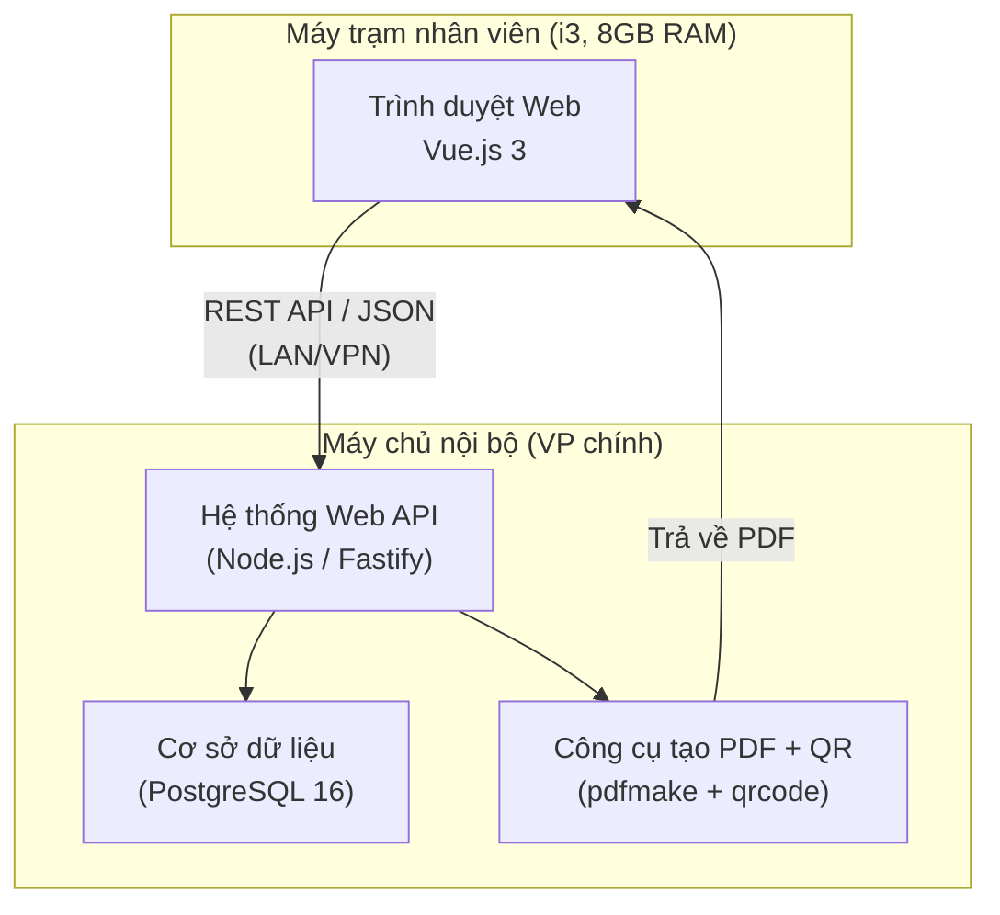
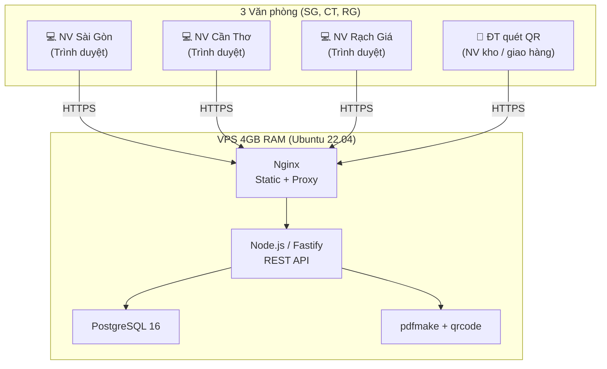

# Công Nghệ & Kiến Trúc Hệ Thống — Phase 1

> Tài liệu kỹ thuật chi tiết về công nghệ và kiến trúc cho dự án ERP TMQ Express.
>
> Đã thống nhất: triển khai trên **VPS thuê** (Cloud). Xem chi tiết tại [SoSanh_CongNghe_VPS.md](./SoSanh_CongNghe_VPS.md)

## Ngăn Xếp Công Nghệ (100% Mã Nguồn Mở)

| Lớp | Công nghệ | Lý do lựa chọn |
|---|---|---|
| **Giao diện (Frontend)** | **Vue.js 3** | Nhẹ hơn các framework khác (như React), dễ bảo trì, hoạt động mượt mà trên máy tính cấu hình thấp. |
| **Biểu đồ thống kê** | **ECharts (Apache)** | Biểu đồ mạnh mẽ (bar, pie, line), miễn phí, hỗ trợ responsive. Dùng cho Dashboard & Báo cáo. |
| **Máy chủ (Backend)** | **Node.js + Fastify** | Tốc độ xử lý nhanh, tiêu thụ ít RAM (~30-50MB khi rảnh), đáp ứng tốt các yêu cầu REST API. |
| **Cơ sở dữ liệu (Database)** | **PostgreSQL 16** | Hệ QTCSDL mã nguồn mở uy tín, hỗ trợ tốt dữ liệu JSON và full-text search. Hoàn toàn miễn phí. |
| **Tạo PDF + QR** | **pdfmake + qrcode** | Tạo PDF biên nhân/phiếu thu/chi có mã QR từ server, thay thế Crystal Reports. |
| **Máy chủ trung gian (Proxy)** | **Nginx** | Hiệu năng cao, phổ biến, proxy API + phục vụ file tĩnh. |
| **Tương tác CSDL (ORM)** | **Prisma** hoặc **Drizzle** | Đảm bảo kiểu dữ liệu an toàn, tự động quản lý phiên bản CSDL. |
| **Xuất Excel** | **ExcelJS** hoặc **SheetJS** | Tạo file Excel bảng kê HĐĐT, xuất báo cáo. |

> [!NOTE]
> **Tại sao chọn PostgreSQL thay vì SQLite?** Với mạng lưới 3 văn phòng (Sài Gòn, Cần Thơ, Rạch Giá) và yêu cầu truy cập đồng thời, PostgreSQL đảm bảo hiệu suất và độ tin cậy dữ liệu cao hơn hẳn SQLite (chỉ thích hợp cho ứng dụng đơn lẻ).

### Ưu & Nhược Điểm Từng Công Nghệ

#### Vue.js 3 (Frontend)

| | Nội dung |
|---|---|
| ✅ **Ưu điểm** | Nhẹ (~33KB gzip), khởi tạo nhanh, phù hợp máy cấu hình thấp |
| ✅ | Cú pháp đơn giản (Composition API), dễ đào tạo nhân sự mới |
| ✅ | Hệ sinh thái đầy đủ (Pinia, Vue Router, Vite) — ít phụ thuộc bên ngoài |
| ✅ | Tài liệu chính thức bằng tiếng Việt, cộng đồng VN đông đảo |
| ⚠️ **Nhược điểm** | Thị trường tuyển dụng nhỏ hơn React (nếu cần mở rộng team sau này) |
| ⚠️ | Ít thư viện UI doanh nghiệp sẵn có so với Angular |

#### Node.js + Fastify (Backend)

| | Nội dung |
|---|---|
| ✅ **Ưu điểm** | Hiệu năng cao — Fastify nhanh gấp ~2× so với Express.js |
| ✅ | Dùng chung ngôn ngữ JavaScript/TypeScript cả frontend lẫn backend |
| ✅ | Tiết kiệm RAM (~30–50MB khi idle), phù hợp VPS nhỏ |
| ✅ | Hệ thống plugin Fastify rõ ràng, dễ mở rộng module |
| ⚠️ **Nhược điểm** | Đơn luồng (single-threaded) — không phù hợp tác vụ CPU-intensive |
| ⚠️ | Hệ sinh thái Fastify nhỏ hơn Express — một số middleware cần tự viết |
| ⚠️ | Xử lý lỗi bất đồng bộ cần đội ngũ có kinh nghiệm |

#### PostgreSQL 16 (Database)

| | Nội dung |
|---|---|
| ✅ **Ưu điểm** | Hoàn toàn miễn phí, không giới hạn dung lượng hay kết nối |
| ✅ | Hỗ trợ JSON/JSONB — linh hoạt cho dữ liệu bán cấu trúc (hóa đơn) |
| ✅ | Full-text search tốt — tìm kiếm biên nhận theo tên/địa chỉ |
| ✅ | Hỗ trợ truy cập đồng thời cao, đảm bảo ACID |
| ⚠️ **Nhược điểm** | Cần kiến thức quản trị (backup, tuning, replication) |
| ⚠️ | Tiêu tốn RAM nhiều hơn SQLite/MySQL ở quy mô nhỏ |

#### pdfmake + qrcode (Tạo PDF + Mã QR)

| | Nội dung |
|---|---|
| ✅ **Ưu điểm** | pdfmake: nhẹ, nhanh, tạo PDF hoàn toàn từ JSON — không cần trình duyệt |
| ✅ | qrcode: tạo mã QR nhúng trên phiếu biên nhận — NV quét bằng điện thoại cập nhật trạng thái |
| ✅ | Cả hai đều miễn phí, mã nguồn mở (MIT) |
| ⚠️ **Nhược điểm** | pdfmake: khó tùy biến layout phức tạp (bảng lồng, hình ảnh) |

#### Nginx (Proxy + Static)

| | Nội dung |
|---|---|
| ✅ **Ưu điểm** | Hiệu năng cực cao, tài liệu phong phú, cộng đồng lớn |
| ✅ | Phục vụ file tĩnh Vue.js + proxy API backend trên cùng 1 server |
| ✅ | Hỗ trợ SSL/TLS với Let's Encrypt (certbot) |
| ⚠️ **Nhược điểm** | Cấu hình phức tạp hơn Caddy, HTTPS cần cài đặt thủ công |

#### Prisma / Drizzle (ORM)

| | Nội dung |
|---|---|
| ✅ **Ưu điểm** | Prisma: type-safe, auto-migration, Prisma Studio để xem dữ liệu trực quan |
| ✅ | Drizzle: nhẹ hơn, SQL-like syntax, hiệu năng tốt hơn Prisma |
| ✅ | Cả hai đều hỗ trợ TypeScript tuyệt vời |
| ⚠️ **Nhược điểm** | Prisma: nặng hơn (engine riêng), query phức tạp đôi khi chậm |
| ⚠️ | Drizzle: còn khá mới, hệ sinh thái và tài liệu chưa phong phú |

---

## Kiến Trúc Tổng Thể

> [!NOTE]
> Đã thống nhất chọn **Phương án B — Thuê VPS** (Cloud). Phương án A (On-Premise) giữ lại để tham khảo.

### Phương án A — On-Premise (Máy chủ nội bộ)

#### Ưu & Nhược Điểm — Phương án A (On-Premise)

| | Nội dung |
|---|---|
| ✅ **Ưu điểm** | Dữ liệu nằm hoàn toàn trong nội bộ — kiểm soát bảo mật tối đa |
| ✅ | Không phụ thuộc Internet — hệ thống vẫn hoạt động khi mất mạng ngoài |
| ✅ | Không phát sinh chi phí hàng tháng cho hosting/VPS |
| ✅ | Tốc độ truy cập cực nhanh qua mạng LAN nội bộ |
| ✅ | Phù hợp quy định về lưu trữ dữ liệu tại chỗ (data residency) |
| ⚠️ **Nhược điểm** | Cần đầu tư máy chủ vật lý ban đầu (hoặc tận dụng PC hiện có) |
| ⚠️ | Khách hàng phải tự quản trị server (hoặc thuê dịch vụ IT) |
| ⚠️ | Văn phòng chi nhánh (Cần Thơ, Rạch Giá) cần kết nối VPN về VP chính |
| ⚠️ | Rủi ro mất dữ liệu nếu không có chiến lược backup tốt |
| ⚠️ | Khó mở rộng quy mô khi lượng nghiệp vụ tăng đột biến |

### Phương án B — Thuê VPS ⭐ (Đang chọn)

#### Ưu & Nhược Điểm — Phương án B (Cloud)

| | Nội dung |
|---|---|
| ✅ **Ưu điểm** | Không cần đầu tư phần cứng máy chủ |
| ✅ | Nhà cung cấp cloud lo backup, UPS, đường truyền — giảm rủi ro |
| ✅ | Tất cả chi nhánh truy cập bình đẳng qua Internet, không cần VPN |
| ✅ | Dễ dàng mở rộng (nâng cấp RAM/CPU VPS) khi nghiệp vụ tăng |
| ✅ | Triển khai và cập nhật phần mềm nhanh hơn (chỉ cần deploy 1 nơi) |
| ⚠️ **Nhược điểm** | Phát sinh chi phí hàng tháng cho VPS (~150.000–500.000 VNĐ/tháng) |
| ⚠️ | Phụ thuộc Internet — mất mạng thì không thể làm việc |
| ⚠️ | Dữ liệu nằm trên server bên ngoài — cần tin tưởng nhà cung cấp |
| ⚠️ | Tốc độ truy cập chậm hơn LAN (phụ thuộc chất lượng đường truyền) |
| ⚠️ | Cần cấu hình bảo mật kỹ (firewall, SSL, SSH key) để chống tấn công |

### So Sánh Nhanh Hai Phương Án

| Tiêu chí | Phương án A (On-Premise) | Phương án B (Cloud) |
|---|---|---|
| **Chi phí ban đầu** | Cao (mua/tận dụng server) | Thấp (chỉ cần thuê VPS) |
| **Chi phí vận hành** | Thấp (điện, bảo trì) | Trung bình (~150K–500K/tháng) |
| **Bảo mật dữ liệu** | ⭐⭐⭐⭐⭐ (Internal) | ⭐⭐⭐⭐ (cần cấu hình tốt) |
| **Độ ổn định** | Phụ thuộc hạ tầng nội bộ | Phụ thuộc nhà cung cấp cloud |
| **Truy cập chi nhánh** | Cần VPN | Trực tiếp qua Internet |
| **Khả năng mở rộng** | Hạn chế | Linh hoạt |
| **Khả năng chịu lỗi** | Tự quản lý | Nhà cung cấp hỗ trợ |
| **Phù hợp với** | DN muốn kiểm soát hoàn toàn | DN muốn triển khai nhanh, ít lo vận hành |

---

## Ước Tính Hiệu Năng

**Phía máy trạm nhân viên (i3, 8GB RAM):**

| Thành phần | RAM ước tính | Ghi chú |
|---|---|---|
| HĐH Windows | ~2GB - 3GB | Bình thường |
| Trình duyệt (1-2 tab) | ~200MB - 400MB | Đủ để vận hành app |
| **Tổng** | **~3GB - 3.5GB** | **Máy vẫn còn dư dả cho tác vụ khác** |

**Phía máy chủ (On-Premise hoặc VPS):**

| Thành phần | RAM ước tính | Ghi chú |
|---|---|---|
| PostgreSQL 16 | ~200MB - 500MB | Rất ổn định |
| Tiến trình Node.js | ~50MB - 100MB | Nhẹ nhàng |
| **Tổng server** | **~250MB - 600MB** | **VPS 4GB RAM dư dả cho cloud** |

---

## Chi Phí Bản Quyền Phần Mềm

| Thành phần | Chi phí bản quyền |
|---|---|
| Nền tảng Frontend (Vue.js 3) | **0 VNĐ** (MIT) |
| Biểu đồ thống kê (ECharts) | **0 VNĐ** (Apache 2.0) |
| Máy chủ API (Node.js + Fastify) | **0 VNĐ** (MIT) |
| CSDL (PostgreSQL) | **0 VNĐ** (PostgreSQL License) |
| PDF + QR (pdfmake + qrcode) | **0 VNĐ** (MIT) |
| Xuất Excel (ExcelJS / SheetJS) | **0 VNĐ** (MIT) |
| Hệ điều hành máy chủ (Ubuntu Linux) | **0 VNĐ** |
| **Tổng chi phí** | **0 VNĐ / Trọn đời** |

*Ghi chú: Chi phí dịch vụ kế toán HĐĐT do khách hàng chi trả riêng theo hợp đồng với kế toán dịch vụ.*
