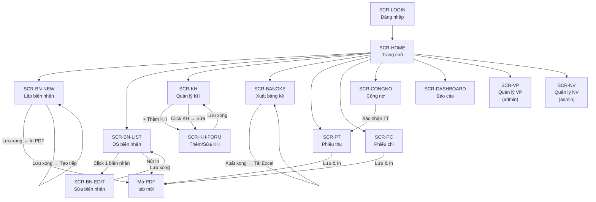
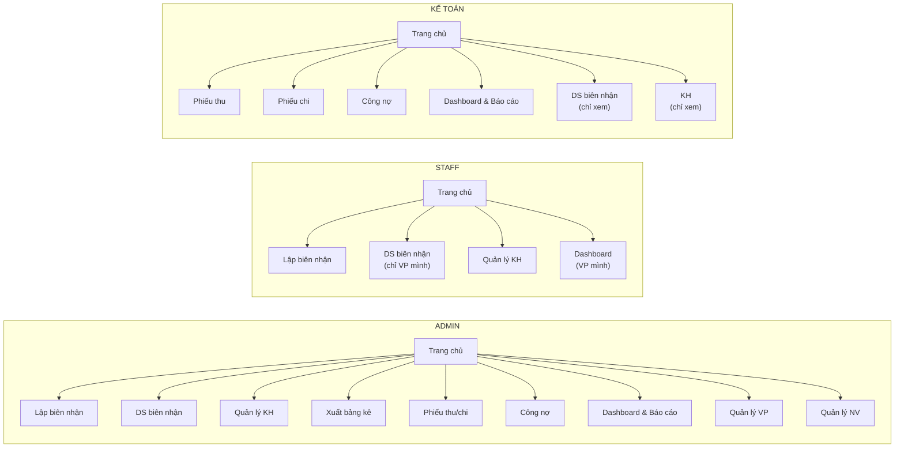

  # Thiết Kế Giao Diện & Luồng Điều Hướng — Phase 1

> **Mục đích tài liệu**: Mô tả chi tiết toàn bộ màn hình trong Phase 1, bao gồm layout, các thành phần UI, và luồng chuyển giao (navigation flow) giữa các màn hình.

> [!NOTE]
> Tham khảo thêm: [NghiepVu_ChiTiet_Phase1.md](./NghiepVu_ChiTiet_Phase1.md) · [DatabaseSchema_Phase1.md](./DatabaseSchema_Phase1.md)

---

## Mục Lục Màn Hình

| # | Màn hình | Mã | Quyền truy cập |
|---|---|---|---|
| 1 | [Đăng nhập](#1-màn-hình-đăng-nhập) | `SCR-LOGIN` | Tất cả |
| 2 | [Trang chủ (Dashboard)](#2-trang-chủ-dashboard) | `SCR-HOME` | admin, staff, accountant |
| 3 | [Lập biên nhận hàng hóa](#3-lập-biên-nhận-hàng-hóa) | `SCR-BN-NEW` | admin, staff |
| 4 | [Danh sách & Tra cứu biên nhận](#4-danh-sách--tra-cứu-biên-nhận) | `SCR-BN-LIST` | admin, staff, accountant (read-only) |
| 5 | [Sửa biên nhận](#5-sửa-biên-nhận) | `SCR-BN-EDIT` | admin, staff |
| 6 | [Quản lý khách hàng](#6-quản-lý-khách-hàng) | `SCR-KH` | admin, staff, accountant (read-only) |
| 7 | [Form thêm/sửa khách hàng](#7-form-thêmsửa-khách-hàng) | `SCR-KH-FORM` | admin, staff |
| 8 | [Xuất bảng kê HĐĐT](#8-xuất-bảng-kê-hđđt) | `SCR-BANGKE` | admin |
| 9 | [Quản lý văn phòng](#9-quản-lý-văn-phòng) | `SCR-VP` | admin |
| 10 | [Quản lý nhân viên](#10-quản-lý-nhân-viên) | `SCR-NV` | admin |
| 11 | [Phiếu thu](#11-phiếu-thu) | `SCR-PT` | admin, accountant |
| 12 | [Phiếu chi](#12-phiếu-chi) | `SCR-PC` | admin, accountant |
| 13 | [Bảng công nợ](#13-bảng-công-nợ) | `SCR-CONGNO` | admin, accountant |
| 14 | [Dashboard thống kê & Báo cáo](#14-dashboard-thống-kê--báo-cáo) | `SCR-DASHBOARD` | admin, accountant, staff (VP mình) |

---

## Luồng Điều Hướng Tổng Thể (Navigation Flow)



### Luồng chi tiết theo vai trò



---

## Thanh Điều Hướng Chung (Sidebar + Header)

Mọi màn hình (trừ `SCR-LOGIN`) đều có chung layout:

```text
┌──────────────────────────────────────────────────────────────────┐
│  HEADER: Logo TMQ Express     [VP: Tp.HCM]  [Nguyễn Văn A ▼]   │
│                                              ├─ Đổi mật khẩu    │
│                                              └─ Đăng xuất        │
├────────────┬─────────────────────────────────────────────────────┤
│  SIDEBAR   │                                                     │
│            │              NỘI DUNG CHÍNH                         │
│  🏠 Trang chủ│          (thay đổi theo từng màn hình)            │
│  📝 Lập BN  │     ← admin, staff                                │
│  📋 DS BN   │     ← admin, staff, KT (chỉ xem)                 │
│  👥 Khách hàng│                                                  │
│  📊 Bảng kê  │     ← Chỉ admin                                  │
│  ──────────│  KẾ TOÁN                                        │
│  💵 Phiếu thu │     ← admin, accountant                          │
│  💸 Phiếu chi │     ← admin, accountant                          │
│  📒 Công nợ  │     ← admin, accountant                          │
│  ──────────│  THỐNG KÊ                                        │
│  📈 Dashboard│     ← admin, accountant, staff (VP mình)          │
│  📄 Báo cáo  │     ← admin, accountant                          │
│  ──────────│  QUẢN TRỊ                                        │
│  🏢 Văn phòng│     ← Chỉ admin                                  │
│  👤 Nhân viên│     ← Chỉ admin                                  │
├────────────┴─────────────────────────────────────────────────────┤
│  FOOTER: © 2026 TMQ Express — v1.0                               │
└──────────────────────────────────────────────────────────────────┘
```

**Quy tắc sidebar:**
- Menu item đang active được highlight (nền đậm hơn)
- Staff không thấy: Bảng kê, Phiếu thu/chi, Công nợ, Báo cáo, Văn phòng, Nhân viên
- Accountant không thấy: Lập BN, Bảng kê, Văn phòng, Nhân viên
- Sidebar có thể thu gọn (collapse) trên màn hình nhỏ

---

## 1. Màn Hình Đăng Nhập

**Mã**: `SCR-LOGIN` · **Route**: `/login`

```text
┌──────────────────────────────────────────────────────────────────┐
│                                                                  │
│                    ┌──────────────────────┐                      │
│                    │   🚚 TMQ EXPRESS     │                      │
│                    │   Hệ thống quản lý   │                      │
│                    │   vận chuyển hàng hóa│                      │
│                    ├──────────────────────┤                      │
│                    │                      │                      │
│                    │  Tên đăng nhập       │                      │
│                    │  ┌──────────────┐    │                      │
│                    │  │              │    │                      │
│                    │  └──────────────┘    │                      │
│                    │                      │                      │
│                    │  Mật khẩu            │                      │
│                    │  ┌──────────────┐    │                      │
│                    │  │         [👁]  │    │                      │
│                    │  └──────────────┘    │                      │
│                    │                      │                      │
│                    │  [■■■ ĐĂNG NHẬP ■■■] │                      │
│                    │                      │                      │
│                    │  ⚠ Sai tài khoản     │ ← Ẩn mặc định       │
│                    │    hoặc mật khẩu     │                      │
│                    └──────────────────────┘                      │
│                                                                  │
└──────────────────────────────────────────────────────────────────┘
```

**Hành vi:**
- Nhấn Enter hoặc click "ĐĂNG NHẬP" → gửi request xác thực
- Thành công → redirect tới `SCR-HOME` (`/`)
- Thất bại → hiện thông báo lỗi dưới nút đăng nhập
- Nếu đã đăng nhập (có token hợp lệ) → redirect thẳng `SCR-HOME`
- Token hết hạn (8 giờ) → redirect về `SCR-LOGIN`

---

## 2. Trang Chủ (Dashboard)

**Mã**: `SCR-HOME` · **Route**: `/`

```text
┌────────────┬─────────────────────────────────────────────────────┐
│  SIDEBAR   │  TRANG CHỦ                    VP: Tp.HCM           │
│            │─────────────────────────────────────────────────────│
│            │                                                     │
│            │  Xin chào, Nguyễn Văn A! (Ca làm việc: 07:00-15:00)│
│            │                                                     │
│            │  ┌────────────┐ ┌────────────┐ ┌────────────┐      │
│            │  │ 📝 12      │ │ 🚚 5       │ │ 📊 3       │      │
│            │  │ Biên nhận  │ │ Đang vận   │ │ Chờ bảng kê│      │
│            │  │ hôm nay    │ │ chuyển     │ │ HĐĐT       │      │
│            │  └────────────┘ └────────────┘ └────────────┘      │
│            │                                                     │
│            │  ┌────────────┐                                    │
│            │  │ 💰 2       │                                    │
│            │  │ Chưa thu   │                                    │
│            │  │ cước       │                                    │
│            │  └────────────┘                                    │
│            │                                                     │
│            │  THAO TÁC NHANH                                    │
│            │  [+ Lập biên nhận mới]  [📊 Xuất bảng kê]          │
│            │                                                     │
└────────────┴─────────────────────────────────────────────────────┘
```

**Hành vi:**
- Các card thống kê click được → điều hướng tới màn hình tương ứng
- "Biên nhận hôm nay" → `SCR-BN-LIST` (filter ngày hôm nay)
- "Chờ bảng kê HĐĐT" → `SCR-BANGKE`
- "Lập biên nhận mới" → `SCR-BN-NEW`
- Dữ liệu thống kê filter theo VP của NV đang đăng nhập

---

## 3. Lập Biên Nhận Hàng Hóa

**Mã**: `SCR-BN-NEW` · **Route**: `/bien-nhan/tao-moi`

```text
┌────────────┬─────────────────────────────────────────────────────┐
│  SIDEBAR   │  LẬP BIÊN NHẬN HÀNG HÓA                           │
│            │─────────────────────────────────────────────────────│
│            │  ┌─ THÔNG TIN CHUNG ──────────────────────────────┐│
│            │  │ Mã biên nhận: [SGRG-0048] (tự động, read-only) ││
│            │  │ Ngày nhận: [20/03/2026 ▼]   NV: Nguyễn Văn A  ││
│            │  │ VP gửi: [Tp.HCM] (auto)  VP nhận: [Rạch Giá ▼]││
│            │  │ Cước vận chuyển: [________]đ                    ││
│            │  │ Trạng thái thu: (●) Đã thu (○) Chưa thu (○) Nợ ││
│            │  └────────────────────────────────────────────────┘│
│            │                                                     │
│            │  ┌─ 👤 BÊN GỬI ───────┐ ┌─ 👤 BÊN NHẬN ─────────┐│
│            │  │ Đơn vị:[________🔍] │ │ Đơn vị:[________🔍]    ││
│            │  │  ┌─ Gợi ý KH ────┐ │ │ Tên:   [____________]  ││
│            │  │  │ Cty Tâm An     │ │ │ ĐT:    [____________]  ││
│            │  │  │ CH Bình Minh   │ │ │ Đ/chỉ: [____________]  ││
│            │  │  └────────────────┘ │ │ CCCD:  [____________]  ││
│            │  │ Tên:   [________]   │ └────────────────────────┘│
│            │  │ ĐT:    [________]   │                           │
│            │  │ Đ/chỉ: [________]   │                           │
│            │  └─────────────────────┘                           │
│            │                                                     │
│            │  ┌─ 📦 HÀNG HÓA ─────────────────────────────────┐│
│            │  │ Tên hàng: [________________________________]   ││
│            │  │ Trọng lượng: [____]kg   Giá trị: [________]đ  ││
│            │  │ Tiền thu hộ (CoD): [________]đ                 ││
│            │  │ [_] Hàng dễ vỡ, hư hỏng không đền bù         ││
│            │  │ Hình thức: (○) Tận nơi (○) Gọi điện (○) Tự tới││
│            │  │ [_] Cần xuất HĐĐT (đưa vào bảng kê)           ││
│            │  │ Ghi chú: [________________________________]    ││
│            │  └────────────────────────────────────────────────┘│
│            │                                                     │
│            │  [💾 LƯU & IN BIÊN NHẬN]  [💾 LƯU]  [✖ HỦY/RESET]│
└────────────┴─────────────────────────────────────────────────────┘
```

**Hành vi & điều hướng:**

| Hành động | Kết quả |
|---|---|
| Thay đổi VP nhận | Mã biên nhận tự cập nhật ngay |
| Gõ ≥ 2 ký tự ở ô "Đơn vị" gửi/nhận | Dropdown gợi ý KH (tối đa 5) |
| Chọn KH từ gợi ý | Auto-fill: Đơn vị, Tên, ĐT, Địa chỉ, MST |
| Click "LƯU & IN" | Validate → Lưu → Mở PDF tab mới → Reset form |
| Click "LƯU" | Validate → Lưu → Toast "Đã lưu" → Reset form |
| Click "HỦY/RESET" | Confirm dialog → Reset toàn bộ form (giữ VP gửi/nhận) |
| Tick "Cần xuất HĐĐT" + Lưu | Lưu BN với `can_xuat_hddt = true` → hiển thị trong bảng kê |
| Validation lỗi | Highlight trường lỗi + thông báo cụ thể |

---

## 4. Danh Sách & Tra Cứu Biên Nhận

**Mã**: `SCR-BN-LIST` · **Route**: `/bien-nhan`

```text
┌────────────┬─────────────────────────────────────────────────────┐
│  SIDEBAR   │  DANH SÁCH BIÊN NHẬN              [+ Tạo mới]      │
│            │─────────────────────────────────────────────────────│
│            │  BỘ LỌC                                             │
│            │  🔍 [Tìm mã BN, tên, SĐT...]                      │
│            │  Từ ngày:[20/03/2026] Đến:[20/03/2026]             │
│            │  VP gửi:[Tất cả ▼] VP nhận:[Tất cả ▼]             │
│            │  TT vận chuyển:[Tất cả ▼] TT thu:[Tất cả ▼]       │
│            │  [🔍 Lọc]  [↺ Xóa bộ lọc]                         │
│            │─────────────────────────────────────────────────────│
│            │  │ Mã BN    │Ngày    │Tuyến │Người gửi│Cước  │Thu │VC│
│            │  │──────────│────────│──────│─────────│──────│───│──│
│            │  │SGRG-0048 │20/03/26│SG→RG │Cty Tâm  │150K  │✅ │🟡│
│            │  │SGCT-0003 │20/03/26│SG→CT │A. Tùng  │ 30K  │❌ │🟢│
│            │  │SGCT-0002 │19/03/26│SG→CT │CH Bình  │250K  │💳 │🔴│
│            │  │...       │        │      │         │      │   │  │
│            │─────────────────────────────────────────────────────│
│            │  Hiển thị 1-20 / 156 biên nhận    [< 1 2 3 ... 8 >]│
└────────────┴─────────────────────────────────────────────────────┘
```

**Ký hiệu trạng thái:** ✅ Đã thu · ❌ Chưa thu · 💳 Công nợ · 🟢 Đã giao · 🟡 Đang VC · 🔴 Chờ VC

**Hành vi & điều hướng:**

| Hành động | Kết quả |
|---|---|
| Click vào 1 dòng biên nhận | → `SCR-BN-EDIT` (`/bien-nhan/:id/sua`) |
| Click "Tạo mới" | → `SCR-BN-NEW` |
| Click icon máy in ở cuối dòng | Mở PDF biên nhận trên tab mới |
| Thay đổi bộ lọc + click "Lọc" | Reload danh sách theo filter |
| Staff đăng nhập | Chỉ thấy BN thuộc VP mình |
| Phân trang | 20 dòng/trang, sắp xếp mới nhất trước |

---

## 5. Sửa Biên Nhận

**Mã**: `SCR-BN-EDIT` · **Route**: `/bien-nhan/:id/sua`

Layout **giống hệt** `SCR-BN-NEW` nhưng có các điểm khác:

```text
┌────────────┬─────────────────────────────────────────────────────┐
│  SIDEBAR   │  SỬA BIÊN NHẬN: SGRG-0048                         │
│            │─────────────────────────────────────────────────────│
│            │  ℹ Biên nhận này đã đưa vào bảng kê BK-20260320-001│
│            │    (ngày 20/03/2026).                               │
│            │─────────────────────────────────────────────────────│
│            │  (Form giống SCR-BN-NEW, các trường đã điền sẵn)   │
│            │                                                     │
│            │  Mã biên nhận: [SGRG-0048] ← KHÔNG SỬA ĐƯỢC       │
│            │  NV nhập: Nguyễn Văn A      ← KHÔNG SỬA ĐƯỢC      │
│            │  Ngày tạo: 20/03/2026 09:15 ← KHÔNG SỬA ĐƯỢC      │
│            │                                                     │
│            │  Trạng thái VC: [Chờ vận chuyển ▼]                 │
│            │  (Chờ VC → Đang VC → Đã giao, có thể quay lại)    │
│            │                                                     │
│            │  [💾 LƯU] [🖨 IN BIÊN NHẬN] [← QUAY LẠI DS]       │
└────────────┴─────────────────────────────────────────────────────┘
```

**Hành vi & điều hướng:**

| Hành động | Kết quả |
|---|---|
| Click "LƯU" | Validate → Cập nhật → Toast → Ở lại `SCR-BN-EDIT` |
| Click "IN BIÊN NHẬN" | Mở PDF tab mới |
| Click "QUAY LẠI DS" | → `SCR-BN-LIST` |

---

## 6. Quản Lý Khách Hàng

**Mã**: `SCR-KH` · **Route**: `/khach-hang`

```text
┌────────────┬─────────────────────────────────────────────────────┐
│  SIDEBAR   │  QUẢN LÝ KHÁCH HÀNG                [+ Thêm KH mới]│
│            │─────────────────────────────────────────────────────│
│            │  🔍 [Tìm tên, SĐT, mã KH, MST...]                │
│            │  Trạng thái: [Đang hoạt động ▼]                    │
│            │─────────────────────────────────────────────────────│
│            │  │ Mã KH  │Tên đơn vị    │Người LH  │SĐT       │MST│
│            │  │────────│──────────────│──────────│──────────│───│
│            │  │KH-001  │Cty Tâm An    │Ng. Văn A │0901234567│031│
│            │  │KH-002  │CH Bình Minh  │Trần B    │0987654321│   │
│            │  │KH-003  │Kho Phú Quốc  │Lê C      │0911222333│030│
│            │  │...     │              │          │          │   │
│            │─────────────────────────────────────────────────────│
│            │                                                     │
│            │  ┌─ CHI TIẾT KH: KH-001 ─────────────────────────┐│
│            │  │ Tên đơn vị: Cty TNHH Tâm An                    ││
│            │  │ Người LH: Nguyễn Văn A   ĐT: 0901 234 567     ││
│            │  │ Địa chỉ: 123 Nguyễn Trãi, Q5, HCM             ││
│            │  │ MST: 0312345678   Email: taman@email.com       ││
│            │  │ Ghi chú: Khách VIP, giao hàng ưu tiên          ││
│            │  │─────────────────────────────────────────────────││
│            │  │ 📊 LỊCH SỬ GIAO DỊCH (12 biên nhận)            ││
│            │  │ │SGRG-0048│20/03│Gửi│150,000đ│                 ││
│            │  │ │SGCT-0003│18/03│Nhận│ 30,000đ│                 ││
│            │  │─────────────────────────────────────────────────││
│            │  │ [✏️ Sửa]   [🗑 Xóa (vô hiệu hóa)]             ││
│            │  └────────────────────────────────────────────────┘│
│            │  Tổng: 156 KH · Hoạt động: 142  [< 1 2 3 ... >]   │
└────────────┴─────────────────────────────────────────────────────┘
```

**Hành vi & điều hướng:**

| Hành động | Kết quả |
|---|---|
| Click "+ Thêm KH mới" | → `SCR-KH-FORM` (mode: thêm mới) |
| Click 1 KH trong bảng | Hiện panel "Chi tiết KH" bên dưới |
| Click "Sửa" trong chi tiết | → `SCR-KH-FORM` (mode: sửa, pre-fill dữ liệu) |
| Click "Xóa" | Confirm dialog → Vô hiệu hóa (`active = false`) |
| Click 1 biên nhận trong lịch sử | → `SCR-BN-EDIT` |
| Gõ ô tìm kiếm (debounce 200ms) | Filter danh sách real-time |

---

## 7. Form Thêm/Sửa Khách Hàng

**Mã**: `SCR-KH-FORM` · **Route**: `/khach-hang/them-moi` hoặc `/khach-hang/:id/sua`

```text
┌────────────┬─────────────────────────────────────────────────────┐
│  SIDEBAR   │  THÊM KHÁCH HÀNG MỚI  (hoặc: SỬA KH: KH-001)     │
│            │─────────────────────────────────────────────────────│
│            │  Mã KH: [KH-004] (tự sinh, read-only)             │
│            │                                                     │
│            │  Tên đơn vị *:  [________________________________] │
│            │  Người liên hệ: [________________________________] │
│            │  Điện thoại:    [________________________________] │
│            │  Địa chỉ:       [________________________________] │
│            │  Email:          [________________________________] │
│            │  Mã số thuế:    [________________________________] │
│            │                  (10 hoặc 13 chữ số)               │
│            │  Ghi chú:       [________________________________] │
│            │                 [________________________________] │
│            │                                                     │
│            │  [💾 LƯU KHÁCH HÀNG]    [← QUAY LẠI]              │
└────────────┴─────────────────────────────────────────────────────┘
```

**Hành vi:**

| Hành động | Kết quả |
|---|---|
| Click "LƯU" | Validate → Lưu → Toast → Redirect `SCR-KH` |
| Click "QUAY LẠI" | → `SCR-KH` (nếu có thay đổi → confirm dialog) |
| MST sai format | Highlight đỏ + "MST phải là 10 hoặc 13 chữ số" |
| Tên đơn vị trống | Highlight đỏ + "Vui lòng nhập tên đơn vị" |

---

## 8. Xuất Bảng Kê HĐĐT

**Mã**: `SCR-BANGKE` · **Route**: `/bang-ke`

```text
┌────────────┬─────────────────────────────────────────────────────┐
│  SIDEBAR   │  XUẤT BẢNG KÊ PHỤC VỤ HĐĐT                        │
│            │─────────────────────────────────────────────────────│
│            │  BỘ LỌC                                             │
│            │  Ngày: [20/03/2026]   VP: [Tp.HCM ▼]              │
│            │  Trạng thái: Chỉ hiện BN chưa đưa vào bảng kê     │
│            │─────────────────────────────────────────────────────│
│            │  [☑ Chọn tất cả]                                    │
│            │  │☑│Mã BN    │Ngày    │Đơn vị gửi  │Đơn vị nhận│Cước │
│            │  │─│─────────│────────│────────────│──────────│─────│
│            │  │☑│SGRG-0048│20/03/26│Cty Tâm An  │Kho PQ    │150K │
│            │  │☐│SGCT-0003│20/03/26│A. Tùng     │CH Bình   │ 30K │
│            │  │☑│SGCT-0002│20/03/26│CH Bình Minh│Ng. Thị C │250K │
│            │  │☐│SGRG-0047│20/03/26│Lê Văn D    │Kho PQ    │ 50K │
│            │─────────────────────────────────────────────────────│
│            │  Đã chọn: 2 biên nhận · Tổng cước: 400,000đ       │
│            │                                                     │
│            │  [📊 XUẤT BẢNG KÊ (2 mục)]   [CHỌN TẤT CẢ]       │
│            │─────────────────────────────────────────────────────│
│            │                                                     │
│            │  LỊCH SỬ BẢNG KÊ ĐÃ XUẤT                           │
│            │  │ Mã bảng kê       │Ngày xuất│Số BN│Tổng cước│📥  │
│            │  │──────────────────│─────────│────│─────────│────│
│            │  │BK-20260319-001   │19/03/26 │  8 │ 1,200K  │ 📥 │
│            │  │BK-20260318-001   │18/03/26 │ 12 │ 2,450K  │ 📥 │
│            │                                                     │
└────────────┴─────────────────────────────────────────────────────┘
```

📥 = Tải lại file Excel bảng kê đã xuất

### Dialog xác nhận xuất bảng kê

```text
┌──────────────────────────────────────┐
│  📊 XÁC NHẬN XUẤT BẢNG KÊ           │
│                                      │
│  Bạn sắp tạo bảng kê gồm            │
│  2 biên nhận.                        │
│  Tổng cước: 400,000đ                │
│                                      │
│  File Excel sẽ được tải về           │
│  máy tính để gửi kế toán dịch vụ.   │
│                                      │
│  [XÁC NHẬN XUẤT]    [HỦY]          │
└──────────────────────────────────────┘
```

---

## 9. Quản Lý Văn Phòng

**Mã**: `SCR-VP` · **Route**: `/van-phong` · **Quyền**: Chỉ admin

```text
┌────────────┬─────────────────────────────────────────────────────┐
│  SIDEBAR   │  QUẢN LÝ VĂN PHÒNG / CHI NHÁNH     [+ Thêm VP]   │
│            │─────────────────────────────────────────────────────│
│            │  │ Mã VP │Tên văn phòng    │Địa chỉ        │TT    │
│            │  │───────│─────────────────│────────────────│──────│
│            │  │ SG    │VP Tp.HCM        │491 Lê Hồng... │🟢 On │
│            │  │ CT    │VP Cần Thơ       │12 Trần Hưng...│🟢 On │
│            │  │ RG    │VP Rạch Giá      │45 Nguyễn...   │🟢 On │
│            │─────────────────────────────────────────────────────│
│            │                                                     │
│            │  ┌─ CHI TIẾT / SỬA: VP Tp.HCM ───────────────────┐│
│            │  │ Mã VP: [SG] (không sửa được)                   ││
│            │  │ Tên:   [VP Tp.HCM_________________]             ││
│            │  │ Đ/chỉ: [491 Lê Hồng Phong, Q10___]             ││
│            │  │ ĐT:    [(028) 383.338.79__________]             ││
│            │  │ Active: [✓]                                     ││
│            │  │                                                  ││
│            │  │ [💾 LƯU]   [↺ HỦY THAY ĐỔI]                   ││
│            │  └────────────────────────────────────────────────┘│
└────────────┴─────────────────────────────────────────────────────┘
```

**Hành vi:** Inline editing — click 1 VP trong bảng → hiện form sửa bên dưới. Thêm mới cũng dùng form tương tự.

---

## 10. Quản Lý Nhân Viên

**Mã**: `SCR-NV` · **Route**: `/nhan-vien` · **Quyền**: Chỉ admin

```text
┌────────────┬─────────────────────────────────────────────────────┐
│  SIDEBAR   │  QUẢN LÝ NHÂN VIÊN                 [+ Thêm NV]    │
│            │─────────────────────────────────────────────────────│
│            │  Lọc VP: [Tất cả ▼]                                │
│            │─────────────────────────────────────────────────────│
│            │  │ Mã NV    │Tên       │VP     │Role  │Username│TT│
│            │  │──────────│──────────│───────│──────│────────│──│
│            │  │NV-SG-001 │Ng. Văn A │SG     │admin │nva     │🟢│
│            │  │NV-SG-002 │Trần B    │SG     │staff │tranb   │🟢│
│            │  │NV-CT-001 │Lê C      │CT     │staff │lec     │🟢│
│            │  │NV-RG-001 │Phạm D    │RG     │staff │phamd   │🔴│
│            │─────────────────────────────────────────────────────│
│            │                                                     │
│            │  ┌─ THÊM / SỬA NHÂN VIÊN ────────────────────────┐│
│            │  │ Mã NV *:    [NV-SG-003_______]                  ││
│            │  │ Tên NV *:   [___________________]               ││
│            │  │ Văn phòng *:[Tp.HCM ▼]                          ││
│            │  │ Vai trò *:  [staff ▼]                            ││
│            │  │ Username *: [___________________]               ││
│            │  │ Mật khẩu:   [___________________] (≥ 6 ký tự)  ││
│            │  │ Active:     [✓]                                  ││
│            │  │                                                  ││
│            │  │ [💾 LƯU]  [🔑 RESET MẬT KHẨU]  [↺ HỦY]        ││
│            │  └────────────────────────────────────────────────┘│
└────────────┴─────────────────────────────────────────────────────┘
```

### Dialog Reset Mật Khẩu

```text
┌──────────────────────────────────────┐
│  🔑 RESET MẬT KHẨU                  │
│                                      │
│  NV: NV-SG-002 (Trần B)             │
│  Mật khẩu sẽ được đặt về: Tmq@1234  │
│  NV sẽ phải đổi MK khi đăng nhập    │
│  lần tiếp theo.                      │
│                                      │
│  [XÁC NHẬN]    [HỦY]               │
└──────────────────────────────────────┘
```

---

## 11. Phiếu Thu

**Mã**: `SCR-PT` · **Route**: `/phieu-thu` · **Quyền**: admin, accountant

```text
┌────────────┬─────────────────────────────────────────────────────┐
│  SIDEBAR   │  PHIẾU THU                           [+ Lập phiếu] │
│            │─────────────────────────────────────────────────────│
│            │  BỘ LỌC                                             │
│            │  Từ ngày:[27/03/2026] Đến:[27/03/2026]             │
│            │  VP:[Tất cả ▼]  Hình thức:[Tất cả ▼]              │
│            │  🔍 [Tìm mã phiếu, đối tượng...]                  │
│            │─────────────────────────────────────────────────────│
│            │  │ Mã PT   │Ngày    │Đối tượng    │Số tiền │HT │TT│
│            │  │─────────│────────│─────────────│────────│───│──│
│            │  │PT-0015  │27/03/26│Cty Tâm An   │150,000 │💵 │✅│
│            │  │PT-0014  │27/03/26│CH Bình Minh  │250,000 │💳 │✅│
│            │  │PT-0013  │26/03/26│Lê Văn D      │ 50,000 │💵 │❌│
│            │─────────────────────────────────────────────────────│
│            │                                                     │
│            │  ┌─ LẬP PHIẾU THU MỚI ──────────────────────────┐ │
│            │  │ Mã phiếu: [PT-0016] (tự sinh, read-only)      │ │
│            │  │ Ngày thu: [27/03/2026]  NV: Nguyễn Văn A      │ │
│            │  │ VP: [Tp.HCM] (auto)                            │ │
│            │  │                                                 │ │
│            │  │ Liên kết BN: [_ Chọn biên nhận (gợi ý) _🔍]  │ │
│            │  │ → Auto-fill khi chọn BN                        │ │
│            │  │                                                 │ │
│            │  │ Đối tượng *: [___________________________]      │ │
│            │  │ Lý do *:     [___________________________]      │ │
│            │  │ Số tiền *:   [___________]đ                     │ │
│            │  │ Hình thức:   (●) Tiền mặt  (○) Chuyển khoản   │ │
│            │  │                                                 │ │
│            │  │ [💾 LƯU]  [🖨 LƯU & IN PDF]  [↺ HỦY]          │ │
│            │  └─────────────────────────────────────────────────┘ │
└────────────┴─────────────────────────────────────────────────────┘
```

💵 = Tiền mặt · 💳 = Chuyển khoản · ✅ = Bình thường · ❌ = Đã hủy

**Hành vi:**

| Hành động | Kết quả |
|---|---|
| Click "+ Lập phiếu" | Mở form lập phiếu thu (inline bên dưới) |
| Chọn biên nhận từ gợi ý | Auto-fill: Đối tượng, Số tiền, Lý do |
| Click "LƯU & IN PDF" | Validate → Lưu → Mở PDF tab mới |
| Click 1 phiếu trong DS | Hiện form sửa (pre-fill dữ liệu) |
| Accountant click phiếu người khác | Chỉ xem, không sửa được |

---

## 12. Phiếu Chi

**Mã**: `SCR-PC` · **Route**: `/phieu-chi` · **Quyền**: admin, accountant

```text
┌────────────┬─────────────────────────────────────────────────────┐
│  SIDEBAR   │  PHIẾU CHI                           [+ Lập phiếu] │
│            │─────────────────────────────────────────────────────│
│            │  BỘ LỌC                                             │
│            │  Từ ngày:[27/03/2026] Đến:[27/03/2026]             │
│            │  VP:[Tất cả ▼]  Hình thức:[Tất cả ▼]              │
│            │  🔍 [Tìm mã phiếu, người nhận...]                 │
│            │─────────────────────────────────────────────────────│
│            │  │ Mã PC   │Ngày    │Người nhận   │Số tiền │HT │TT│
│            │  │─────────│────────│─────────────│────────│───│──│
│            │  │PC-0008  │27/03/26│NV giao hàng  │200,000 │💵 │✅│
│            │  │PC-0007  │26/03/26│Tiền xăng xe  │ 50,000 │💵 │✅│
│            │─────────────────────────────────────────────────────│
│            │                                                     │
│            │  ┌─ LẬP PHIẾU CHI MỚI ──────────────────────────┐ │
│            │  │ Mã phiếu: [PC-0009] (tự sinh, read-only)      │ │
│            │  │ Ngày chi: [27/03/2026]  NV: Nguyễn Văn A      │ │
│            │  │ VP: [Tp.HCM] (auto)                            │ │
│            │  │                                                 │ │
│            │  │ Người nhận *: [___________________________]     │ │
│            │  │ Lý do *:      [___________________________]     │ │
│            │  │ Số tiền *:    [___________]đ                    │ │
│            │  │ Hình thức:    (●) Tiền mặt  (○) Chuyển khoản  │ │
│            │  │                                                 │ │
│            │  │ [💾 LƯU]  [🖨 LƯU & IN PDF]  [↺ HỦY]          │ │
│            │  └─────────────────────────────────────────────────┘ │
└────────────┴─────────────────────────────────────────────────────┘
```

**Hành vi:** Layout và hành vi tương tự `SCR-PT`, nhưng không có liên kết biên nhận. Chỉ admin được hủy phiếu chi.

---

## 13. Bảng Công Nợ

**Mã**: `SCR-CONGNO` · **Route**: `/cong-no` · **Quyền**: admin, accountant

```text
┌────────────┬─────────────────────────────────────────────────────┐
│  SIDEBAR   │  QUẢN LÝ CÔNG NỢ                                   │
│            │─────────────────────────────────────────────────────│
│            │  BỘ LỌC                                             │
│            │  VP:[Tất cả ▼]  TT:[Chưa thu + Quá hạn ▼]         │
│            │  Từ ngày:[26/02/2026] Đến:[27/03/2026]             │
│            │  🔍 [Tìm đối tượng, mã BN...]                     │
│            │─────────────────────────────────────────────────────│
│            │  TỔNG QUAN: Tổng nợ: 3,250,000đ · Quá hạn: 850,000đ│
│            │─────────────────────────────────────────────────────│
│            │  │Đối tượng    │Mã BN    │Số tiền │Ngày PS│Ngày│TT│
│            │  │─────────────│─────────│────────│───────│────│──│
│            │  │Cty Tâm An   │SGRG-0048│150,000 │20/03  │ 7  │🟡│
│            │  │CH Bình Minh │SGCT-0002│250,000 │15/03  │ 12 │🟡│
│            │  │Kho PQ       │SGRG-0040│850,000 │20/02  │ 35 │🔴│
│            │  │Lê Văn D     │SGCT-0001│ 50,000 │27/03  │  0 │🟡│
│            │─────────────────────────────────────────────────────│
│            │  Hiển thị 1-4 / 4                                   │
│            │                                                     │
│            │  ┌─ XÁC NHẬN THANH TOÁN: Kho PQ ────────────────┐ │
│            │  │ BN: SGRG-0040  Nợ: 850,000đ  Quá hạn 35 ngày │ │
│            │  │                                                 │ │
│            │  │ Hình thức TT: (●) Tiền mặt  (○) Chuyển khoản  │ │
│            │  │ Ghi chú:      [___________________________]     │ │
│            │  │                                                 │ │
│            │  │ → Hệ thống sẽ tự động tạo phiếu thu PT-0017   │ │
│            │  │                                                 │ │
│            │  │ [✅ XÁC NHẬN THANH TOÁN]    [HỦY]              │ │
│            │  └─────────────────────────────────────────────────┘ │
└────────────┴─────────────────────────────────────────────────────┘
```

🟡 = Chưa thu · 🔴 = Quá hạn (> 30 ngày) · 🟢 = Đã thu

**Hành vi:**

| Hành động | Kết quả |
|---|---|
| Click 1 dòng công nợ | Hiện panel "Xác nhận thanh toán" bên dưới |
| Click "Xác nhận TT" | Dialog xác nhận → Tạo phiếu thu → Cập nhật trạng thái → Toast |
| Click mã BN | → `SCR-BN-EDIT` |
| Đổi bộ lọc TT sang "Đã thu" | Hiện công nợ đã tất toán (lịch sử) |

---

## 14. Dashboard Thống Kê & Báo Cáo

**Mã**: `SCR-DASHBOARD` · **Route**: `/dashboard` · **Quyền**: admin, accountant, staff (VP mình)

```text
┌────────────┬─────────────────────────────────────────────────────┐
│  SIDEBAR   │  DASHBOARD THỐNG KÊ         [VP: Tất cả ▼] [T3/26]│
│            │─────────────────────────────────────────────────────│
│            │                                                     │
│            │  ┌──────────┐ ┌──────────┐ ┌──────────┐ ┌────────┐│
│            │  │ 📝 24    │ │ 💰       │ │ ✅       │ │ 🔴     ││
│            │  │ Biên nhận│ │ Doanh thu│ │ Đã thu   │ │ Công nợ││
│            │  │ hôm nay  │ │4,500,000 │ │3,200,000 │ │1,300,00││
│            │  └──────────┘ └──────────┘ └──────────┘ └────────┘│
│            │                                                     │
│            │  📈 DOANH THU 7 NGÀY              🥧 TUYẾN ĐƯỜNG   │
│            │  ┌──────────────────────────┐  ┌────────────────┐  │
│            │  │     ▁ ▃ █ ▅ ▇ ▃ ▆       │  │  SG→CT: 45%    │  │
│            │  │  T2 T3 T4 T5 T6 T7 CN   │  │  SG→RG: 30%    │  │
│            │  └──────────────────────────┘  │  CT→RG: 25%    │  │
│            │                                └────────────────┘  │
│            │  📊 THU / CHI THEO THÁNG                            │
│            │  ┌──────────────────────────────────────────┐      │
│            │  │  ── Thu   ── Chi                          │      │
│            │  │  ╱╲    ╱╲                                 │      │
│            │  │ ╱  ╲  ╱  ╲   ╱─                          │      │
│            │  │╱    ╲╱    ╲_╱                             │      │  
│            │  │T1  T2   T3                                │      │
│            │  └──────────────────────────────────────────┘      │
│            │─────────────────────────────────────────────────────│
│            │  BÁO CÁO                                            │
│            │  Loại: [Doanh thu theo kỳ ▼]  Kỳ: [Tháng 3/2026 ▼]│
│            │  [📄 Xuất PDF]  [📊 Xuất Excel]                    │
└────────────┴─────────────────────────────────────────────────────┘
```

**Hành vi:**

| Hành động | Kết quả |
|---|---|
| Click card "Biên nhận hôm nay" | → `SCR-BN-LIST` (filter hôm nay) |
| Click card "Công nợ" | → `SCR-CONGNO` |
| Đổi VP trong dropdown | Reload dữ liệu theo VP đã chọn |
| Staff đăng nhập | Chỉ xem được VP mình, dropdown bị disable |
| Chọn loại báo cáo + kỳ | Preview trước / Xuất ngay |
| Click "Xuất PDF" | Tải file PDF (A4, có logo TMQ Express) |
| Click "Xuất Excel" | Tải file Excel (dữ liệu raw) |

---

## Tổng Hợp Điều Hướng

| Từ màn hình | Hành động | Đến màn hình |
|---|---|---|
| `SCR-LOGIN` | Đăng nhập thành công | `SCR-HOME` |
| `SCR-HOME` | Click menu / card / nút | `SCR-BN-NEW`, `SCR-BN-LIST`, `SCR-KH`, `SCR-BANGKE`, `SCR-PT`, `SCR-PC`, `SCR-CONGNO`, `SCR-DASHBOARD`, `SCR-VP`, `SCR-NV` |
| `SCR-BN-NEW` | Lưu & In | PDF (tab mới) + Reset form |
| `SCR-BN-NEW` | Lưu | Reset form (ở lại) |
| `SCR-BN-LIST` | Click 1 biên nhận | `SCR-BN-EDIT` |
| `SCR-BN-LIST` | Click "+ Tạo mới" | `SCR-BN-NEW` |
| `SCR-BN-LIST` | Click icon In | PDF (tab mới) |
| `SCR-BN-EDIT` | Lưu | Ở lại `SCR-BN-EDIT` |
| `SCR-BN-EDIT` | Quay lại | `SCR-BN-LIST` |
| `SCR-BN-EDIT` | In biên nhận | PDF (tab mới) |
| `SCR-KH` | + Thêm KH | `SCR-KH-FORM` (thêm mới) |
| `SCR-KH` | Click Sửa KH | `SCR-KH-FORM` (sửa) |
| `SCR-KH` | Click BN trong lịch sử | `SCR-BN-EDIT` |
| `SCR-KH-FORM` | Lưu | `SCR-KH` |
| `SCR-KH-FORM` | Quay lại | `SCR-KH` |
| `SCR-BANGKE` | Xuất bảng kê | Dialog xác nhận → Tải Excel → Ở lại |
| `SCR-BANGKE` | Tải lại bảng kê cũ | Tải file Excel |
| `SCR-PT` | Lưu phiếu thu | Toast → Ở lại / In PDF |
| `SCR-PT` | In phiếu thu | PDF (tab mới) |
| `SCR-PC` | Lưu phiếu chi | Toast → Ở lại / In PDF |
| `SCR-PC` | In phiếu chi | PDF (tab mới) |
| `SCR-CONGNO` | Xác nhận thanh toán | Dialog → Tạo phiếu thu → Cập nhật |
| `SCR-CONGNO` | Click mã BN | `SCR-BN-EDIT` |
| `SCR-DASHBOARD` | Click card thống kê | Màn hình tương ứng |
| `SCR-DASHBOARD` | Xuất báo cáo | Tải PDF/Excel |
| `SCR-VP` | Thêm/Sửa/Vô hiệu hóa | Inline → Ở lại `SCR-VP` |
| `SCR-NV` | Thêm/Sửa/Reset MK | Inline → Ở lại `SCR-NV` |
| Mọi màn hình | Click "Đăng xuất" | `SCR-LOGIN` |
| Mọi màn hình | Token hết hạn | `SCR-LOGIN` (auto redirect) |

---

## Vue Router — Cấu Trúc Routes

```javascript
const routes = [
  { path: '/login', name: 'Login', component: LoginView, meta: { guest: true } },
  {
    path: '/',
    component: MainLayout, // Sidebar + Header
    meta: { requiresAuth: true },
    children: [
      { path: '', name: 'Home', component: HomeView },
      { path: 'bien-nhan', name: 'BienNhanList', component: BienNhanListView },
      { path: 'bien-nhan/tao-moi', name: 'BienNhanNew', component: BienNhanFormView },
      { path: 'bien-nhan/:id/sua', name: 'BienNhanEdit', component: BienNhanFormView },
      { path: 'khach-hang', name: 'KhachHangList', component: KhachHangListView },
      { path: 'khach-hang/them-moi', name: 'KhachHangNew', component: KhachHangFormView },
      { path: 'khach-hang/:id/sua', name: 'KhachHangEdit', component: KhachHangFormView },
      { path: 'bang-ke', name: 'BangKe', component: BangKeView, meta: { role: 'admin' } },
      { path: 'phieu-thu', name: 'PhieuThu', component: PhieuThuView, meta: { role: ['admin', 'accountant'] } },
      { path: 'phieu-chi', name: 'PhieuChi', component: PhieuChiView, meta: { role: ['admin', 'accountant'] } },
      { path: 'cong-no', name: 'CongNo', component: CongNoView, meta: { role: ['admin', 'accountant'] } },
      { path: 'dashboard', name: 'Dashboard', component: DashboardView },
      { path: 'bao-cao', name: 'BaoCao', component: BaoCaoView, meta: { role: ['admin', 'accountant'] } },
      { path: 'van-phong', name: 'VanPhong', component: VanPhongView, meta: { role: 'admin' } },
      { path: 'nhan-vien', name: 'NhanVien', component: NhanVienView, meta: { role: 'admin' } },
    ]
  }
]
```

> [!IMPORTANT]
> **Navigation Guard**: Middleware kiểm tra `requiresAuth` (có token không?) và `role` (admin / staff / accountant?) trước khi cho phép truy cập route. Nếu không đủ quyền → redirect về `/login` hoặc `/`.
