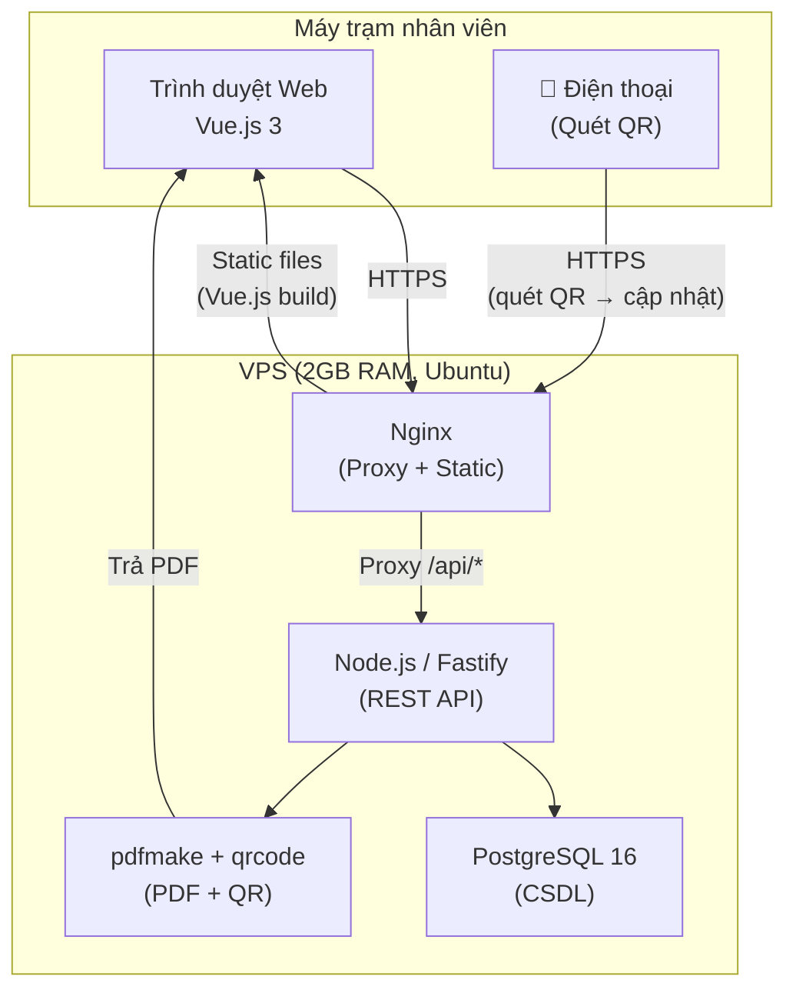
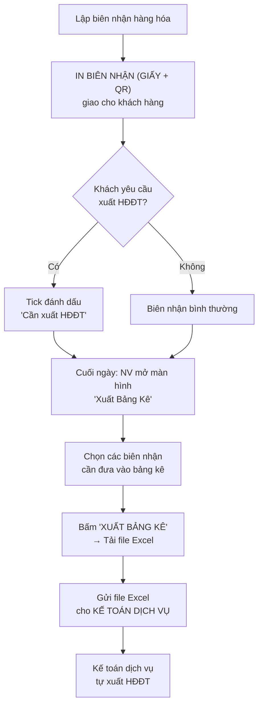
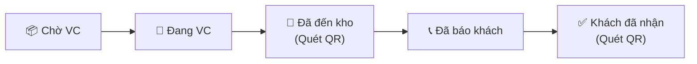
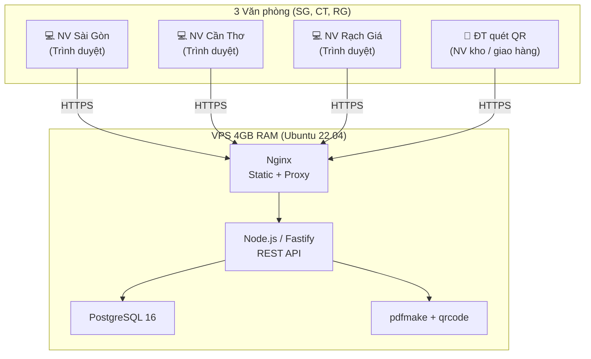

# Kế Hoạch Tổng Thể Nâng Cấp ERP — TMQ Express

> **Mục đích tài liệu**: Bản kế hoạch kỹ thuật tổng quan cho **toàn bộ hệ thống** ERP TMQ Express, bao gồm tất cả các module dự kiến qua các giai đoạn triển khai.

> [!IMPORTANT]
> Đây là kế hoạch **tổng thể**. Kế hoạch triển khai chi tiết:
> - **Phase 1**: [Phase1/](../Phase1/) — Toàn bộ nghiệp vụ: Biên nhận, QR Tracking, Kế toán, Công nợ, Dashboard, Báo cáo

## Phân Chia Giai Đoạn

| Giai đoạn | Phạm vi | Trạng thái |
|---|---|---|
| **Phase 1** | Biên nhận, KH, PDF+QR, Vận chuyển, Bảng kê HĐĐT, Migrate dữ liệu, Kế toán thu/chi, Công nợ, Dashboard, Báo cáo | 📋 Đang lập kế hoạch |

---

## 1. Nguyên Tắc Chung

| Nguyên tắc | Quyết định triển khai |
|---|---|
| **Bản quyền (Licensing)** | Sử dụng 100% mã nguồn mở, không tốn chi phí bản quyền phần mềm. |
| **Nền tảng ứng dụng** | Web App (truy cập qua trình duyệt) giúp kết nối dễ dàng từ nhiều chi nhánh. |
| **Máy trạm (Client)** | Nhân viên truy cập qua trình duyệt trên máy tính hoặc điện thoại. |
| **Hạ tầng máy chủ** | **Thuê VPS** — tất cả chi nhánh truy cập bình đẳng qua Internet. |
| **Hóa đơn điện tử (HĐĐT)** | Phần mềm **xuất bảng kê** → gửi cho kế toán dịch vụ → kế toán tự xuất HĐĐT. |
| **Theo dõi vận chuyển** | NV quét mã QR trên phiếu biên nhận bằng điện thoại để cập nhật trạng thái. |
| **Phân quyền** | 3 vai trò: Admin / Staff / Kế toán — xem [PhanQuyen_DinhHuong.md](./PhanQuyen_DinhHuong.md) |

### Hạ Tầng Triển Khai — Thuê VPS

> [!NOTE]
> Đã thống nhất chọn phương án **thuê VPS** (Cloud). Không triển khai On-Premise.

| Thông số | Giá trị | Ghi chú |
|---|---|---|
| **RAM** | 4 GB | Tối thiểu 2 GB, chọn 4 GB để dự phòng mở rộng |
| **vCPU** | 2 core | Tối thiểu 1 core, chọn 2 core |
| **SSD** | 40 GB | DB nhỏ (~100MB sau 1 năm), dư cho hệ thống |
| **Bandwidth** | ≥ 500 GB/tháng | Thực tế dùng ~1 GB/tháng |
| **HĐH** | Ubuntu 22.04 LTS | Ổn định, LTS đến 2027 |
| **Chi phí** | **~250K/tháng** | Vietnix VPS SSD 2 (4GB/2vCPU/40GB) |



### Yêu Cầu Mạng Tại Các Chi Nhánh

| Vị trí | Tốc độ tối thiểu | Ghi chú |
|---|---|---|
| VP chính (SG) | ≥ 10 Mbps | Đường truyền Internet bình thường |
| VP chi nhánh (CT, RG) | ≥ 5 Mbps | Chỉ gửi/nhận API JSON + PDF nhỏ |

---

## 2. Đề Xuất Công Nghệ (100% Mã Nguồn Mở)

| Lớp | Công nghệ | Lý do lựa chọn |
|---|---|---|
| **Giao diện (Frontend)** | **Vue.js 3** | Nhẹ (~33KB gzip), dễ bảo trì, hoạt động tốt trên máy cấu hình thấp. |
| **Biểu đồ thống kê** | **ECharts (Apache)** | Biểu đồ mạnh mẽ, miễn phí. |
| **Máy chủ (Backend)** | **Node.js + Fastify** | Tốc độ cao, tiêu thụ ít RAM (~50-100MB). Cùng ngôn ngữ JS với frontend. |
| **Cơ sở dữ liệu** | **PostgreSQL 16** | Mã nguồn mở, hỗ trợ JSON, full-text search, truy cập đồng thời. |
| **Tạo PDF + QR** | **pdfmake + qrcode** | Tạo PDF có mã QR từ server, thay thế Crystal Reports. |
| **Proxy** | **Nginx** | Phổ biến, hiệu năng cao, phục vụ file tĩnh + proxy API. |
| **ORM** | **Prisma** hoặc **Drizzle** | Type-safe, tự động quản lý phiên bản CSDL. |

> [!NOTE]
> So sánh chi tiết các phương án công nghệ (Node.js vs Java vs .NET vs PHP) và yêu cầu VPS tương ứng xem tại [SoSanh_CongNghe_VPS.md](../Phase1/SoSanh_CongNghe_VPS.md)

---

## 3. Nghiệp Vụ Chính

### 3.1 Xuất Bảng Kê Phục Vụ HĐĐT



> [!NOTE]
> Phần mềm **không trực tiếp** gọi API nhà cung cấp HĐĐT. Việc xuất HĐĐT do kế toán dịch vụ xử lý dựa trên bảng kê.

### 3.2 Theo Dõi Vận Chuyển (QR Code)



| # | Trạng thái | Ai cập nhật | Cách cập nhật |
|---|---|---|---|
| 1 | `Chờ vận chuyển` | Hệ thống | Tự động khi lập biên nhận |
| 2 | `Đang vận chuyển` | NV VP gửi | Bấm nút trên máy tính (chọn hàng loạt) |
| 3 | `Đã đến kho` | NV VP nhận | **Quét QR** bằng điện thoại |
| 4 | `Đã báo khách` | NV VP nhận | Bấm nút sau khi gọi ĐT |
| 5 | `Khách đã nhận` | NV giao hàng | **Quét QR** khi khách ký nhận |

---

## 4. Thiết Kế Cơ Sở Dữ Liệu (Database Schema — Toàn Bộ Hệ Thống)

> [!NOTE]
> **Encoding**: PostgreSQL sử dụng **UTF-8** mặc định — hỗ trợ đầy đủ tiếng Việt.
>
> Schema Phase 1 chi tiết xem tại [Phase1/DatabaseSchema_Phase1.md](../Phase1/DatabaseSchema_Phase1.md)

### Bảng `van_phong` (Thông tin chi nhánh)

| Cột | Kiểu dữ liệu | Mô tả |
|---|---|---|
| `id` | SERIAL PK | Khóa chính |
| `ma_vp` | VARCHAR(10) | Mã chi nhánh (VD: SG, CT, RG) |
| `ten` | VARCHAR(200) | Văn Phòng Tp.HCM |
| `dia_chi` | VARCHAR(500) | 491 Lê Hồng Phong... |
| `dien_thoai` | VARCHAR(20) | (028) 383.338.79 |
| `active` | BOOLEAN | Trạng thái hoạt động |

### Bảng `nhan_vien` (Thông tin nhân sự)

| Cột | Kiểu dữ liệu | Mô tả |
|---|---|---|
| `id` | SERIAL PK | Khóa chính |
| `ma_nv` | VARCHAR(20) | Mã nhân viên |
| `ten` | VARCHAR(200) | Tên nhân viên |
| `van_phong_id` | FK → van_phong | Nơi làm việc |
| `role` | VARCHAR(50) | Phân quyền (admin / staff / accountant) |
| `username` | VARCHAR(100) | Tài khoản đăng nhập |
| `password_hash` | VARCHAR(255) | Mật khẩu (đã mã hóa) |

### Bảng `khach_hang` (Quản lý khách hàng / đối tác)

| Cột | Kiểu dữ liệu | Mô tả |
|---|---|---|
| `id` | SERIAL PK | Khóa chính |
| `ma_kh` | VARCHAR(20) UNIQUE | Mã khách hàng (VD: KH-001) |
| `ten_don_vi` | VARCHAR(200) | Tên công ty / cửa hàng |
| `nguoi_lien_he` | VARCHAR(200) | Người liên hệ chính |
| `dien_thoai` | VARCHAR(20) | Số điện thoại |
| `dia_chi` | VARCHAR(500) | Địa chỉ |
| `email` | VARCHAR(200) | Email (nếu có) |
| `ma_so_thue` | VARCHAR(20) | Mã số thuế (10 hoặc 13 chữ số) |
| `ghi_chu` | TEXT | Ghi chú |
| `active` | BOOLEAN | Còn hoạt động |
| `created_at` | TIMESTAMP | Ngày tạo |

### Bảng `bien_nhan` (Dữ liệu cốt lõi)

| Cột | Kiểu dữ liệu | Mô tả |
|---|---|---|
| `id` | SERIAL PK | Khóa chính |
| `ma_so` | VARCHAR(20) UNIQUE | Mã tự gen (VD: SGRG-0048) |
| `ngay_nhan` | TIMESTAMP | Ngày giờ nhận hàng |
| `van_phong_gui_id` | FK → van_phong | VP lập biên nhận |
| `van_phong_nhan_id` | FK → van_phong | VP đích đến |
| `nhan_vien_nhap_id` | FK → nhan_vien | Nhân viên trực tiếp lập |
| `gia_cuoc` | DECIMAL(15,0) | Cước phí (VNĐ) |
| `trang_thai_thu` | ENUM | Đã thu / Chưa thu / Công nợ |
| `don_vi_gui` | VARCHAR(200) | Công ty/Cửa hàng gửi |
| `nguoi_gui` | VARCHAR(200) | Tên cá nhân gửi |
| `dien_thoai_gui` | VARCHAR(20) | Số điện thoại gửi |
| `dia_chi_gui` | VARCHAR(500) | Địa chỉ gửi |
| `don_vi_nhan` | VARCHAR(200) | Công ty/Cửa hàng nhận |
| `nguoi_nhan` | VARCHAR(200) | Tên cá nhân nhận |
| `dien_thoai_nhan` | VARCHAR(20) | Số điện thoại nhận |
| `dia_chi_nhan` | VARCHAR(500) | Địa chỉ nhận |
| `so_cccd` | VARCHAR(20) | Căn cước công dân người nhận |
| `ten_hang_hoa` | TEXT | Chi tiết các mặt hàng |
| `gia_tri_hang` | DECIMAL(15,0) | Giá trị tiền hàng khai báo |
| `trong_luong` | DECIMAL(10,2) | Số KG |
| `thu_ho` | DECIMAL(15,0) | Số tiền CoD |
| `hang_hu_khong_den` | BOOLEAN | Khách chấp nhận rủi ro |
| `can_xuat_hddt` | BOOLEAN DEFAULT FALSE | Đánh dấu cần xuất HĐĐT |
| `hinh_thuc_giao` | ENUM | Giao tận nơi / ĐT đến nhận / Tự đến nhận |
| `trang_thai` | ENUM | Chờ VC / Đang VC / Đã đến kho / Đã báo khách / Khách đã nhận |
| `created_at` | TIMESTAMP | Thời gian tạo Record |

### Bảng `lich_su_trang_thai` (Lịch sử cập nhật trạng thái vận chuyển)

| Cột | Kiểu dữ liệu | Mô tả |
|---|---|---|
| `id` | SERIAL PK | Khóa chính |
| `bien_nhan_id` | FK → bien_nhan | Biên nhận nào |
| `trang_thai_cu` | ENUM | Trạng thái cũ |
| `trang_thai_moi` | ENUM | Trạng thái mới |
| `nhan_vien_id` | FK → nhan_vien | NV thực hiện |
| `phuong_thuc` | VARCHAR(20) | `qr_scan` / `manual` / `batch` |
| `ghi_chu` | TEXT | Ghi chú (nếu có) |
| `created_at` | TIMESTAMP | Thời gian cập nhật |

### Bảng `bang_ke` (Lịch sử bảng kê đã xuất)

| Cột | Kiểu dữ liệu | Mô tả |
|---|---|---|
| `id` | SERIAL PK | Khóa chính |
| `ma_bang_ke` | VARCHAR(50) UNIQUE | Mã tự sinh (VD: BK-20260320-001) |
| `ngay_xuat` | TIMESTAMP | Thời gian xuất bảng kê |
| `nhan_vien_xuat_id` | FK → nhan_vien | NV thực hiện xuất |
| `van_phong_id` | FK → van_phong | VP xuất bảng kê |
| `so_bien_nhan` | INTEGER | Tổng số biên nhận trong bảng kê |
| `tong_cuoc` | DECIMAL(15,0) | Tổng cước phí (VNĐ) |
| `ten_file` | VARCHAR(255) | Tên file Excel đã tạo |
| `created_at` | TIMESTAMP | Thời gian tạo record |

### Bảng `bang_ke_chi_tiet` (Biên nhận thuộc bảng kê nào)

| Cột | Kiểu dữ liệu | Mô tả |
|---|---|---|
| `id` | SERIAL PK | Khóa chính |
| `bang_ke_id` | FK → bang_ke | Thuộc bảng kê nào |
| `bien_nhan_id` | FK → bien_nhan | Biên nhận nào |

### Bảng `phieu_thu` (Thu tiền từ khách hàng)

| Cột | Kiểu dữ liệu | Mô tả |
|---|---|---|
| `id` | SERIAL PK | Khóa chính |
| `ma_phieu` | VARCHAR(20) UNIQUE | Mã phiếu thu (VD: PT-0001) |
| `ngay_thu` | TIMESTAMP | Ngày thu tiền |
| `van_phong_id` | FK → van_phong | VP thực hiện |
| `nhan_vien_id` | FK → nhan_vien | Nhân viên thu |
| `doi_tuong` | VARCHAR(200) | Tên khách hàng / đơn vị nộp tiền |
| `ly_do` | TEXT | Nội dung thu |
| `so_tien` | DECIMAL(15,0) | Số tiền thu (VNĐ) |
| `hinh_thuc` | ENUM | Tiền mặt / Chuyển khoản |
| `bien_nhan_id` | FK → bien_nhan NULL | Liên kết biên nhận (nếu có) |
| `created_at` | TIMESTAMP | Thời gian tạo |

### Bảng `phieu_chi` (Chi trả cho đối tác / chi phí)

| Cột | Kiểu dữ liệu | Mô tả |
|---|---|---|
| `id` | SERIAL PK | Khóa chính |
| `ma_phieu` | VARCHAR(20) UNIQUE | Mã phiếu chi (VD: PC-0001) |
| `ngay_chi` | TIMESTAMP | Ngày chi tiền |
| `van_phong_id` | FK → van_phong | VP thực hiện |
| `nhan_vien_id` | FK → nhan_vien | Nhân viên duyệt chi |
| `nguoi_nhan` | VARCHAR(200) | Người nhận tiền |
| `ly_do` | TEXT | Nội dung chi |
| `so_tien` | DECIMAL(15,0) | Số tiền chi (VNĐ) |
| `hinh_thuc` | ENUM | Tiền mặt / Chuyển khoản |
| `created_at` | TIMESTAMP | Thời gian tạo |

### Bảng `cong_no` (Theo dõi công nợ khách hàng)

| Cột | Kiểu dữ liệu | Mô tả |
|---|---|---|
| `id` | SERIAL PK | Khóa chính |
| `doi_tuong` | VARCHAR(200) | Tên khách hàng / đơn vị |
| `bien_nhan_id` | FK → bien_nhan | Phát sinh từ biên nhận nào |
| `so_tien_no` | DECIMAL(15,0) | Số tiền nợ |
| `ngay_phat_sinh` | TIMESTAMP | Ngày phát sinh công nợ |
| `ngay_thu` | TIMESTAMP NULL | Ngày thanh toán (NULL = chưa thu) |
| `phieu_thu_id` | FK → phieu_thu NULL | Liên kết phiếu thu khi đã thanh toán |
| `trang_thai` | ENUM | Chưa thu / Đã thu / Quá hạn |
| `ghi_chu` | TEXT | Ghi chú |

---

## 5. Kiến Trúc Hệ Thống & Hiệu Năng

### Kiến trúc triển khai (VPS)



### Ước tính hiệu năng

**Phía máy trạm nhân viên (i3, 8GB RAM):**

| Thành phần | RAM ước tính | Ghi chú |
|---|---|---|
| HĐH Windows | ~2-3 GB | Bình thường |
| Trình duyệt (1-2 tab) | ~200-400 MB | Đủ để vận hành app |
| **Tổng** | **~3-3.5 GB** | **Máy vẫn dư dả** |

**Phía VPS (4GB RAM):**

| Thành phần | RAM ước tính | Ghi chú |
|---|---|---|
| HĐH Linux | ~200-300 MB | Ubuntu minimal |
| Nginx | ~20-50 MB | Nhẹ |
| Node.js + Fastify | ~50-100 MB | Nhẹ |
| PostgreSQL 16 | ~200-500 MB | Ổn định |
| **Tổng** | **~500-900 MB** | **VPS 4GB dư dả** |

---

## 6. Phác Thảo Giao Diện (Wireframes — Toàn Bộ Hệ Thống)

> [!NOTE]
> Wireframes Phase 1 chi tiết xem tại [Wireframes_Phase1.md](../Phase1/Wireframes_Phase1.md)

### Màn hình 1: Lập biên nhận hàng hóa — *Phase 1*

```text
┌─────────────────────────────────────────────────────────────────┐
│ TMQ Express                          [VP: Tp.HCM ▼] [User ▼]    │
├─────────────┬───────────────────────────────────────────────────┤
│ DS Biên nhận│  THÔNG TIN BIÊN NHẬN                              │
│ ┌──────────┐│  Mã số: [Tự động gen]      Ngày lập: [27/03/2026] │
│ │ 🔍 Tìm  ││  Cước vận chuyển: [____]đ  (Đã thu / Chưa / Nợ)   │
│ ├──────────┤│  Từ: [VP Tp.HCM ▼]         Đến: [VP Cần Thơ ▼]    │
│ │SGCT-0003 ││───────────────────────────────────────────────────│
│ │SGCT-0002 ││  👤 BÊN GỬI             👤 BÊN NHẬN              │
│ │SGCT-0001 ││  Đơn vị: [________]     Đơn vị: [________]        │
│ │SGRG-0048 ││  Tên:    [________]     Tên:    [________]        │
│ │          ││  ĐT:     [________]     ĐT:     [________]        │
│ │          ││  Đ/chỉ:  [________]     Đ/chỉ:  [________]        │
│ │          ││───────────────────────────────────────────────────┤
│ │          ││  📦 THÔNG TIN HÀNG HÓA                           │
│ │          ││  Mô tả: [__________________________]              │
│ │          ││  [x] Hàng dễ vỡ, hư hỏng không đền bù.            │
│ │          ││  Hình thức: (_) Tận nơi  (_) Gọi điện  (_) Tự tới │
│ │          ││  [ ] Cần xuất HĐĐT (đưa vào bảng kê)               │
└────────────┘│───────────────────────────────────────────────────│
│             │  [+] Thêm mới  [💾] LƯU & IN BIÊN NHẬN  [✖] Hủy  │
└─────────────┴───────────────────────────────────────────────────┘
```

### Màn hình 2: Xuất bảng kê phục vụ HĐĐT — *Phase 1*

```text
┌─────────────────────────────────────────────────────────────────┐
│ XUẤT BẢNG KÊ PHỤC VỤ HĐĐT          Ngày xem: [27/03/2026]        │
├─────────────────────────────────────────────────────────────────┤
│ [x]  SGRG-0048  Cty Tâm An → Tôn       150,000                  │
│ [ ]  SGCT-0003  ...        → ...        30,000                  │
│ [x]  SGCT-0002  ...        → ...       250,000                  │
├─────────────────────────────────────────────────────────────────┤
│ Đã chọn 2 biên nhận · Tổng cước: 400,000đ                       │
│  [ 📊 XUẤT BẢNG KÊ (2 mục) ]    [ CHỌN TẤT CẢ ]                  │
└─────────────────────────────────────────────────────────────────┘
```

### Màn hình 3: Quét QR cập nhật trạng thái (Mobile) — *Phase 1*

```text
┌─────────────────────────────┐
│     TMQ Express             │
│     📱 CẬP NHẬT TRẠNG THÁI  │
├─────────────────────────────┤
│                             │
│  Mã: SGRG-0048             │
│  Gửi: Cty Tâm An (SG)     │
│  Nhận: Kho PQ (RG)        │
│  Cước: 150,000đ           │
│                             │
│  Trạng thái hiện tại:      │
│  🚚 Đang vận chuyển        │
│                             │
│  ┌───────────────────────┐  │
│  │                       │  │
│  │  🏢 XÁC NHẬN          │  │
│  │  ĐÃ ĐẾN KHO          │  │
│  │                       │  │
│  └───────────────────────┘  │
│                             │
└─────────────────────────────┘
```

### Màn hình 4: Dashboard thống kê — *Phase 1*

```text
┌─────────────────────────────────────────────────────────────────┐
│ TMQ Express — DASHBOARD               [VP: Tất cả ▼] [User ▼]   │
├─────────────────────────────────────────────────────────────────┤
│  ┌──────────┐ ┌──────────┐ ┌──────────┐ ┌──────────┐           │
│  │ Biên nhận │ │ Doanh thu │ │  Đã thu  │ │ Công nợ  │           │
│  │    12     │ │ 4,500,000│ │ 3,200,000│ │ 1,300,000│           │
│  └──────────┘ └──────────┘ └──────────┘ └──────────┘           │
│  📈 DOANH THU 7 NGÀY (ECharts)    🥧 TUYẾN ĐƯỜNG               │
│  ┌──────────────────────────┐  ┌──────────────────┐             │
│  │     ▁ ▃ █ ▅ ▇ ▃ ▆       │  │  SG→CT: 45%      │             │
│  │  T2 T3 T4 T5 T6 T7 CN   │  │  SG→RG: 30%      │             │
│  └──────────────────────────┘  │  CT→RG: 25%      │             │
│                                └──────────────────┘             │
└─────────────────────────────────────────────────────────────────┘
```

---

## 7. Chi Phí Bản Quyền Phần Mềm

| Thành phần | Chi phí bản quyền |
|---|---|
| Nền tảng Frontend (Vue.js 3) | **0 VNĐ** (MIT) |
| Biểu đồ thống kê (ECharts) | **0 VNĐ** (Apache 2.0) |
| Máy chủ API (Node.js + Fastify) | **0 VNĐ** (MIT) |
| CSDL (PostgreSQL) | **0 VNĐ** (PostgreSQL License) |
| Thư viện PDF + QR (pdfmake, qrcode) | **0 VNĐ** (MIT) |
| Hệ điều hành máy chủ (Ubuntu Linux) | **0 VNĐ** |
| **Tổng chi phí tài nguyên mã nguồn** | **0 VNĐ / Trọn đời** |

*Ghi chú: Chi phí dịch vụ kế toán HĐĐT do khách hàng chi trả riêng theo hợp đồng với kế toán dịch vụ.*

---

## 8. Lộ Trình Triển Khai Tổng Thể (Dự Kiến)

### Phase 1 — Toàn Bộ Nghiệp Vụ

| Giai đoạn | Hạng mục |
|---|---|
| **Bước 1** | Hạ tầng: VPS, CSDL, API, đăng nhập, phân quyền 3 role |
| **Bước 2** | Quản lý KH + Biên nhận hàng hóa |
| **Bước 3** | In ấn PDF + QR Code |
| **Bước 4** | Theo dõi vận chuyển (quét QR) |
| **Bước 5** | Xuất bảng kê HĐĐT (Admin only) |
| **Bước 6** | Tích hợp dữ liệu PM cũ (migrate) |
| **Bước 7** | Kế toán thu/chi + Quản lý công nợ |
| **Bước 8** | Dashboard thống kê + Báo cáo tổng hợp |
| **Bước 9** | Kiểm thử, nghiệm thu, đào tạo, chuyển giao |
