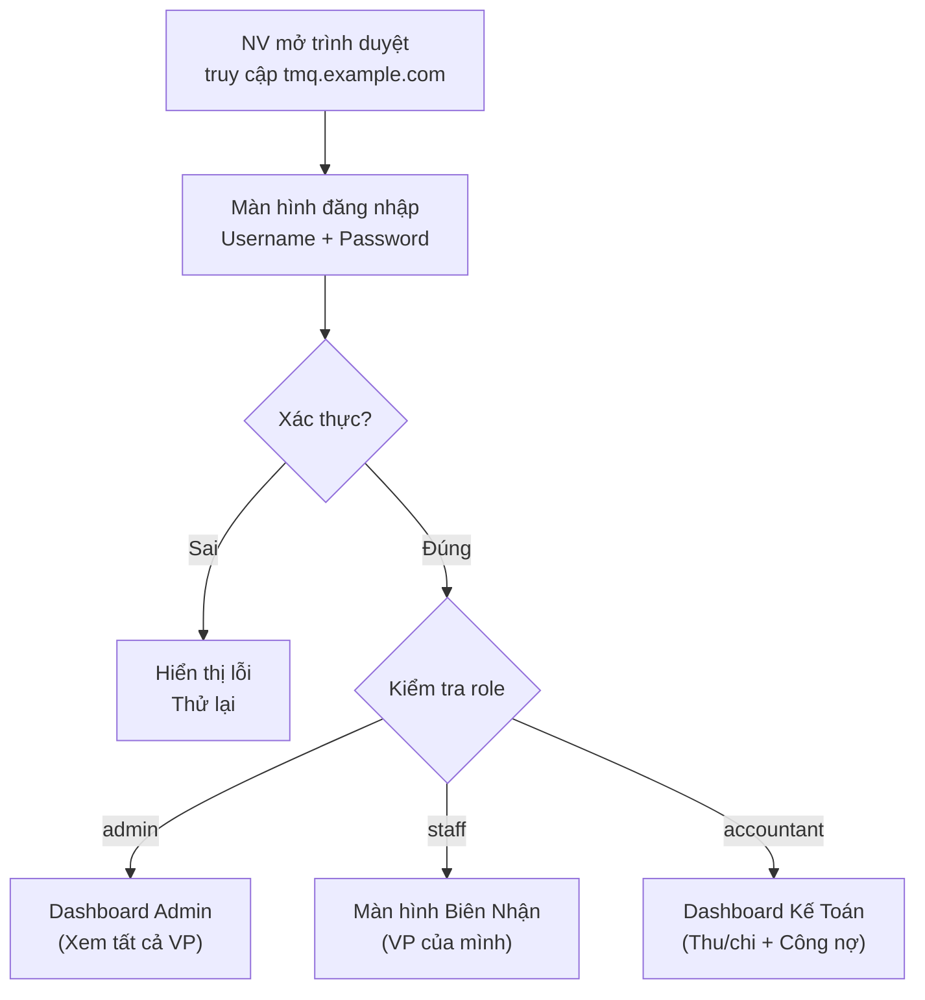

# Định Hướng Quản Lý Phân Quyền — TMQ Express

> **Mục đích**: Xác định các vai trò (role) và quyền truy cập trong hệ thống ERP TMQ Express.

---

## 1. Danh Sách Vai Trò

| Vai trò | Mã | Mô tả | Ai thuộc vai trò này? |
|---|---|---|---|
| **Admin** | `admin` | Quản trị toàn bộ hệ thống | Chủ chành, Quản lý VP chính |
| **Nhân viên** | `staff` | Thao tác nghiệp vụ hàng ngày | NV quầy, NV kho, NV giao hàng |
| **Kế toán** | `accountant` | Quản lý tài chính, thu/chi, công nợ | NV kế toán |

---

## 2. Ma Trận Phân Quyền Chi Tiết

### Module Biên Nhận & Vận Chuyển

| Chức năng | Admin | Staff | Kế toán |
|---|:---:|:---:|:---:|
| **Lập biên nhận mới** | ✅ | ✅ | ❌ |
| **Sửa biên nhận** | ✅ | ✅ *(chỉ BN do mình tạo)* | ❌ |
| **Xem danh sách biên nhận** | ✅ *(tất cả VP)* | ✅ *(VP của mình)* | ✅ *(chỉ xem)* |
| **In phiếu biên nhận (PDF+QR)** | ✅ | ✅ | ❌ |
| **Quét QR cập nhật trạng thái** | ✅ | ✅ | ❌ |
| **Quay lại trạng thái trước** | ✅ | ❌ | ❌ |
| **Cập nhật hàng loạt ("Gửi xe")** | ✅ | ✅ | ❌ |
| **Đánh dấu "Cần xuất HĐĐT"** | ✅ | ✅ *(khi lập BN)* | ❌ |
| **Xuất bảng kê (Excel)** | ✅ | ❌ | ❌ |

### Module Khách Hàng

| Chức năng | Admin | Staff | Kế toán |
|---|:---:|:---:|:---:|
| **Tạo khách hàng mới** | ✅ | ✅ | ❌ |
| **Sửa thông tin KH** | ✅ | ✅ | ❌ |
| **Xem danh sách KH** | ✅ | ✅ | ✅ |
| **Vô hiệu hóa KH** | ✅ | ❌ | ❌ |
| **Xem lịch sử giao dịch KH** | ✅ | ✅ | ✅ |

### Module Kế Toán Thu/Chi & Công Nợ

| Chức năng | Admin | Staff | Kế toán |
|---|:---:|:---:|:---:|
| **Lập phiếu thu** | ✅ | ❌ | ✅ |
| **Lập phiếu chi** | ✅ | ❌ | ✅ |
| **Xem phiếu thu/chi** | ✅ | ❌ | ✅ |
| **Sửa phiếu thu/chi** | ✅ | ❌ | ✅ *(chỉ phiếu do mình tạo)* |
| **Hủy phiếu thu/chi** | ✅ | ❌ | ❌ |
| **In phiếu thu/chi (PDF)** | ✅ | ❌ | ✅ |
| **Xem bảng công nợ** | ✅ | ❌ | ✅ |
| **Xác nhận thanh toán công nợ** | ✅ | ❌ | ✅ |

### Module Dashboard & Báo Cáo

| Chức năng | Admin | Staff | Kế toán |
|---|:---:|:---:|:---:|
| **Xem Dashboard tổng quan** | ✅ *(tất cả VP)* | ✅ *(VP của mình)* | ✅ *(tất cả VP)* |
| **Xem báo cáo doanh thu** | ✅ | ❌ | ✅ |
| **Xem báo cáo biên nhận theo tuyến** | ✅ | ✅ *(VP của mình)* | ✅ |
| **Xem sổ quỹ tiền mặt** | ✅ | ❌ | ✅ |
| **Xuất báo cáo (PDF / Excel)** | ✅ | ❌ | ✅ |
| **So sánh tháng/năm** | ✅ | ❌ | ✅ |

### Module Quản Trị Hệ Thống

| Chức năng | Admin | Staff | Kế toán |
|---|:---:|:---:|:---:|
| **Tạo/sửa nhân viên** | ✅ | ❌ | ❌ |
| **Vô hiệu hóa nhân viên** | ✅ | ❌ | ❌ |
| **Reset mật khẩu NV** | ✅ | ❌ | ❌ |
| **Quản lý văn phòng** | ✅ | ❌ | ❌ |
| **Xem lịch sử hệ thống** | ✅ | ❌ | ❌ |

---

## 3. Quy Tắc Phân Quyền

### Quy tắc chung

- **Mỗi NV thuộc 1 VP** — dữ liệu mặc định lọc theo VP của NV đó.
- **Admin xem tất cả VP** — có thể chuyển bộ lọc sang VP khác.
- **Staff chỉ xem VP mình** — không truy cập được dữ liệu VP khác.
- **Kế toán xem tất cả VP** — nhưng không thao tác biên nhận / vận chuyển.

### Quy tắc đặc biệt

| Quy tắc | Mô tả |
|---|---|
| **Sửa biên nhận** | Staff chỉ sửa BN do **chính mình** tạo. Admin sửa được tất cả. |
| **Quay lại trạng thái** | Chỉ Admin mới được quay lại trạng thái VC (VD: `Đã đến kho` → `Đang VC`). |
| **Hủy phiếu thu/chi** | Chỉ Admin. Kế toán chỉ sửa phiếu do mình tạo, không được hủy. |
| **Đổi mật khẩu** | NV tự đổi mật khẩu của mình. Admin reset mật khẩu cho NV khác. |
| **Vô hiệu hóa** | Chỉ Admin. NV/KH bị vô hiệu hóa vẫn giữ dữ liệu lịch sử. |

---

## 4. Luồng Đăng Nhập & Phiên Làm Việc



### Bảo mật phiên

| Thông số | Giá trị |
|---|---|
| Cơ chế xác thực | JWT (JSON Web Token) |
| Thời gian hết hạn token | 8 giờ (1 ca làm việc) |
| Lưu token | Cookie httpOnly (bảo mật hơn localStorage) |
| Đăng nhập nhiều thiết bị | Cho phép (VD: máy tính + điện thoại quét QR) |

---

## 5. Cấu Trúc Dữ Liệu Phân Quyền

Phân quyền lưu trực tiếp trong bảng `nhan_vien`:

```
nhan_vien.role = 'admin' | 'staff' | 'accountant'
nhan_vien.van_phong_id = FK → van_phong
```

Mỗi API endpoint kiểm tra `role` trước khi xử lý:

```text
GET  /api/bien-nhan       → staff, admin, accountant (read-only)
POST /api/bien-nhan       → staff, admin
PUT  /api/bien-nhan/:id   → staff (chỉ BN mình tạo), admin
POST /api/phieu-thu       → accountant, admin
GET  /api/bao-cao/*       → accountant, admin
POST /api/nhan-vien       → admin only
```

---

## Tài Liệu Liên Quan

| Tài liệu | Mô tả |
|---|---|
| [NghiepVu_ChiTiet_Phase1.md](../Phase1/NghiepVu_ChiTiet_Phase1.md) | Chi tiết nghiệp vụ, quy tắc phân quyền từng NV |
| [DatabaseSchema_Phase1.md](../Phase1/DatabaseSchema_Phase1.md) | Schema database, bảng `nhan_vien.role` |
| [ERP_MasterPlan.md](./ERP_MasterPlan.md) | Kế hoạch tổng thể |
