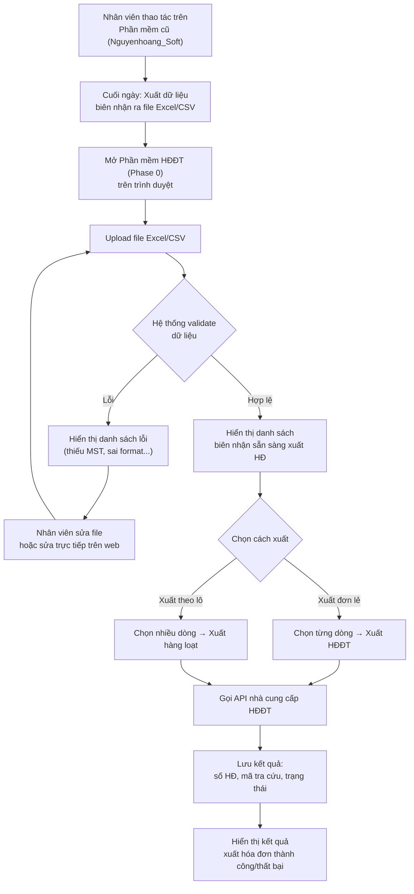
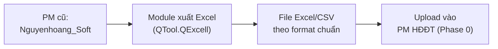
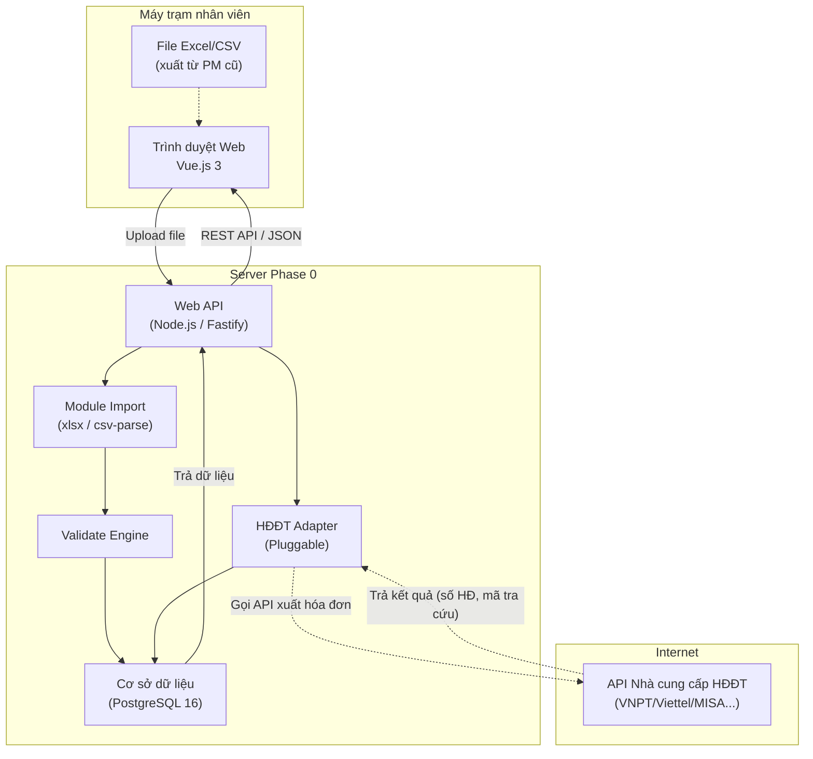
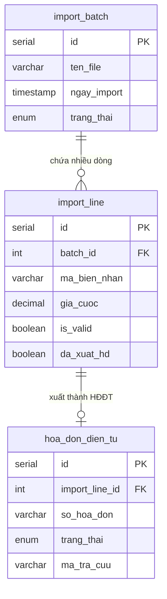
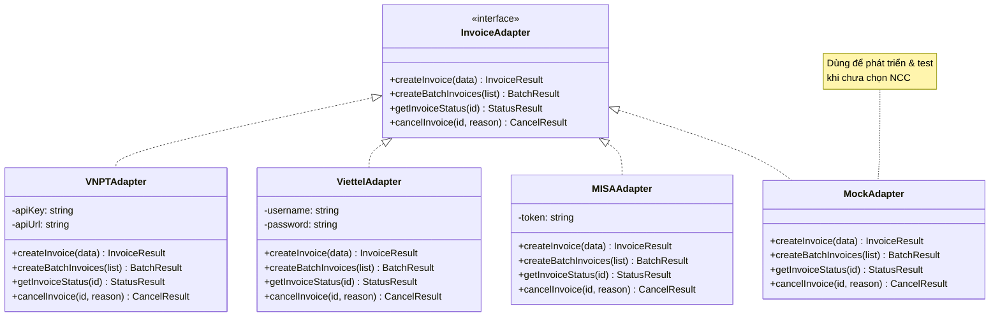

# Kế Hoạch Phase 0 — Phần Mềm Xuất Hóa Đơn Điện Tử (Import Data)

> **Mục đích tài liệu**: Kế hoạch kỹ thuật cho Phase 0 — phần mềm web nhỏ gọn, chuyên xuất Hóa Đơn Điện Tử từ dữ liệu import của phần mềm hiện tại (Nguyenhoang_Soft).

> [!IMPORTANT]
> Phase 0 là bước **tiên quyết** trước Phase 1. Mục tiêu: giải quyết ngay bài toán xuất HĐĐT mà **không cần chờ** upgrade toàn diện hệ thống ERP.

## Bối Cảnh

Khách hàng đang sử dụng phần mềm ERP cũ (VB.NET / SQL Server 2005) để quản lý biên nhận hàng hóa. Hiện tại **chưa có khả năng xuất Hóa Đơn Điện Tử**. Thay vì chờ Phase 1 (nâng cấp toàn bộ), Phase 0 cung cấp một công cụ **độc lập** để:

1. Nhận dữ liệu cuối ngày từ phần mềm cũ (qua file Excel/CSV)
2. Validate dữ liệu → Xuất hóa đơn điện tử qua API nhà cung cấp
3. Lưu lịch sử & hỗ trợ tra cứu, hủy hóa đơn

---

## Phạm Vi Phase 0

| Bao gồm | Mô tả |
|---|---|
| ✅ **Import dữ liệu** | Nhận file Excel/CSV từ phần mềm cũ, đọc & validate dữ liệu |
| ✅ **Xuất HĐĐT đơn lẻ** | Chọn từng dòng dữ liệu → xuất hóa đơn ngay |
| ✅ **Xuất HĐĐT theo lô** | Chọn nhiều dòng → xuất hàng loạt cuối ngày |
| ✅ **Tra cứu hóa đơn** | Xem lịch sử, trạng thái, mã tra cứu của các HĐĐT đã xuất |
| ✅ **Hủy hóa đơn** | Thực hiện hủy HĐĐT đã xuất (theo quy định) |
| ✅ **Hạ tầng nền tảng** | Server, database, đăng nhập cơ bản |

| Không bao gồm | Giai đoạn |
|---|---|
| ❌ Quản lý biên nhận hàng hóa | Phase 1 |
| ❌ Quản lý khách hàng đầy đủ | Phase 1 |
| ❌ In ấn PDF biên nhận | Phase 1 |
| ❌ Kế toán thu/chi, công nợ | Phase 2+ |
| ❌ Dashboard, báo cáo thống kê | Phase 2+ |

---

## Nguyên Tắc Chung

| Nguyên tắc | Quyết định |
|---|---|
| **Độc lập hoàn toàn** | Phase 0 hoạt động song song với PM cũ, không can thiệp vào hệ thống hiện tại |
| **Dữ liệu đầu vào** | File Excel/CSV — nhân viên xuất từ PM cũ cuối ngày (hoặc khi cần) |
| **Tái sử dụng cho Phase 1** | Module HĐĐT (Adapter Pattern) sẽ được tái sử dụng nguyên vẹn trong Phase 1 |
| **Công nghệ** | Cùng tech stack với Phase 1 (Vue.js 3, Node.js/Fastify, PostgreSQL) để đảm bảo tính liên tục |

---

## Luồng Nghiệp Vụ

### Quy trình tổng thể



### Quy trình xuất dữ liệu từ phần mềm cũ



> [!NOTE]
> Phần mềm cũ đã có sẵn chức năng **Export Excel** (`QTool.QExcell`) — ta chỉ cần định nghĩa format chuẩn để nhân viên xuất đúng mẫu.

---

## Yêu Cầu Format File Import (Excel/CSV)

### Cấu trúc cột bắt buộc

| STT | Tên cột | Bắt buộc | Mô tả | Ví dụ |
|---|---|---|---|---|
| 1 | `ma_bien_nhan` | ✅ | Mã biên nhận từ PM cũ | SGRG-0048 |
| 2 | `ngay_nhan` | ✅ | Ngày nhận hàng (dd/MM/yyyy) | 20/03/2026 |
| 3 | `don_vi_gui` | ✅ | Tên công ty / cá nhân gửi | Cty TNHH Tâm An |
| 4 | `dia_chi_gui` |  | Địa chỉ bên gửi | 123 Nguyễn Trãi, Q5 |
| 5 | `mst_gui` |  | Mã số thuế bên gửi (nếu có) | 0312345678 |
| 6 | `don_vi_nhan` | ✅ | Tên công ty / cá nhân nhận | CH Bình Minh |
| 7 | `dia_chi_nhan` |  | Địa chỉ bên nhận | 45 Trần Hưng Đạo, CT |
| 8 | `mst_nhan` |  | Mã số thuế bên nhận (nếu có) | 1801234567 |
| 9 | `ten_hang_hoa` | ✅ | Mô tả hàng hóa | Phụ tùng xe máy |
| 10 | `gia_cuoc` | ✅ | Cước phí vận chuyển (VNĐ) | 150000 |
| 11 | `thue_suat` |  | Thuế suất VAT (%) — mặc định 8% | 8 |
| 12 | `ghi_chu` |  | Ghi chú thêm | KH VIP |

> [!TIP]
> File mẫu Excel sẽ được cung cấp sẵn trong phần mềm Phase 0. Nhân viên chỉ cần xuất dữ liệu từ PM cũ theo đúng mẫu này.

### Quy tắc validate

| Mã | Quy tắc | Mức độ |
|---|---|---|
| V-01 | `ma_bien_nhan` không được trùng với dữ liệu đã import trước đó | ❌ Lỗi |
| V-02 | `ngay_nhan` phải đúng format dd/MM/yyyy và không phải ngày tương lai | ❌ Lỗi |
| V-03 | `gia_cuoc` phải là số dương > 0 | ❌ Lỗi |
| V-04 | `don_vi_gui` và `don_vi_nhan` không được để trống | ❌ Lỗi |
| V-05 | `ten_hang_hoa` không được để trống | ❌ Lỗi |
| V-06 | `mst_gui` / `mst_nhan` nếu có — phải đúng 10 hoặc 13 ký tự số | ⚠️ Cảnh báo |
| V-07 | `thue_suat` nếu không có — mặc định 8% | ℹ️ Tự động |

---

## Kiến Trúc Kỹ Thuật

> [!NOTE]
> Phase 0 dùng **cùng tech stack** với Phase 1 để đảm bảo module HĐĐT có thể tái sử dụng nguyên vẹn.

### Sơ đồ hệ thống



### So sánh độ phức tạp Phase 0 vs Phase 1

| Tiêu chí | Phase 0 | Phase 1 |
|---|---|---|
| **Số module** | 2 (Import + HĐĐT) | 5+ (Biên nhận, KH, In PDF, HĐĐT, Auth) |
| **Số bảng DB** | 3 | 5+ |
| **Số màn hình** | 3 | 6+ |
| **Thời gian ước tính** | 2-3 tuần | 8-12 tuần |
| **Giá trị tái sử dụng** | Module HĐĐT → Phase 1 | — |

---

## Database Schema — Phase 0

> [!NOTE]
> **Encoding**: PostgreSQL sử dụng **UTF-8** mặc định — hỗ trợ đầy đủ tiếng Việt.

### Bảng `import_batch` (Phiên import dữ liệu)

| Cột | Kiểu dữ liệu | Mô tả |
|---|---|---|
| `id` | SERIAL PK | Khóa chính |
| `ten_file` | VARCHAR(255) | Tên file đã upload |
| `ngay_import` | TIMESTAMP | Thời gian import |
| `nhan_vien_import` | VARCHAR(200) | Người thực hiện import |
| `tong_so_dong` | INTEGER | Tổng số dòng trong file |
| `so_dong_hop_le` | INTEGER | Số dòng validate thành công |
| `so_dong_loi` | INTEGER | Số dòng có lỗi |
| `trang_thai` | ENUM | Đang xử lý / Hoàn tất / Có lỗi |
| `created_at` | TIMESTAMP | Thời gian tạo record |

### Bảng `import_line` (Từng dòng dữ liệu import)

| Cột | Kiểu dữ liệu | Mô tả |
|---|---|---|
| `id` | SERIAL PK | Khóa chính |
| `batch_id` | FK → import_batch | Thuộc phiên import nào |
| `ma_bien_nhan` | VARCHAR(20) | Mã biên nhận từ PM cũ |
| `ngay_nhan` | DATE | Ngày nhận hàng |
| `don_vi_gui` | VARCHAR(200) | Tên bên gửi |
| `dia_chi_gui` | VARCHAR(500) | Địa chỉ bên gửi |
| `mst_gui` | VARCHAR(20) | MST bên gửi |
| `don_vi_nhan` | VARCHAR(200) | Tên bên nhận |
| `dia_chi_nhan` | VARCHAR(500) | Địa chỉ bên nhận |
| `mst_nhan` | VARCHAR(20) | MST bên nhận |
| `ten_hang_hoa` | TEXT | Mô tả hàng hóa |
| `gia_cuoc` | DECIMAL(15,0) | Cước vận chuyển (VNĐ) |
| `thue_suat` | DECIMAL(4,2) | Thuế suất VAT (%) |
| `ghi_chu` | TEXT | Ghi chú |
| `is_valid` | BOOLEAN | Dữ liệu hợp lệ? |
| `loi_validate` | TEXT NULL | Chi tiết lỗi validate (nếu có) |
| `da_xuat_hd` | BOOLEAN DEFAULT FALSE | Đã xuất HĐĐT chưa? |
| `hoa_don_id` | FK → hoa_don_dien_tu NULL | Link tới HĐĐT đã xuất |

### Bảng `hoa_don_dien_tu` (Lịch sử hóa đơn đã xuất)

| Cột | Kiểu dữ liệu | Mô tả |
|---|---|---|
| `id` | SERIAL PK | Khóa chính |
| `import_line_id` | FK → import_line | Xuất từ dòng import nào |
| `ma_bien_nhan` | VARCHAR(20) | Mã biên nhận gốc (để tra cứu nhanh) |
| `so_hoa_don` | VARCHAR(50) | Số hóa đơn được NCC cấp |
| `ngay_xuat` | TIMESTAMP | Thời gian xuất |
| `provider` | VARCHAR(50) | Nhà cung cấp (vnpt / viettel / misa) |
| `trang_thai` | ENUM | Hợp lệ / Đã hủy / Lỗi |
| `ma_tra_cuu` | VARCHAR(100) | Mã tra cứu online |
| `tien_chua_thue` | DECIMAL(15,0) | Tiền trước thuế |
| `tien_thue` | DECIMAL(15,0) | Tiền thuế VAT |
| `tong_tien` | DECIMAL(15,0) | Tổng thanh toán |
| `response_data` | JSONB | Dữ liệu response từ NCC (lưu nguyên) |
| `ghi_chu` | TEXT | Ghi chú |
| `created_at` | TIMESTAMP | Thời gian tạo |

### Quan hệ giữa các bảng



---

## Phác Thảo Giao Diện (Wireframes)

### Màn hình 1: Import & Validate Dữ Liệu

```text
┌─────────────────────────────────────────────────────────────────┐
│ 📄 HĐĐT Phase 0 — Import Dữ Liệu            [NV: Ngọc ▼]     │
├─────────────────────────────────────────────────────────────────┤
│                                                                 │
│  ┌─────────────────────────────────────────────────────────┐   │
│  │                                                         │   │
│  │     📁 Kéo thả file Excel/CSV vào đây                   │   │
│  │         hoặc [Chọn file từ máy tính]                    │   │
│  │                                                         │   │
│  │     Hỗ trợ: .xlsx, .xls, .csv   │   [📥 Tải file mẫu] │   │
│  └─────────────────────────────────────────────────────────┘   │
│                                                                 │
│  ────────── KẾT QUẢ VALIDATE ──────────                        │
│  ✅ Hợp lệ: 18 dòng    ⚠️ Cảnh báo: 3 dòng    ❌ Lỗi: 2 dòng │
│                                                                 │
│  ┌─────────────────────────────────────────────────────────┐   │
│  │ [ ] │ STT │ Mã BN      │ Bên gửi    │ Cước    │ TT    │   │
│  │─────│─────│────────────│────────────│─────────│───────│   │
│  │ [x] │  1  │ SGRG-0048  │ Cty Tâm An │ 150,000 │ ✅    │   │
│  │ [x] │  2  │ SGCT-0003  │ CH B.Minh  │  30,000 │ ✅    │   │
│  │ [ ] │  3  │ SGRG-0047  │ Ng. Văn A  │  50,000 │ ⚠️ MST│   │
│  │ [ ] │  4  │ SGCT-0002  │            │ 250,000 │ ❌    │   │
│  │     │     │            │ ↳ Lỗi: Thiếu tên bên gửi     │   │
│  │ [x] │  5  │ SGRG-0046  │ Kho PQ     │  80,000 │ ✅    │   │
│  │ ... │ ... │ ...        │ ...        │ ...     │ ...   │   │
│  └─────────────────────────────────────────────────────────┘   │
│                                                                 │
│  Đã chọn: 3 biên nhận hợp lệ                                  │
│  [📤 XUẤT HĐĐT CHO CÁC MỤC ĐÃ CHỌN]   [✅ CHỌN TẤT CẢ HỢP LỆ]│
└─────────────────────────────────────────────────────────────────┘
```

### Màn hình 2: Kết Quả Xuất Hóa Đơn

```text
┌─────────────────────────────────────────────────────────────────┐
│ 📄 KẾT QUẢ XUẤT HĐĐT                Phiên: #12 — 20/03/2026   │
├─────────────────────────────────────────────────────────────────┤
│                                                                 │
│  Đang xuất: ████████████████░░░░  3/5 hóa đơn (60%)            │
│                                                                 │
│  ┌─────────────────────────────────────────────────────────┐   │
│  │ Mã BN     │ Bên gửi    │ Cước    │ Số HĐ    │ KQ      │   │
│  │───────────│────────────│─────────│──────────│─────────│   │
│  │ SGRG-0048 │ Cty Tâm An │ 150,000 │ AA/23/48 │ ✅ OK   │   │
│  │ SGCT-0003 │ CH B.Minh  │  30,000 │ AA/23/49 │ ✅ OK   │   │
│  │ SGRG-0046 │ Kho PQ     │  80,000 │ ⏳ ...   │ Đang gửi│   │
│  │ SGRG-0045 │ Anh Tùng   │ 120,000 │ —        │ ⏳ Chờ  │   │
│  │ SGCT-0001 │ Cty XYZ    │ 200,000 │ —        │ ⏳ Chờ  │   │
│  └─────────────────────────────────────────────────────────┘   │
│                                                                 │
│  ✅ Thành công: 2   ❌ Thất bại: 0   ⏳ Đang xử lý: 3          │
│                                                                 │
│  [🔄 Thử lại mục lỗi]   [📋 Xem lịch sử]   [🏠 Import tiếp]  │
└─────────────────────────────────────────────────────────────────┘
```

### Màn hình 3: Lịch Sử & Tra Cứu Hóa Đơn

```text
┌─────────────────────────────────────────────────────────────────┐
│ 📋 LỊCH SỬ HÓA ĐƠN ĐIỆN TỬ                    [NV: Ngọc ▼]   │
├──────────┬──────────────────────────────────────────────────────┤
│ BỘ LỌC   │  DANH SÁCH HÓA ĐƠN ĐÃ XUẤT                        │
│          │                                                      │
│ Từ ngày: │  ┌──────────────────────────────────────────────┐   │
│ [01/03]  │  │ Số HĐ   │ Mã BN     │ Bên mua    │ Tiền   │TT │
│ Đến ngày:│  │─────────│───────────│────────────│────────│───│  │
│ [20/03]  │  │ AA/23/48│ SGRG-0048 │ Cty Tâm An │150,000 │ ✅│  │
│          │  │ AA/23/49│ SGCT-0003 │ CH B.Minh  │ 30,000 │ ✅│  │
│ Trạng thái│ │ AA/23/47│ SGRG-0046 │ Kho PQ     │ 80,000 │ ✅│  │
│ [Tất cả▼]│  │ AA/23/46│ SGRG-0045 │ Anh Tùng   │120,000 │ 🚫│  │
│          │  └──────────────────────────────────────────────┘   │
│ 🔍 Tìm:  │                                                      │
│ [______] │  📋 CHI TIẾT: AA/23/48                               │
│          │  Mã biên nhận: SGRG-0048                             │
│──────────│  Bên gửi: Cty TNHH Tâm An (MST: 0312345678)         │
│ THỐNG KÊ │  Hàng hóa: Phụ tùng xe máy                          │
│ Tổng HĐ: │  Tiền cước: 150,000đ   VAT 8%: 12,000đ              │
│    48     │  Tổng: 162,000đ                                      │
│ Hợp lệ:  │  Mã tra cứu: ABC123XYZ                              │
│    46     │  NCC: VNPT   │ Ngày xuất: 20/03/2026                │
│ Đã hủy:  │──────────────────────────────────────────────────────│
│     2     │  [🔗 Tra cứu online]   [🚫 Hủy hóa đơn]            │
└──────────┴──────────────────────────────────────────────────────┘
```

---

## Kiến Trúc HĐĐT Adapter (Tái Sử Dụng Cho Phase 1)



> [!IMPORTANT]
> **MockAdapter** cho phép phát triển và demo toàn bộ hệ thống Phase 0 **trước khi** khách hàng quyết định chọn nhà cung cấp HĐĐT. Khi chọn xong, chỉ cần viết Adapter tương ứng và cắm vào.

---

## Lộ Trình Triển Khai Phase 0

| Giai đoạn | Hạng mục | Thời gian ước tính |
|---|---|---|
| **Bước 1** | Khởi tạo dự án, thiết lập CSDL, API đăng nhập cơ bản | 2-3 ngày |
| **Bước 2** | Module Import: Upload file, parse Excel/CSV, validate dữ liệu, lưu DB | 3-4 ngày |
| **Bước 3** | Frontend: Màn hình import + validate, màn hình danh sách chờ xuất | 3-4 ngày |
| **Bước 4** | Module HĐĐT: Adapter interface, MockAdapter, xuất đơn lẻ + lô | 3-4 ngày |
| **Bước 5** | Frontend: Kết quả xuất HĐ, lịch sử tra cứu, hủy hóa đơn | 2-3 ngày |
| **Bước 6** | (Khi chọn NCC): Viết Adapter thật (VNPT/Viettel/MISA), kiểm thử | 2-3 ngày |
| **Bước 7** | UAT, nghiệm thu, chuyển giao | 2-3 ngày |
| | **Tổng ước tính** | **~2-3 tuần** |

> [!TIP]
> Bước 1-5 có thể thực hiện song song với quá trình khách hàng chọn nhà cung cấp HĐĐT. Bước 6 chỉ cần 2-3 ngày sau khi có API credentials.

---

## Tài Liệu Liên Quan

| Tài liệu | Mô tả |
|---|---|
| [Kế hoạch tổng thể ERP](../TongThe_NangCap_ERP/ERP_MasterPlan.md) | Master plan toàn bộ hệ thống |
| [Kế hoạch Phase 1](../Phase1_BienNhan_HDDT/KeHoach_Phase1.md) | Phase 1 — Biên nhận + HĐĐT tích hợp |
| [Hệ thống hiện tại](../CurrentSystem_ReverseEngineering.md) | Reverse engineering PM Nguyenhoang_Soft |
