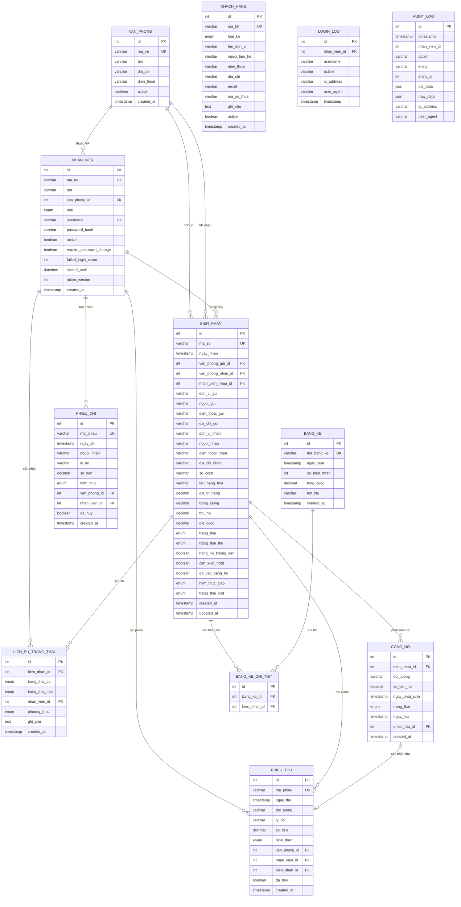

# TMQ Express ERP — Mô Tả Database

> **Database Engine:** PostgreSQL 15+
> **ORM:** Prisma 6.x
> **Tổng cộng:** 12 bảng, 9 enums, 25 indexes, 15 foreign keys
> **Cập nhật lần cuối:** 2026-04-28 (Phase 2: COD Workflow)

---

## Mục Lục

1. [Sơ đồ quan hệ (ERD)](#1-sơ-đồ-quan-hệ-erd)
2. [Mô tả chi tiết quan hệ giữa các bảng](#2-mô-tả-chi-tiết-quan-hệ-giữa-các-bảng)
3. [Enums](#3-enums)
4. [Chi tiết thuộc tính từng bảng](#4-chi-tiết-thuộc-tính-từng-bảng)
5. [Indexes & Performance](#5-indexes--performance)
6. [Triggers & Business Logic tự động](#6-triggers--business-logic-tự-động)
7. [Quy tắc sinh mã tự động](#7-quy-tắc-sinh-mã-tự-động)
8. [Ràng buộc toàn vẹn dữ liệu](#8-ràng-buộc-toàn-vẹn-dữ-liệu)
9. [Seed Data mẫu](#9-seed-data-mẫu)

---

## 1. Sơ đồ quan hệ (ERD)



---

## 2. Mô tả chi tiết quan hệ giữa các bảng

### 2.1. Tổng hợp Foreign Keys

| FK Constraint | Bảng nguồn | Cột FK | Bảng đích | Cột đích | ON DELETE | ON UPDATE |
|---|---|---|---|---|---|---|
| `nhan_vien_van_phong_id_fkey` | nhan_vien | van_phong_id | van_phong | id | RESTRICT | CASCADE |
| `bien_nhan_van_phong_gui_id_fkey` | bien_nhan | van_phong_gui_id | van_phong | id | RESTRICT | CASCADE |
| `bien_nhan_van_phong_nhan_id_fkey` | bien_nhan | van_phong_nhan_id | van_phong | id | RESTRICT | CASCADE |
| `bien_nhan_nhan_vien_nhap_id_fkey` | bien_nhan | nhan_vien_nhap_id | nhan_vien | id | RESTRICT | CASCADE |
| `lich_su_trang_thai_bien_nhan_id_fkey` | lich_su_trang_thai | bien_nhan_id | bien_nhan | id | RESTRICT | CASCADE |
| `lich_su_trang_thai_nhan_vien_id_fkey` | lich_su_trang_thai | nhan_vien_id | nhan_vien | id | RESTRICT | CASCADE |
| `bang_ke_chi_tiet_bang_ke_id_fkey` | bang_ke_chi_tiet | bang_ke_id | bang_ke | id | RESTRICT | CASCADE |
| `bang_ke_chi_tiet_bien_nhan_id_fkey` | bang_ke_chi_tiet | bien_nhan_id | bien_nhan | id | RESTRICT | CASCADE |
| `phieu_thu_nhan_vien_id_fkey` | phieu_thu | nhan_vien_id | nhan_vien | id | RESTRICT | CASCADE |
| `phieu_thu_bien_nhan_id_fkey` | phieu_thu | bien_nhan_id | bien_nhan | id | SET NULL | CASCADE |
| `phieu_chi_nhan_vien_id_fkey` | phieu_chi | nhan_vien_id | nhan_vien | id | RESTRICT | CASCADE |
| `cong_no_bien_nhan_id_fkey` | cong_no | bien_nhan_id | bien_nhan | id | RESTRICT | CASCADE |
| `cong_no_phieu_thu_id_fkey` | cong_no | phieu_thu_id | phieu_thu | id | SET NULL | CASCADE |

### 2.2. Mô tả quan hệ theo nghiệp vụ

#### VAN_PHONG ↔ NHAN_VIEN (1:N)
- Mỗi nhân viên thuộc **đúng 1** văn phòng (bắt buộc)
- Mỗi văn phòng có **nhiều** nhân viên
- Không thể xoá VP nếu còn NV (`ON DELETE RESTRICT`)

#### VAN_PHONG ↔ BIEN_NHAN (1:N × 2 quan hệ)
- **VP Gửi** (`van_phong_gui_id`): VP nơi hàng được gửi đi
- **VP Nhận** (`van_phong_nhan_id`): VP nơi hàng sẽ đến
- Quy tắc: VP gửi **phải khác** VP nhận (validate ở application layer)
- Không thể xoá VP nếu còn BN liên quan

#### NHAN_VIEN ↔ BIEN_NHAN (1:N)
- **NV Nhập** (`nhan_vien_nhap_id`): NV tạo biên nhận
- Staff chỉ được sửa BN do mình tạo (enforce ở application layer)

#### BIEN_NHAN ↔ LICH_SU_TRANG_THAI (1:N)
- Mỗi lần chuyển trạng thái tạo 1 bản ghi lịch sử
- Ghi nhận: trạng thái cũ, trạng thái mới, NV thực hiện, phương thức, thời điểm

#### BIEN_NHAN ↔ BANG_KE_CHI_TIET (1:N)
- 1 BN chỉ thuộc **tối đa 1** bảng kê (enforce qua `da_vao_bang_ke` flag)
- Khi vào bảng kê, BN được đánh dấu `da_vao_bang_ke = true`

#### BANG_KE ↔ BANG_KE_CHI_TIET (1:N)
- Bảng trung gian giữa BangKe và BienNhan
- Unique constraint: `(bang_ke_id, bien_nhan_id)` — 1 BN không xuất hiện 2 lần trong cùng 1 bảng kê

#### BIEN_NHAN ↔ CONG_NO (1:N)
- Khi BN có `trang_thai_thu = 'cong_no'`, hệ thống tự tạo bản ghi CongNo
- 1 BN có thể phát sinh nhiều công nợ (lý thuyết)

#### CONG_NO ↔ PHIEU_THU (N:1 — optional)
- Khi xác nhận thanh toán công nợ → tự tạo PhieuThu → gắn `phieu_thu_id`
- `ON DELETE SET NULL`: nếu xoá PhieuThu, CongNo vẫn tồn tại nhưng mất liên kết

#### BIEN_NHAN ↔ PHIEU_THU (1:N — optional)
- PhieuThu có thể liên kết với BN (thu cước) hoặc không (thu khác)
- `ON DELETE SET NULL`: nếu xoá BN, PhieuThu vẫn tồn tại

#### NHAN_VIEN ↔ PHIEU_THU / PHIEU_CHI (1:N)
- NV tạo phiếu. Non-admin chỉ sửa phiếu do mình tạo

---

## 3. Enums

### 3.1. Role — Vai trò người dùng

| Giá trị | Mô tả | Quyền hạn |
|---|---|---|
| `admin` | Quản trị viên | Toàn quyền: CRUD tất cả, quản lý NV, VP |
| `staff` | Nhân viên | Tạo/sửa BN (chỉ của mình), cập nhật trạng thái |
| `accountant` | Kế toán | Quản lý phiếu thu/chi, công nợ, bảng kê |

### 3.2. TrangThai — Trạng thái vận chuyển

| Giá trị | Nhãn | Chuyển tiếp cho phép |
|---|---|---|
| `cho_vc` | Chờ vận chuyển | → `dang_vc` |
| `dang_vc` | Đang vận chuyển | → `da_den_kho` |
| `da_den_kho` | Đã đến kho | → `da_bao_khach` |
| `da_bao_khach` | Đã báo khách | → `khach_da_nhan` |
| `khach_da_nhan` | Khách đã nhận | _(kết thúc)_ |

> **Quy tắc:** Chỉ cho phép chuyển trạng thái **tuần tự**, không được nhảy bước. Validate ở application layer (`ALLOWED_TRANSITIONS` map).

### 3.3. TrangThaiThu — Trạng thái thanh toán cước

| Giá trị | Mô tả | Hành vi tự động |
|---|---|---|
| `da_thu` | Đã thu tiền cước | Không có |
| `chua_thu` | Chưa thu | Không có |
| `cong_no` | Ghi công nợ | Tự động tạo bản ghi `cong_no` |

### 3.4. HinhThucGiao — Hình thức giao hàng

| Giá trị | Mô tả |
|---|---|
| `tan_noi` | Giao tận nơi |
| `goi_dien` | Gọi điện báo khách |
| `tu_toi` | Khách tự tới lấy |

### 3.5. HinhThucThanhToan — Hình thức thanh toán

| Giá trị | Mô tả |
|---|---|
| `tien_mat` | Tiền mặt |
| `chuyen_khoan` | Chuyển khoản ngân hàng |

### 3.6. TrangThaiCongNo — Trạng thái công nợ

| Giá trị | Mô tả | Chuyển bởi |
|---|---|---|
| `chua_thu` | Chưa thu | Mặc định khi tạo |
| `da_thu` | Đã thu (có phiếu thu liên kết) | Xác nhận thanh toán / Hủy PT → revert |
| `qua_han` | Quá hạn (>30 ngày) | Check runtime khi list |

### 3.7. PhuongThucCapNhat — Phương thức cập nhật trạng thái

| Giá trị | Mô tả |
|---|---|
| `manual` | Cập nhật thủ công (từng BN) |
| `qr_scan` | Quét QR code |
| `batch` | Cập nhật hàng loạt (gửi xe) |

### 3.8. LoaiKH — Loại khách hàng

| Giá trị | Mô tả |
|---|---|
| `doanh_nghiep` | Doanh nghiệp (Cty, DNTN, Cửa hàng...) |
| `ca_nhan` | Cá nhân thường xuyên |

### 3.9. TrangThaiCOD — Trạng thái thu hộ (COD)

| Giá trị | Mô tả | Chuyển bởi |
|---|---|---|
| `khong_co` | Không có thu hộ | Mặc định khi `thu_ho = 0` |
| `cho_thu` | Chờ thu từ người nhận | Tự động khi tạo BN với `thu_ho > 0` |
| `da_thu` | VP nhận đã thu tiền | `xacNhanThuCOD()` hoặc auto-thu khi giao hàng |
| `da_chuyen` | Tiền đã chuyển về VP gửi | `xacNhanChuyenCOD()` |
| `da_tra` | Đã trả cho người gửi | `xacNhanTraCOD()` |

> **State Machine:** `cho_thu → da_thu → da_chuyen → da_tra`. Mỗi bước chỉ chấp nhận đúng 1 trạng thái đầu vào. Validate ở application layer (`thu-ho.service.js`).

---

## 4. Chi tiết thuộc tính từng bảng

### 4.1. `van_phong` — Văn phòng / Chi nhánh

| Cột | Kiểu | Ràng buộc | Mô tả |
|---|---|---|---|
| `id` | SERIAL (INT) | PK, AUTO_INCREMENT | ID tự tăng |
| `ma_vp` | VARCHAR(10) | UNIQUE, NOT NULL | Mã văn phòng viết tắt (VD: `SG`, `CT`, `RG`) |
| `ten` | VARCHAR(200) | NOT NULL | Tên đầy đủ văn phòng |
| `dia_chi` | VARCHAR(500) | NULLABLE | Địa chỉ |
| `dien_thoai` | VARCHAR(20) | NULLABLE | Số điện thoại |
| `active` | BOOLEAN | DEFAULT `true` | Trạng thái hoạt động (soft delete) |
| `created_at` | TIMESTAMP(3) | DEFAULT `now()` | Ngày tạo |

---

### 4.2. `nhan_vien` — Nhân viên

| Cột | Kiểu | Ràng buộc | Mô tả |
|---|---|---|---|
| `id` | SERIAL (INT) | PK, AUTO_INCREMENT | ID tự tăng |
| `ma_nv` | VARCHAR(20) | UNIQUE, NOT NULL | Mã NV (VD: `NV-SG-001`) |
| `ten` | VARCHAR(200) | NOT NULL | Họ tên |
| `van_phong_id` | INT | FK → `van_phong.id`, NOT NULL | Văn phòng trực thuộc |
| `role` | ENUM `Role` | DEFAULT `'staff'` | Vai trò (admin/staff/accountant) |
| `username` | VARCHAR(100) | UNIQUE, NOT NULL | Tên đăng nhập |
| `password_hash` | VARCHAR(255) | NOT NULL | Mật khẩu đã hash (bcrypt, 10 rounds) |
| `active` | BOOLEAN | DEFAULT `true` | Trạng thái hoạt động |
| `require_password_change` | BOOLEAN | DEFAULT `false` | Yêu cầu đổi mật khẩu lần đăng nhập đầu |
| `failed_login_count` | INT | DEFAULT `0` | Số lần đăng nhập sai liên tiếp (S-03) |
| `locked_until` | TIMESTAMP(3) | NULLABLE | Thời điểm hết khóa (S-03) |
| `token_version` | INT | DEFAULT `0` | Phiên bản token — dùng cho JWT revocation (S-04) |
| `created_at` | TIMESTAMP(3) | DEFAULT `now()` | Ngày tạo |

---

### 4.3. `khach_hang` — Khách hàng

| Cột | Kiểu | Ràng buộc | Mô tả |
|---|---|---|---|
| `id` | SERIAL (INT) | PK, AUTO_INCREMENT | ID tự tăng |
| `ma_kh` | VARCHAR(20) | UNIQUE, NOT NULL | Mã KH (VD: `KH-0001`) |
| `loai_kh` | ENUM `LoaiKH` | DEFAULT `'ca_nhan'` | Loại KH: doanh nghiệp hoặc cá nhân |
| `ten_don_vi` | VARCHAR(300) | NOT NULL | Tên đơn vị / cá nhân |
| `nguoi_lien_he` | VARCHAR(200) | NULLABLE | Người liên hệ |
| `dien_thoai` | VARCHAR(20) | NULLABLE, INDEX | Số điện thoại |
| `dia_chi` | VARCHAR(500) | NULLABLE | Địa chỉ |
| `email` | VARCHAR(200) | NULLABLE | Email |
| `ma_so_thue` | VARCHAR(20) | NULLABLE | MST (phục vụ xuất HĐĐT) |
| `ghi_chu` | TEXT | NULLABLE | Ghi chú tự do |
| `active` | BOOLEAN | DEFAULT `true` | Trạng thái |
| `created_at` | TIMESTAMP(3) | DEFAULT `now()` | Ngày tạo |

> **Lưu ý:** Bảng `khach_hang` hiện **không có FK** trực tiếp tới `bien_nhan`. Thông tin người gửi/nhận được nhập tự do trên BN (denormalized). Bảng KH dùng cho mục đích tra cứu, báo cáo. Khi tạo BN, hệ thống **tự động tạo KH mới** nếu có SĐT và chưa tồn tại (xem trigger 6.8).

---

### 4.4. `bien_nhan` — Biên nhận hàng hoá _(bảng chính)_

| Cột | Kiểu | Ràng buộc | Mô tả |
|---|---|---|---|
| `id` | SERIAL (INT) | PK, AUTO_INCREMENT | ID tự tăng |
| `ma_so` | VARCHAR(30) | UNIQUE, NOT NULL | Mã biên nhận (VD: `SGCT-0001`) |
| `ngay_nhan` | TIMESTAMP(3) | DEFAULT `now()`, INDEX | Ngày nhận hàng |
| `van_phong_gui_id` | INT | FK → `van_phong.id`, INDEX, NOT NULL | VP nơi gửi |
| `van_phong_nhan_id` | INT | FK → `van_phong.id`, INDEX, NOT NULL | VP nơi nhận |
| `nhan_vien_nhap_id` | INT | FK → `nhan_vien.id`, NOT NULL | NV nhập liệu |
| `don_vi_gui` | VARCHAR(300) | NULLABLE | Đơn vị gửi |
| `nguoi_gui` | VARCHAR(200) | NULLABLE | Người gửi |
| `dien_thoai_gui` | VARCHAR(20) | NULLABLE | SĐT người gửi |
| `dia_chi_gui` | VARCHAR(500) | NULLABLE | Địa chỉ người gửi |
| `don_vi_nhan` | VARCHAR(300) | NULLABLE | Đơn vị nhận |
| `nguoi_nhan` | VARCHAR(200) | NULLABLE | Người nhận |
| `dien_thoai_nhan` | VARCHAR(20) | NULLABLE | SĐT người nhận |
| `dia_chi_nhan` | VARCHAR(500) | NULLABLE | Địa chỉ người nhận |
| `so_cccd` | VARCHAR(20) | NULLABLE | Số CCCD người nhận |
| `ten_hang_hoa` | VARCHAR(500) | NOT NULL | Tên/mô tả hàng hoá |
| `gia_tri_hang` | DECIMAL(15,0) | NULLABLE | Giá trị khai báo (VNĐ) |
| `trong_luong` | DECIMAL(10,2) | NULLABLE | Trọng lượng (kg) |
| `thu_ho` | DECIMAL(15,0) | DEFAULT `0` | Tiền thu hộ (VNĐ) |
| `gia_cuoc` | DECIMAL(15,0) | DEFAULT `0`, NOT NULL | Giá cước vận chuyển (VNĐ) |
| `trang_thai` | ENUM `TrangThai` | DEFAULT `'cho_vc'`, INDEX | Trạng thái vận chuyển |
| `trang_thai_thu` | ENUM `TrangThaiThu` | DEFAULT `'da_thu'` | Trạng thái thanh toán cước |
| `hang_hu_khong_den` | BOOLEAN | DEFAULT `false` | Đánh dấu hàng bị hư/không đến |
| `can_xuat_hddt` | BOOLEAN | DEFAULT `false`, INDEX (composite) | Cần xuất hoá đơn điện tử |
| `da_vao_bang_ke` | BOOLEAN | DEFAULT `false`, INDEX (composite) | Đã đưa vào bảng kê HĐĐT |
| `hinh_thuc_giao` | ENUM `HinhThucGiao` | DEFAULT `'tan_noi'` | Hình thức giao hàng |
| `trang_thai_cod` | ENUM `TrangThaiCOD` | DEFAULT `'khong_co'`, INDEX | Trạng thái thu hộ COD |
| `created_at` | TIMESTAMP(3) | DEFAULT `now()` | Ngày tạo |
| `updated_at` | TIMESTAMP(3) | AUTO (`@updatedAt`) | Tự động cập nhật khi sửa |

---

### 4.5. `lich_su_trang_thai` — Lịch sử trạng thái vận chuyển

| Cột | Kiểu | Ràng buộc | Mô tả |
|---|---|---|---|
| `id` | SERIAL (INT) | PK, AUTO_INCREMENT | ID tự tăng |
| `bien_nhan_id` | INT | FK → `bien_nhan.id`, INDEX, NOT NULL | Biên nhận liên quan |
| `trang_thai_cu` | ENUM `TrangThai` | NULLABLE | Trạng thái trước (NULL khi mới tạo) |
| `trang_thai_moi` | ENUM `TrangThai` | NOT NULL | Trạng thái mới |
| `nhan_vien_id` | INT | FK → `nhan_vien.id`, NOT NULL | NV thực hiện |
| `phuong_thuc` | ENUM `PhuongThucCapNhat` | DEFAULT `'manual'` | Cách cập nhật |
| `ghi_chu` | TEXT | NULLABLE | Ghi chú bổ sung |
| `created_at` | TIMESTAMP(3) | DEFAULT `now()` | Thời điểm cập nhật |

---

### 4.6. `bang_ke` — Bảng kê hoá đơn điện tử

| Cột | Kiểu | Ràng buộc | Mô tả |
|---|---|---|---|
| `id` | SERIAL (INT) | PK, AUTO_INCREMENT | ID tự tăng |
| `ma_bang_ke` | VARCHAR(30) | UNIQUE, NOT NULL | Mã bảng kê (VD: `BK-0001`) |
| `ngay_xuat` | TIMESTAMP(3) | DEFAULT `now()` | Ngày xuất bảng kê |
| `so_bien_nhan` | INT | DEFAULT `0` | Số lượng BN trong bảng kê |
| `tong_cuoc` | DECIMAL(15,0) | DEFAULT `0` | Tổng cước tất cả BN |
| `ten_file` | VARCHAR(200) | NOT NULL | Tên file Excel xuất ra |
| `created_at` | TIMESTAMP(3) | DEFAULT `now()` | Ngày tạo |

---

### 4.7. `bang_ke_chi_tiet` — Chi tiết bảng kê _(bảng trung gian)_

| Cột | Kiểu | Ràng buộc | Mô tả |
|---|---|---|---|
| `id` | SERIAL (INT) | PK, AUTO_INCREMENT | ID tự tăng |
| `bang_ke_id` | INT | FK → `bang_ke.id`, NOT NULL | Bảng kê cha |
| `bien_nhan_id` | INT | FK → `bien_nhan.id`, NOT NULL | Biên nhận |

**Unique Constraint:** `(bang_ke_id, bien_nhan_id)` — Mỗi BN chỉ xuất hiện 1 lần trong 1 bảng kê.

---

### 4.8. `phieu_thu` — Phiếu thu

| Cột | Kiểu | Ràng buộc | Mô tả |
|---|---|---|---|
| `id` | SERIAL (INT) | PK, AUTO_INCREMENT | ID tự tăng |
| `ma_phieu` | VARCHAR(20) | UNIQUE, NOT NULL | Mã phiếu (VD: `PT-0001`) |
| `ngay_thu` | TIMESTAMP(3) | DEFAULT `now()`, INDEX | Ngày thu |
| `doi_tuong` | VARCHAR(300) | NOT NULL | Đối tượng nộp tiền |
| `ly_do` | VARCHAR(500) | NOT NULL | Lý do thu |
| `so_tien` | DECIMAL(15,0) | NOT NULL | Số tiền (VNĐ) |
| `hinh_thuc` | ENUM `HinhThucThanhToan` | DEFAULT `'tien_mat'` | Hình thức thanh toán |
| `van_phong_id` | INT | INDEX, NOT NULL | VP thực hiện |
| `nhan_vien_id` | INT | FK → `nhan_vien.id`, NOT NULL | NV tạo phiếu |
| `bien_nhan_id` | INT | FK → `bien_nhan.id`, NULLABLE | BN liên kết (nếu thu cước) |
| `da_huy` | BOOLEAN | DEFAULT `false` | Đánh dấu đã huỷ (soft delete) |
| `created_at` | TIMESTAMP(3) | DEFAULT `now()` | Ngày tạo |

> **Lưu ý:** `van_phong_id` **không có FK** ở database level, giá trị lấy từ `user.van_phong_id` khi tạo.

---

### 4.9. `phieu_chi` — Phiếu chi

| Cột | Kiểu | Ràng buộc | Mô tả |
|---|---|---|---|
| `id` | SERIAL (INT) | PK, AUTO_INCREMENT | ID tự tăng |
| `ma_phieu` | VARCHAR(20) | UNIQUE, NOT NULL | Mã phiếu (VD: `PC-0001`) |
| `ngay_chi` | TIMESTAMP(3) | DEFAULT `now()`, INDEX | Ngày chi |
| `nguoi_nhan` | VARCHAR(300) | NOT NULL | Người nhận tiền |
| `ly_do` | VARCHAR(500) | NOT NULL | Lý do chi |
| `so_tien` | DECIMAL(15,0) | NOT NULL | Số tiền (VNĐ) |
| `hinh_thuc` | ENUM `HinhThucThanhToan` | DEFAULT `'tien_mat'` | Hình thức |
| `van_phong_id` | INT | INDEX, NOT NULL | VP thực hiện |
| `nhan_vien_id` | INT | FK → `nhan_vien.id`, NOT NULL | NV tạo phiếu |
| `da_huy` | BOOLEAN | DEFAULT `false` | Đánh dấu đã huỷ (soft delete) |
| `created_at` | TIMESTAMP(3) | DEFAULT `now()` | Ngày tạo |

---

### 4.10. `cong_no` — Công nợ

| Cột | Kiểu | Ràng buộc | Mô tả |
|---|---|---|---|
| `id` | SERIAL (INT) | PK, AUTO_INCREMENT | ID tự tăng |
| `bien_nhan_id` | INT | FK → `bien_nhan.id`, NOT NULL | BN phát sinh nợ |
| `doi_tuong` | VARCHAR(300) | NOT NULL | Đối tượng nợ (lấy từ đơn vị gửi / người gửi) |
| `so_tien_no` | DECIMAL(15,0) | NOT NULL | Số tiền nợ = giá cước BN (VNĐ) |
| `ngay_phat_sinh` | TIMESTAMP(3) | DEFAULT `now()`, INDEX | Ngày phát sinh |
| `trang_thai` | ENUM `TrangThaiCongNo` | DEFAULT `'chua_thu'`, INDEX | Trạng thái |
| `ngay_thu` | TIMESTAMP(3) | NULLABLE | Ngày thu được (khi `da_thu`) |
| `phieu_thu_id` | INT | FK → `phieu_thu.id`, NULLABLE | Phiếu thu liên kết |
| `created_at` | TIMESTAMP(3) | DEFAULT `now()` | Ngày tạo |

---

### 4.11. `login_log` — Nhật ký đăng nhập (v1.1 Security)

| Cột | Kiểu | Ràng buộc | Mô tả |
|---|---|---|---|
| `id` | SERIAL (INT) | PK, AUTO_INCREMENT | ID tự tăng |
| `nhan_vien_id` | INT | NULLABLE, INDEX | NV đăng nhập (NULL nếu username không tồn tại) |
| `username` | VARCHAR(100) | NOT NULL | Username đã dùng |
| `action` | VARCHAR(20) | NOT NULL | `login_success` \| `login_failed` \| `logout` |
| `ip_address` | VARCHAR(45) | NULLABLE | IP client |
| `user_agent` | VARCHAR(500) | NULLABLE | User-Agent header |
| `timestamp` | TIMESTAMP(3) | DEFAULT `now()`, INDEX | Thời điểm |

---

### 4.12. `audit_log` — Nhật ký thao tác (v1.1 Security)

| Cột | Kiểu | Ràng buộc | Mô tả |
|---|---|---|---|
| `id` | SERIAL (INT) | PK, AUTO_INCREMENT | ID tự tăng |
| `timestamp` | TIMESTAMP(3) | DEFAULT `now()`, INDEX | Thời điểm |
| `nhan_vien_id` | INT | NOT NULL, INDEX | NV thực hiện |
| `action` | VARCHAR(20) | NOT NULL | `CREATE` \| `UPDATE` \| `DELETE` \| `EXPORT` |
| `entity` | VARCHAR(50) | NOT NULL, INDEX (composite) | Bảng bị tác động (`bien_nhan`, `phieu_thu`, ...) |
| `entity_id` | INT | NULLABLE, INDEX (composite) | ID record bị tác động |
| `old_data` | JSON | NULLABLE | Dữ liệu trước thay đổi |
| `new_data` | JSON | NULLABLE | Dữ liệu sau thay đổi |
| `ip_address` | VARCHAR(45) | NULLABLE | IP client |
| `user_agent` | VARCHAR(500) | NULLABLE | User-Agent header |

---

## 5. Indexes & Performance

### 5.1. Unique Indexes

| Bảng | Cột | Tên index |
|---|---|---|
| van_phong | `ma_vp` | `van_phong_ma_vp_key` |
| nhan_vien | `ma_nv` | `nhan_vien_ma_nv_key` |
| nhan_vien | `username` | `nhan_vien_username_key` |
| khach_hang | `ma_kh` | `khach_hang_ma_kh_key` |
| bien_nhan | `ma_so` | `bien_nhan_ma_so_key` |
| bang_ke | `ma_bang_ke` | `bang_ke_ma_bang_ke_key` |
| bang_ke_chi_tiet | `(bang_ke_id, bien_nhan_id)` | `bang_ke_chi_tiet_bang_ke_id_bien_nhan_id_key` |
| phieu_thu | `ma_phieu` | `phieu_thu_ma_phieu_key` |
| phieu_chi | `ma_phieu` | `phieu_chi_ma_phieu_key` |

### 5.2. Non-unique Indexes (Performance)

| Bảng | Cột(s) | Tên index | Mục đích |
|---|---|---|---|
| bien_nhan | `van_phong_gui_id` | `bien_nhan_van_phong_gui_id_idx` | Filter theo VP gửi |
| bien_nhan | `van_phong_nhan_id` | `bien_nhan_van_phong_nhan_id_idx` | Filter theo VP nhận |
| bien_nhan | `trang_thai` | `bien_nhan_trang_thai_idx` | Filter/count theo trạng thái |
| bien_nhan | `ngay_nhan` | `bien_nhan_ngay_nhan_idx` | Filter theo khoảng ngày |
| bien_nhan | `(can_xuat_hddt, da_vao_bang_ke)` | `bien_nhan_can_xuat_hddt_da_vao_bang_ke_idx` | Tìm BN cần xuất HĐĐT chưa vào bảng kê |
| bien_nhan | `trang_thai_cod` | `bien_nhan_trang_thai_cod_idx` | Filter theo trạng thái COD |
| lich_su_trang_thai | `bien_nhan_id` | `lich_su_trang_thai_bien_nhan_id_idx` | Truy vấn lịch sử theo BN |
| phieu_thu | `ngay_thu` | `phieu_thu_ngay_thu_idx` | Filter theo ngày |
| phieu_thu | `van_phong_id` | `phieu_thu_van_phong_id_idx` | Filter theo VP |
| phieu_chi | `ngay_chi` | `phieu_chi_ngay_chi_idx` | Filter theo ngày |
| phieu_chi | `van_phong_id` | `phieu_chi_van_phong_id_idx` | Filter theo VP |
| cong_no | `trang_thai` | `cong_no_trang_thai_idx` | Filter công nợ chua_thu/qua_han |
| cong_no | `ngay_phat_sinh` | `cong_no_ngay_phat_sinh_idx` | Filter theo thời gian |
| khach_hang | `dien_thoai` | `khach_hang_dien_thoai_idx` | Autocomplete tìm theo SĐT |
| login_log | `nhan_vien_id` | `login_log_nhan_vien_id_idx` | Filter theo NV |
| login_log | `timestamp` | `login_log_timestamp_idx` | Filter theo thời gian |
| audit_log | `nhan_vien_id` | `audit_log_nhan_vien_id_idx` | Filter theo NV |
| audit_log | `(entity, entity_id)` | `audit_log_entity_entity_id_idx` | Tra lịch sử 1 record |
| audit_log | `timestamp` | `audit_log_timestamp_idx` | Filter theo thời gian |

---

## 6. Triggers & Business Logic tự động

> **Lưu ý quan trọng:** Hệ thống **không sử dụng database triggers** (PostgreSQL functions/triggers). Toàn bộ business logic được xử lý ở **application layer** (Node.js service) sử dụng **Prisma transactions** (`$transaction`) để đảm bảo tính nguyên tử (atomicity).

### 6.1. Trigger: Tạo biên nhận → Tự tạo lịch sử trạng thái

| Thuộc tính | Giá trị |
|---|---|
| **Khi nào** | `createBienNhan()` — Tạo BN mới |
| **File** | `services/bien-nhan.service.js` |
| **Hành vi** | Tạo bản ghi `lich_su_trang_thai` đầu tiên với `trang_thai_moi = 'cho_vc'`, `trang_thai_cu = NULL` |
| **Transaction** | ✅ Prisma `$transaction` |

```
Tạo BN → INSERT lich_su_trang_thai {
  trang_thai_cu: NULL,
  trang_thai_moi: 'cho_vc',
  ghi_chu: 'Tạo biên nhận mới'
}
```

### 6.2. Trigger: Tạo biên nhận công nợ → Tự tạo CongNo

| Thuộc tính | Giá trị |
|---|---|
| **Khi nào** | `createBienNhan()` với `trang_thai_thu = 'cong_no'` |
| **File** | `services/bien-nhan.service.js` |
| **Hành vi** | Tạo bản ghi `cong_no` với `so_tien_no = gia_cuoc`, `doi_tuong = don_vi_gui hoặc nguoi_gui` |
| **Transaction** | ✅ Cùng transaction với tạo BN |

```
IF trang_thai_thu = 'cong_no' THEN
  INSERT cong_no {
    doi_tuong: don_vi_gui || nguoi_gui || 'N/A',
    so_tien_no: gia_cuoc,
    trang_thai: 'chua_thu'
  }
```

### 6.3. Trigger: Cập nhật trạng thái BN → Ghi lịch sử

| Thuộc tính | Giá trị |
|---|---|
| **Khi nào** | PATCH `/:id/trang-thai` hoặc `/batch-trang-thai` |
| **File** | `routes/bien-nhan.routes.js` |
| **Hành vi** | Validate transition tuần tự → Update BN → INSERT lịch sử |
| **Transaction** | ✅ Prisma `$transaction` |

```
Validate: ALLOWED_TRANSITIONS[current].includes(new)
  → UPDATE bien_nhan SET trang_thai = new
  → INSERT lich_su_trang_thai { trang_thai_cu, trang_thai_moi, nhan_vien_id, phuong_thuc }
```

### 6.4. Trigger: Xác nhận thanh toán công nợ → Tự tạo phiếu thu

| Thuộc tính | Giá trị |
|---|---|
| **Khi nào** | `xacNhanThanhToan(congNoId)` |
| **File** | `services/cong-no.service.js` |
| **Hành vi** | Tạo PhieuThu tự động → Cập nhật CongNo: `trang_thai = 'da_thu'`, gắn `phieu_thu_id`, `ngay_thu` |
| **Transaction** | ✅ Prisma `$transaction` + retry on unique violation (P2002) |

```
INSERT phieu_thu {
  doi_tuong: cn.doi_tuong,
  ly_do: 'Thu công nợ BN {ma_so}',
  so_tien: cn.so_tien_no
}
UPDATE cong_no {
  trang_thai: 'da_thu',
  ngay_thu: now(),
  phieu_thu_id: pt.id
}
```

### 6.5. Trigger: Huỷ phiếu thu → Revert công nợ

| Thuộc tính | Giá trị |
|---|---|
| **Khi nào** | `huyPhieuThu(id)` |
| **File** | `services/phieu-thu.service.js` |
| **Hành vi** | Đánh dấu `da_huy = true` → Tìm CongNo liên kết → Revert về `chua_thu` |
| **Transaction** | ✅ Prisma `$transaction` |

```
UPDATE phieu_thu SET da_huy = true
UPDATE cong_no WHERE phieu_thu_id = pt.id SET {
  trang_thai: 'chua_thu',
  ngay_thu: NULL,
  phieu_thu_id: NULL
}
```

### 6.6. Trigger: Xuất bảng kê → Đánh dấu BN

| Thuộc tính | Giá trị |
|---|---|
| **Khi nào** | `createBangKe(bienNhanIds)` |
| **File** | `services/bang-ke.service.js` |
| **Hành vi** | Tạo BangKe + BangKeChiTiet → Cập nhật `da_vao_bang_ke = true` cho các BN |
| **Transaction** | ✅ Prisma `$transaction` |

```
INSERT bang_ke { ma_bang_ke, so_bien_nhan, tong_cuoc, ten_file }
INSERT bang_ke_chi_tiet[] { bang_ke_id, bien_nhan_id }
UPDATE bien_nhan SET da_vao_bang_ke = true WHERE id IN (ids)
```

### 6.7. Trigger: Tạo phiếu thu từ BN → Auto-fill

| Thuộc tính | Giá trị |
|---|---|
| **Khi nào** | `createPhieuThu()` với `bien_nhan_id` |
| **File** | `services/phieu-thu.service.js` |
| **Hành vi** | Tự điền `doi_tuong`, `ly_do`, `so_tien` từ BN nếu không cung cấp |

```
IF bien_nhan_id THEN
  doi_tuong ??= bn.don_vi_gui || bn.nguoi_gui
  ly_do ??= 'Thu cước BN {ma_so}'
  so_tien ??= bn.gia_cuoc
```

### 6.8. Trigger: Tạo biên nhận → Auto-create KH

| Thuộc tính | Giá trị |
|---|---|
| **Khi nào** | `createBienNhan()` — Tạo BN mới |
| **File** | `services/bien-nhan.service.js` (helper `autoCreateKhachHang`) |
| **Hành vi** | Với mỗi bên (gửi / nhận): nếu có tên + SĐT → lookup KH bằng SĐT → nếu chưa tồn tại → tạo KH mới (loại `ca_nhan`) |
| **Transaction** | ✅ Cùng transaction với tạo BN |
| **Error handling** | Try-catch — nếu auto-create fail thì BN vẫn được tạo bình thường |

```
FOR EACH side IN (gui, nhan):
  IF !ten -> SKIP (không đủ thông tin)
  IF !sdt -> SKIP (vãng lai)
  IF EXISTS KH WHERE dien_thoai = sdt -> SKIP (đã có)
  ELSE -> INSERT khach_hang { ma_kh, loai_kh='ca_nhan', ten_don_vi, dien_thoai, ... }
  -> Trả auto_created_kh[] về API response
```

---

## 7. Quy tắc sinh mã tự động

Tất cả mã được sinh ở application layer với cơ chế **retry on unique violation** (Prisma error code `P2002`, tối đa 3 lần thử).

| Bảng | Trường | Format | Ví dụ | Logic |
|---|---|---|---|---|
| bien_nhan | ma_so | `{MA_VP_GUI}{MA_VP_NHAN}-XXXX` | `SGCT-0001` | `findFirst(orderBy: desc)` + parse số + increment |
| khach_hang | ma_kh | `KH-XXXX` | `KH-0001` | `generateCode('khachHang', 'ma_kh', 'KH')` |
| phieu_thu | ma_phieu | `PT-XXXX` | `PT-0001` | `createWithCode(fn, 'phieuThu', 'ma_phieu', 'PT')` |
| phieu_chi | ma_phieu | `PC-XXXX` | `PC-0001` | `createWithCode(fn, 'phieuChi', 'ma_phieu', 'PC')` |
| bang_ke | ma_bang_ke | `BK-XXXX` | `BK-0001` | `generateCode('bangKe', 'ma_bang_ke', 'BK')` |
| nhan_vien | ma_nv | `NV-{VP}-XXX` | `NV-SG-001` | Thủ công khi tạo NV |

> **Race condition safety:** Hàm `createWithCode()` wrap cả việc sinh mã lẫn INSERT trong vòng retry, nếu gặp unique violation thì tự tăng số và thử lại.

---

## 8. Ràng buộc toàn vẹn dữ liệu

### 8.1. Database-level constraints

| Loại | Bảng | Chi tiết |
|---|---|---|
| PRIMARY KEY | Tất cả 12 bảng | `id` SERIAL |
| UNIQUE | 9 constraints | ma_vp, ma_nv, username, ma_kh, ma_so, ma_bang_ke, (bang_ke_id, bien_nhan_id), ma_phieu (PT), ma_phieu (PC) |
| FOREIGN KEY | 13 constraints | Xem bảng FK ở mục 2.1 |
| NOT NULL | Các cột bắt buộc | Xem chi tiết từng bảng |
| DEFAULT | Nhiều cột | `true`, `false`, `0`, `now()`, enum values |

### 8.2. Application-level constraints (validation)

| Rule | Bảng | Mô tả | File |
|---|---|---|---|
| VP gửi ≠ VP nhận | bien_nhan | Validate khi tạo BN mới | `bien-nhan.routes.js` |
| Chuyển TT tuần tự | bien_nhan | Theo `ALLOWED_TRANSITIONS` map | `bien-nhan.routes.js` |
| Staff sửa BN mình | bien_nhan | `nhan_vien_nhap_id === userId` | `bien-nhan.service.js` |
| Không sửa ma_so | bien_nhan | Whitelist 17 fields, không spread body trực tiếp | `bien-nhan.service.js` |
| Không thu nợ đã thu | cong_no | Check `trang_thai !== 'da_thu'` | `cong-no.service.js` |
| Không huỷ PT đã huỷ | phieu_thu | Check `da_huy !== true` | `phieu-thu.service.js` |
| Không huỷ PC đã huỷ | phieu_chi | Check `da_huy !== true` | `phieu-chi.service.js` |
| Non-admin sửa PT/PC mình | phieu_thu/chi | `nhan_vien_id === userId` | `phieu-thu/chi.service.js` |
| Staff sửa BN trong 24h | bien_nhan | Quá 24 giờ → 403 Forbidden | `bien-nhan.service.js` |
| Account lock | nhan_vien | 5 lần sai → khóa 15 phút | `auth.service.js` |
| JWT token_version | nhan_vien | Verify mỗi request against DB | `plugins/auth.js` |
| BN phải có hàng hoá | bien_nhan | `ten_hang_hoa: minLength 1` | `bien-nhan.routes.js` |
| Rate limit scan | scan | 30 req/phút (public endpoint) | `scan.routes.js` |

### 8.3. Phân quyền (RBAC)

| Endpoint | admin | staff | accountant |
|---|---|---|---|
| Tạo/sửa biên nhận | ✅ | ✅ (chỉ BN mình) | ❌ |
| Cập nhật trạng thái | ✅ | ✅ | ❌ |
| Tạo/sửa phiếu thu | ✅ | ✅ | ✅ |
| Tạo/sửa phiếu chi | ✅ | ✅ | ✅ |
| Xem danh sách | ✅ (tất cả VP) | ✅ (chỉ VP mình) | ✅ |
| Quản lý NV/VP | ✅ | ❌ | ❌ |

---

## 9. Seed Data mẫu

File: `prisma/seed.js` — Chạy bằng `npx prisma db seed`

| Bảng | Số lượng | Mô tả |
|---|---|---|
| van_phong | 3 | SG (Tp.HCM), CT (Cần Thơ), RG (Rạch Giá) |
| nhan_vien | 6 | 1 admin, 2 kế toán, 3 staff — MK: `Tmq@1234` |
| khach_hang | 10 | Đa dạng: Cty TNHH, DNTN, Cửa hàng, CP |
| bien_nhan | 30 | 6 tuyến × 5 BN, đủ 5 trạng thái |
| lich_su_trang_thai | ~60 | Tự động theo trạng thái BN |
| cong_no | ~6 | BN có trang_thai_thu = 'cong_no' |
| phieu_thu | 10 | Đa dạng: thu cước, thu nợ, thu hộ |
| phieu_chi | 6 | Chi VC, thuê mặt bằng, VPP |
| bang_ke | 1 | Gồm 3 BN đầu tiên |

**Tài khoản test:**

| Username | Role | Văn phòng | Mật khẩu |
|---|---|---|---|
| `admin` | admin | SG | `Tmq@1234` |
| `ketoan` | accountant | SG | `Tmq@1234` |
| `ketoan_ct` | accountant | CT | `Tmq@1234` |
| `staff_sg` | staff | SG | `Tmq@1234` |
| `staff_ct` | staff | CT | `Tmq@1234` |
| `staff_rg` | staff | RG | `Tmq@1234` |
