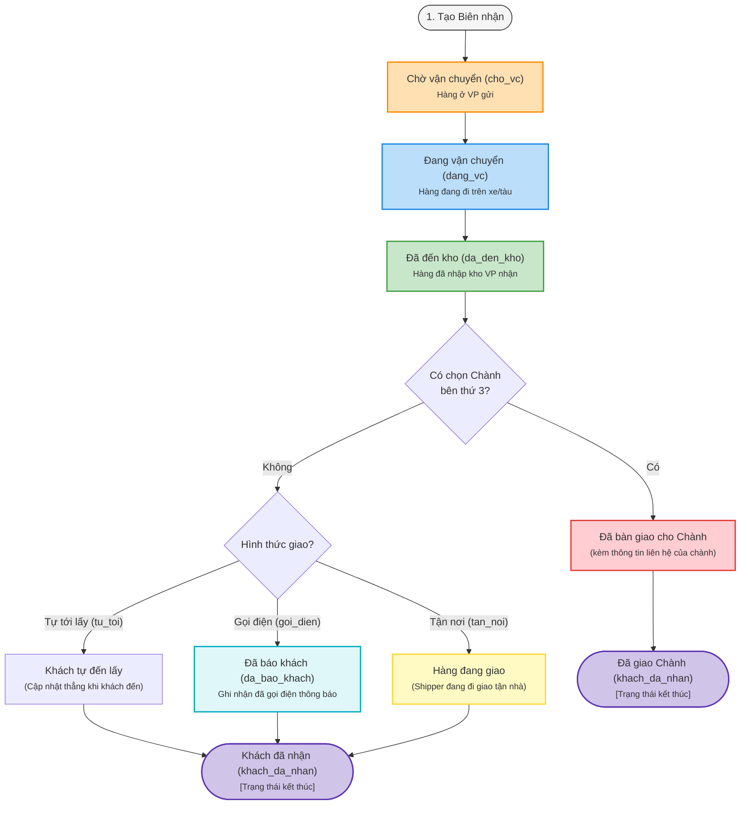

# Vòng đời Biên nhận TMQ Express (Receipt Lifecycle Synthesis)

Tài liệu này tổng hợp chi tiết nghiệp vụ về **vòng đời của một biên nhận** (đơn hàng) tại TMQ Express, đối chiếu giữa quy trình nghiệp vụ thực tế và cấu trúc kỹ thuật hiện tại của hệ thống.

---

## 1. Sơ đồ Tổng quan Vòng đời (Workflow Diagram)

Dưới đây là sơ đồ luồng trạng thái từ lúc tiếp nhận hàng hóa cho đến khi kết thúc vòng đời biên nhận, bao gồm các nhánh xử lý khác nhau dựa trên hình thức giao hàng và việc sử dụng đơn vị vận chuyển thứ ba (Chành).

---

## 2. Chi tiết Nghiệp vụ các Giai đoạn

### 2.1. Giai đoạn 1: Tuyến chính (Đồng nhất cho mọi biên nhận)
Bất kể hình thức nhận hàng hay đối tác vận chuyển nào, tất cả biên nhận khi khởi tạo đều phải đi qua 3 bước tuần tự bắt buộc:
1. **Chờ vận chuyển (`cho_vc`)**: Hàng hóa đã được nhân viên VP gửi tiếp nhận, dán nhãn, in biên nhận (có mã QR) và xếp vào kho gửi chờ gom chuyến.
2. **Đang vận chuyển (`dang_vc`)**: Hàng hóa đã được xếp lên xe/tàu trung chuyển và đang trên đường đi từ VP gửi đến VP nhận.
3. **Đã đến kho (`da_den_kho`)**: Xe hàng cập bến nhận, nhân viên VP nhận thực hiện kiểm đếm và quét mã nhập kho.

---

### 2.2. Giai đoạn 2: Phân nhánh xử lý (Sau khi hàng đã đến kho nhận)

Tùy vào thuộc tính giao nhận được cấu hình lúc tạo biên nhận, luồng nghiệp vụ sẽ rẽ nhánh như sau:

#### Nhánh A: Hàng không giao qua Chành bên thứ ba (`chanh_id` trống)
Dựa vào thuộc tính **Hình thức giao** (`hinh_thuc_giao`):
* **Trường hợp 1: Khách tự đến lấy (`hinh_thuc_giao = tu_toi`)**
  * Hàng nằm tại kho nhận. Khi nào khách hàng chủ động đến văn phòng nhận xuất trình biên nhận/tin nhắn, nhân viên xác nhận và cập nhật thẳng từ `da_den_kho` sang `khach_da_nhan`. 
  * *Bỏ qua trạng thái trung gian `da_bao_khach`.*
* **Trường hợp 2: Gọi báo khách đến lấy (`hinh_thuc_giao = goi_dien`)**
  * Nhân viên kho nhận tiến hành gọi điện thông báo cho người nhận.
  * Hệ thống bắt buộc ghi nhận trạng thái trung gian **Đã báo khách (`da_bao_khach`)** kèm theo lịch sử thời gian cuộc gọi để phục vụ đối soát thời gian lưu kho.
  * Khi khách đến nhận hàng, cập nhật sang trạng thái cuối **Khách đã nhận (`khach_da_nhan`)**.
* **Trường hợp 3: Giao tận nơi (`hinh_thuc_giao = tan_noi`)**
  * Nhân viên sắp xếp lịch và giao hàng cho shipper đi phát tận nhà.
  * Hệ thống cần cập nhật trạng thái **"Hàng đang giao"** (Shipper đang vận chuyển chặng cuối).
  * Khi khách nhận hàng thành công, cập nhật trạng thái cuối **Khách đã nhận (`khach_da_nhan`)**.

#### Nhánh B: Có chọn Chành bên thứ ba (`chanh_id` hợp lệ)
* Hàng sau khi đến kho nhận sẽ được bàn giao ngay cho đối tác Chành xe liên kết tiếp theo.
* Nhân viên cập nhật trạng thái đã bàn giao cho đơn vị vận chuyển tiếp theo. Hệ thống hiển thị thông tin chi tiết về Chành (Tên chành, Số điện thoại, Người liên hệ) trên màn hình chi tiết và giao diện tra cứu QR công khai để khách hàng chủ động liên hệ chặng tiếp theo.
* Đến đây, trách nhiệm vận chuyển của TMQ Express chính thức **kết thúc (Terminal State)**.

---

## 3. Khảo sát & Đối chiếu Kỹ thuật hiện tại

Để phục vụ phát triển hoặc điều chỉnh hệ thống, dưới đây là bảng đối chiếu cấu trúc Database (`schema.prisma`) và Route xử lý hiện tại của TMQ Express:

### 3.1. Các Enum và Cột Database hiện hành

| Nghiệp vụ | Cột trong DB | Kiểu dữ liệu hiện tại | Trạng thái / Giá trị hiện có |
|---|---|---|---|
| **Trạng thái vận chuyển** | `trang_thai` | `enum TrangThai` | `cho_vc`, `dang_vc`, `da_den_kho`, `da_bao_khach`, `khach_da_nhan` |
| **Hình thức giao** | `hinh_thuc_giao` | `enum HinhThucGiao` | `tan_noi`, `goi_dien`, `tu_toi` |
| **Đơn vị Chành (bên thứ ba)** | `chanh_id` | `Int?` (Khóa ngoại) | Tham chiếu đến bảng `Chanh` (chứa tên, SĐT, địa chỉ...) |

---

### 3.2. Đánh giá và Đề xuất tối ưu hóa hệ thống (Gaps & Improvements)

> [!IMPORTANT]
> Qua đối chiếu giữa yêu cầu nghiệp vụ thực tế của bạn và mã nguồn hiện tại, có **2 điểm khác biệt cần lưu ý và tối ưu**:

#### 1. Trạng thái "Hàng đang giao" cho hình thức Tận nơi
* **Hiện tại trong Code**: Hệ thống chỉ có 5 trạng thái vận chuyển tuần tự:
  $$\text{Chờ VC} \rightarrow \text{Đang VC} \rightarrow \text{Đã đến kho} \rightarrow \text{Đã báo khách} \rightarrow \text{Khách đã nhận}$$
  Đối với đơn hàng `tan_noi`, nhân viên hiện đang phải cập nhật trạng thái `da_bao_khach` làm bước đệm trung gian trước khi giao.
* **Đề xuất nâng cấp**: 
  * Bổ sung giá trị `dang_giao` (Đang giao hàng) vào `enum TrangThai` trong database.
  * Cập nhật bản đồ chuyển đổi trạng thái `ALLOWED_TRANSITIONS` trong file `backend/src/routes/bien-nhan.routes.js` để cho phép phân nhánh động dựa trên `hinh_thuc_giao`.

#### 2. Trạng thái bàn giao Chành (Bên thứ ba)
* **Hiện tại trong Code**: Khi giao hàng cho Chành, hệ thống vẫn chuyển trạng thái về `khach_da_nhan` và ghi chú thêm thông tin chành vào lịch sử cập nhật.
* **Đề xuất nâng cấp**:
  * Bổ sung giá trị `da_giao_chanh` (Đã giao Chành) vào `enum TrangThai` để phân biệt rõ ràng trên báo cáo giữa khách hàng thực tế ký nhận và hàng gửi trung chuyển qua bên thứ ba.
  * Khi quét QR hoặc tra cứu công khai, nếu trạng thái là `da_giao_chanh`, giao diện sẽ tự động hiển thị thông tin Chành liên kết (`chanh.ten`, `chanh.dien_thoai`) nổi bật để khách dễ nắm thông tin liên lạc.

---

## 4. Bảng Tra cứu Cập nhật Trạng thái cho Nhân viên

| Trạng thái hiện tại | Điều kiện chuyển | Trạng thái đích | Ghi chú vận hành |
|---|---|---|---|
| **Chờ VC** | Xe hàng khởi hành | **Đang VC** | Nhân viên VP gửi thực hiện |
| **Đang VC** | Xe cập bến nhận | **Đã đến kho** | Nhân viên VP nhận thực hiện quét mã nhập kho |
| **Đã đến kho** | `hinh_thuc_giao = tu_toi` | **Khách đã nhận** | Cập nhật trực tiếp khi khách mang biên nhận tới lấy hàng |
| **Đã đến kho** | `hinh_thuc_giao = goi_dien` | **Đã báo khách** | Cập nhật ngay sau khi thực hiện cuộc gọi báo khách |
| **Đã đến kho** | `hinh_thuc_giao = tan_noi` | **Hàng đang giao** | Cập nhật khi bàn giao hàng cho shipper đi phát |
| **Đã đến kho** / **Đã báo khách** / **Đang giao** | Có chọn Chành | **Đã giao Chành** | Bàn giao cho chành xe chặng cuối, kết thúc đơn hàng |
| **Đã báo khách** / **Đang giao** | Khách đã nhận hàng | **Khách đã nhận** | Trạng thái cuối của đơn hàng nội bộ |
